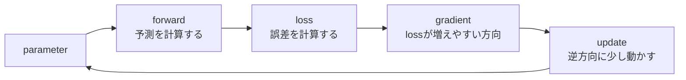

# 第11章 勾配降下法

**この章のゴール**

勾配の逆方向へパラメータを更新する考え方を理解し、`optimizer.zero_grad()`、`loss.backward()`、`optimizer.step()` の役割を説明できるようになること。

## 11.1 勾配降下法とは何か

前章では、微分と勾配について学びました。

微分は、

```text
ある値を少し変えたとき、結果がどう変わるか
```

を見るための道具でした。

ニューラルネットワークでは、特に次のことを知りたいのでした。

```text
パラメータを少し変えたとき、lossがどう変わるか
```

この情報をまとめたものが勾配です。

勾配は、lossが増えやすい方向を表します。

```text
勾配の方向
=
lossが増えやすい方向
```

しかし、学習でやりたいのはlossを増やすことではありません。

やりたいのは、lossを小さくすることです。

そのため、勾配とは逆向きにパラメータを動かします。

```text
勾配の方向に動く
↓
lossが増えやすい

勾配の逆方向に動く
↓
lossが減りやすい
```

この考え方でパラメータを更新する方法を、**勾配降下法**と呼びます。

英語では、gradient descent と呼びます。

基本的な更新式は次の通りです。

```text
parameter = parameter - learning_rate * gradient
```

ここで、

```text
parameter: 更新したいパラメータ
learning_rate: 学習率
gradient: lossに対する勾配
```

です。

勾配降下法の流れを図にすると、次のようになります。



たとえば、あるパラメータ `w` があるとします。

```text
w = 3.0
```

このとき、lossに対する勾配が次のようだったとします。

```text
gradient = 2.0
```

学習率を `0.1` とすると、更新は次のようになります。

```text
w = w - learning_rate * gradient
```

つまり、

```text
w = 3.0 - 0.1 * 2.0
w = 3.0 - 0.2
w = 2.8
```

です。

勾配がプラスなので、`w` は減りました。

これは、

```text
wを増やすとlossが増えやすい
↓
wを減らす
```

という動きです。

逆に、勾配がマイナスだった場合を考えます。

```text
w = 3.0
gradient = -2.0
learning_rate = 0.1
```

更新すると、

```text
w = 3.0 - 0.1 * (-2.0)
w = 3.0 + 0.2
w = 3.2
```

です。

勾配がマイナスなので、`w` は増えました。

これは、

```text
wを増やすとlossが減りやすい
↓
wを増やす
```

という動きです。

このように、勾配降下法は、勾配を使ってlossが小さくなる方向にパラメータを少しずつ動かす方法です。

---

## 11.2 損失を小さくする方向に重みを更新する

勾配降下法の目的は、損失を小さくすることです。

たとえば、次のような関数を考えます。

```text
loss = (w - 5)^2
```

この関数は、`w = 5` のときに最小になります。

実際に値を見てみます。

```text
w = 2 → loss = (2 - 5)^2 = 9
w = 3 → loss = (3 - 5)^2 = 4
w = 4 → loss = (4 - 5)^2 = 1
w = 5 → loss = (5 - 5)^2 = 0
w = 6 → loss = (6 - 5)^2 = 1
w = 7 → loss = (7 - 5)^2 = 4
```

`w` が5に近づくほど、lossは小さくなります。

では、最初に `w = 2` だったとします。

```text
w = 2
```

このとき、lossを小さくするには、`w` を増やす必要があります。

```text
w = 2
↓
wを増やす
↓
5に近づく
↓
lossが小さくなる
```

この判断を、勾配を使って行います。

`loss = (w - 5)^2` の微分は、次のようになります。

```text
d loss / d w = 2(w - 5)
```

`w = 2` のとき、

```text
gradient = 2(2 - 5)
gradient = -6
```

勾配はマイナスです。

勾配降下法の更新式は次の通りです。

```text
w = w - learning_rate * gradient
```

学習率を `0.1` とすると、

```text
w = 2 - 0.1 * (-6)
w = 2 + 0.6
w = 2.6
```

`w` は増えました。

これは、lossを小さくする方向です。

次に、最初に `w = 7` だった場合を考えます。

```text
w = 7
```

このとき、lossを小さくするには、`w` を減らす必要があります。

勾配を計算します。

```text
gradient = 2(7 - 5)
gradient = 4
```

勾配はプラスです。

更新すると、

```text
w = 7 - 0.1 * 4
w = 7 - 0.4
w = 6.6
```

`w` は減りました。

これも、lossを小さくする方向です。

このように、勾配降下法は、今の場所での勾配を見て、lossが下がる方向へ少しだけ進みます。

```text
今のパラメータ
↓
勾配を計算
↓
勾配の逆方向に少し動かす
↓
lossが下がる
```

これを何度も繰り返すことで、パラメータをよい値に近づけていきます。

---

## 11.3 学習率

勾配降下法では、**学習率**が重要です。

学習率は、1回の更新でどれくらい大きくパラメータを動かすかを決める値です。

更新式は次の通りでした。

```text
parameter = parameter - learning_rate * gradient
```

ここで、`learning_rate` が学習率です。

たとえば、勾配が次のようだったとします。

```text
gradient = 2.0
```

学習率が `0.1` なら、更新量は次のようになります。

```text
0.1 * 2.0 = 0.2
```

学習率が `0.01` なら、更新量は次のようになります。

```text
0.01 * 2.0 = 0.02
```

学習率が大きいほど、一度に大きく動きます。

学習率が小さいほど、少しずつ動きます。

```text
学習率が大きい
↓
大きく更新する

学習率が小さい
↓
小さく更新する
```

学習率が大きすぎると、問題が起きます。

最小値に近づくどころか、行き過ぎてしまうことがあります。

たとえば、lossが小さい場所を通り越して、反対側に飛んでしまうようなイメージです。

```text
学習率が大きすぎる
↓
最小値を飛び越える
↓
lossが下がらない
↓
場合によっては発散する
```

逆に、学習率が小さすぎると、学習がとても遅くなります。

```text
学習率が小さすぎる
↓
少しずつしか動かない
↓
lossは下がるが時間がかかる
```

そのため、学習率は非常に重要なハイパーパラメータです。

ハイパーパラメータとは、モデルが学習する値ではなく、人間が設定する値です。

```text
モデルが学習する値:
重み
バイアス
embedding

人間が設定する値:
学習率
バッチサイズ
層の数
hidden size
```

Transformerの学習でも、学習率は非常に重要です。

学習率が合っていないと、lossが下がらなかったり、学習が不安定になったりします。

実際の大規模なTransformerでは、単純に一定の学習率を使うのではなく、学習率スケジュールを使うことが多いです。

たとえば、最初は少しずつ学習率を上げ、その後ゆっくり下げる方法があります。

```text
warmup
↓
decay
```

ただし、この教科書の段階では、まず次のことを理解できれば十分です。

```text
学習率は、勾配に沿ってどれくらい動くかを決める値である
```

---

## 11.4 更新式の意味

勾配降下法の更新式をもう一度見ます。

```text
parameter = parameter - learning_rate * gradient
```

この式は短いですが、ニューラルネットワークの学習の中心です。

それぞれの部分を分解します。

まず、`gradient` は勾配です。

```text
gradient
=
そのパラメータを少し増やしたときに、lossがどう変わるか
```

勾配がプラスなら、パラメータを増やすとlossが増えやすいです。

```text
gradient > 0
↓
parameterを増やすとlossが増える
↓
parameterを減らすべき
```

更新式では、

```text
parameter - learning_rate * gradient
```

となっているので、勾配がプラスならパラメータは減ります。

次に、勾配がマイナスの場合を考えます。

```text
gradient < 0
↓
parameterを増やすとlossが減る
↓
parameterを増やすべき
```

更新式では、マイナスの勾配を引くことになります。

```text
parameter - learning_rate * (-値)
=
parameter + 値
```

つまり、パラメータは増えます。

このように、更新式は自動的にlossが下がる方向へ動くようになっています。

次に、`learning_rate` の意味です。

```text
learning_rate * gradient
```

は、実際にどれくらい動かすかを表します。

勾配が大きければ、大きく動きます。

勾配が小さければ、小さく動きます。

学習率が大きければ、全体的に大きく動きます。

学習率が小さければ、全体的に小さく動きます。

つまり、更新式は次のように読めます。

```text
今のパラメータから、
lossが増える方向である勾配を、
学習率の分だけ引く
```

より直感的に言うと、

```text
lossが下がる方向へ、少しだけ動く
```

です。

PyTorchでoptimizerを使う場合、この更新式は内部で実行されます。

たとえば、SGDでは基本的に次のような更新が行われます。

```python
parameter -= learning_rate * parameter.grad
```

実際には、optimizerがこの処理をまとめてやってくれます。

```python
optimizer.step()
```

つまり、

```python
loss.backward()
optimizer.step()
```

は、次の意味です。

```text
loss.backward():
各パラメータの勾配を計算する

optimizer.step():
勾配を使ってパラメータを更新する
```

---

## 11.5 勾配が大きい場合と小さい場合

勾配の大きさは、lossの変化の激しさを表します。

勾配が大きい場合、そのパラメータを少し変えるだけでlossが大きく変わります。

```text
勾配が大きい
↓
少し動かすだけでlossが大きく変わる
```

勾配が小さい場合、そのパラメータを少し変えてもlossはあまり変わりません。

```text
勾配が小さい
↓
少し動かしてもlossはあまり変わらない
```

たとえば、次のような勾配を考えます。

```text
gradient = 10.0
```

学習率が `0.1` なら、更新量は次の通りです。

```text
0.1 * 10.0 = 1.0
```

かなり大きく動きます。

一方、勾配が次のように小さい場合を考えます。

```text
gradient = 0.01
```

学習率が `0.1` なら、更新量は次の通りです。

```text
0.1 * 0.01 = 0.001
```

少ししか動きません。

勾配が大きいことは、必ずしも良いことではありません。

勾配が大きすぎると、パラメータ更新が大きくなりすぎて、学習が不安定になることがあります。

```text
勾配が大きすぎる
↓
更新が大きすぎる
↓
lossが急に大きくなる
↓
学習が壊れることがある
```

これを **勾配爆発** と呼ぶことがあります。

特に深いニューラルネットワークでは、勾配が非常に大きくなる問題が起こることがあります。

逆に、勾配が非常に小さくなることもあります。

```text
勾配が小さすぎる
↓
パラメータがほとんど更新されない
↓
学習が進まない
```

これを **勾配消失** と呼ぶことがあります。

Transformerでは、残差接続やLayer Normalizationなどが、深いネットワークの学習を安定させるために重要な役割を持ちます。

この段階では、まず次の直感を持っていれば十分です。

```text
勾配は、lossを変える方向と強さを表す
勾配が大きいと大きく更新される
勾配が小さいと小さく更新される
大きすぎても小さすぎても学習は難しくなる
```

---

## 11.6 局所最適と大域最適

勾配降下法は、lossを小さくする方向に進む方法です。

しかし、常に一番よい場所にたどり着けるとは限りません。

ここで、**局所最適**と**大域最適**という考え方が出てきます。

大域最適とは、全体の中で最もlossが小さい場所です。

```text
大域最適
=
全体で一番よい解
```

一方、局所最適とは、その周辺だけを見ると一番よい場所です。

```text
局所最適
=
近くを見ると一番よいが、全体で一番とは限らない場所
```

山や谷の地形で考えるとわかりやすいです。

lossを地形の高さだと考えます。

```text
高さが高い = lossが大きい
高さが低い = lossが小さい
```

勾配降下法は、今いる場所から坂を下っていきます。

```text
今いる場所
↓
下り坂の方向へ進む
↓
低い場所へ向かう
```

しかし、地形に複数の谷がある場合、近くの谷に入ってしまうことがあります。

その谷は周辺では低い場所ですが、全体で一番低いとは限りません。

これが局所最適です。

ニューラルネットワークのlossの地形は非常に高次元で複雑です。

単純な山や谷の図で完全に説明できるものではありません。

しかし、直感としては、

```text
勾配降下法は、今いる場所から見て下がる方向に進む
```

方法だと考えるとよいです。

そのため、初期値や学習率、optimizerの選び方によって、学習の結果が変わることがあります。

ただし、深層学習では、単純な局所最適だけが問題になるわけではありません。

鞍点、平坦な領域、勾配のスケール、データのノイズなど、さまざまな要素があります。

この教科書では、まず次の理解で十分です。

```text
勾配降下法は、lossが下がる方向に少しずつ進む
ただし、lossの地形が複雑なので、進み方には工夫が必要である
```

---

## 11.7 ニューラルネットワークの学習との関係

ニューラルネットワークの学習は、勾配降下法を中心に回っています。

大まかな流れは次の通りです。

```text
1. 入力をモデルに入れる
2. 予測を出す
3. 正解と比べてlossを計算する
4. lossから各パラメータの勾配を計算する
5. 勾配を使ってパラメータを更新する
6. これを何度も繰り返す
```

PyTorch風に書くと、次のようになります。

```python
logits = model(inputs)
loss = loss_fn(logits, targets)

optimizer.zero_grad()
loss.backward()
optimizer.step()
```

それぞれの意味は次の通りです。

```text
logits = model(inputs):
モデルが予測を出す

loss = loss_fn(logits, targets):
予測と正解からlossを計算する

optimizer.zero_grad():
前回の勾配をリセットする

loss.backward():
各パラメータの勾配を計算する

optimizer.step():
勾配を使ってパラメータを更新する
```

Transformerでも、この流れは同じです。

たとえば、言語モデルの場合は次のようになります。

```text
token_ids
↓
Transformer
↓
logits
↓
cross entropy
↓
loss
↓
backward
↓
parameter update
```

ここで、学習されるパラメータはたくさんあります。

```text
embedding table
Q/K/VのLinear層
Attention出力のLinear層
Feed Forward Network
LayerNorm
出力層
```

`loss.backward()` を呼ぶと、PyTorchはこれらすべてのパラメータについて勾配を計算します。

そして、`optimizer.step()` によって、各パラメータが更新されます。

```text
parameter = parameter - learning_rate * gradient
```

実際には、SGDだけでなく、AdamやAdamWのようなoptimizerを使うことが多いです。

AdamやAdamWは、単純な勾配降下法に比べて、勾配の履歴やスケールを使って更新量を調整します。

ただし、基本的な考え方は同じです。

```text
勾配を使って、lossが小さくなる方向にパラメータを更新する
```

この理解があれば、optimizerが変わっても、学習の大枠を見失わずに済みます。

---

## 11.8 PyTorchで勾配降下法を実装する

ここでは、PyTorchで勾配降下法を手で実装してみます。

まず、単純な関数を最小化します。

```text
loss = (w - 5)^2
```

この関数は、`w = 5` のときに最小になります。

最初は `w = 0` から始めます。

```python
import torch

w = torch.tensor(0.0, requires_grad=True)

learning_rate = 0.1

for step in range(10):
    loss = (w - 5) ** 2

    loss.backward()

    with torch.no_grad():
        w -= learning_rate * w.grad

    w.grad.zero_()

    print(step, "w:", float(w), "loss:", float(loss))
```

出力は、おおよそ次のようになります。

```text
0 w: 1.0 loss: 25.0
1 w: 1.8 loss: 16.0
2 w: 2.44 loss: 10.24
3 w: 2.952 loss: 6.5536
4 w: 3.3616 loss: 4.1943
5 w: 3.6893 loss: 2.6844
6 w: 3.9514 loss: 1.7180
7 w: 4.1611 loss: 1.0995
8 w: 4.3289 loss: 0.7037
9 w: 4.4631 loss: 0.4504
```

`w` が少しずつ5に近づいています。

lossも小さくなっています。

このコードの流れを確認します。

まず、lossを計算します。

```python
loss = (w - 5) ** 2
```

次に、勾配を計算します。

```python
loss.backward()
```

この時点で、`w.grad` に勾配が入ります。

次に、勾配を使って `w` を更新します。

```python
with torch.no_grad():
    w -= learning_rate * w.grad
```

最後に、勾配をゼロにします。

```python
w.grad.zero_()
```

この流れが、勾配降下法の基本です。

```text
lossを計算する
勾配を計算する
パラメータを更新する
勾配をリセットする
```

この小さな例では、パラメータは `w` 1つだけです。

しかし、ニューラルネットワークでは、同じことを大量のパラメータに対して行います。

---

## 11.9 PyTorchのoptimizerを使う

前節では、パラメータ更新を手で書きました。

```python
with torch.no_grad():
    w -= learning_rate * w.grad
```

実際のニューラルネットワークでは、optimizerを使うことが多いです。

ここでは、SGD optimizerを使って同じことをします。

```python
import torch

w = torch.tensor(0.0, requires_grad=True)

optimizer = torch.optim.SGD([w], lr=0.1)

for step in range(10):
    loss = (w - 5) ** 2

    optimizer.zero_grad()
    loss.backward()
    optimizer.step()

    print(step, "w:", float(w), "loss:", float(loss))
```

出力は、前節と同じように `w` が5に近づいていきます。

```text
0 w: 1.0 loss: 25.0
1 w: 1.8 loss: 16.0
2 w: 2.44 loss: 10.24
...
```

ここで重要なのは、次の3行です。

```python
optimizer.zero_grad()
loss.backward()
optimizer.step()
```

この順番は、PyTorchの学習ループで非常によく出てきます。

意味は次の通りです。

```text
optimizer.zero_grad():
前回の勾配をリセットする

loss.backward():
現在のlossに対する勾配を計算する

optimizer.step():
勾配を使ってパラメータを更新する
```

実際のモデルでは、`[w]` のように1つのパラメータだけを渡すのではなく、モデル全体のパラメータをoptimizerに渡します。

```python
optimizer = torch.optim.SGD(model.parameters(), lr=0.1)
```

あるいは、Transformerや言語モデルではAdamWを使うことが多いです。

```python
optimizer = torch.optim.AdamW(model.parameters(), lr=1e-4)
```

AdamWの中身はSGDより複雑ですが、基本的な使い方は同じです。

```python
optimizer.zero_grad()
loss.backward()
optimizer.step()
```

この3行は、PyTorchでモデルを学習させるときの基本形です。

---

## 11.10 小さな線形モデルを学習させる

ここでは、もう少し機械学習らしい例を見ます。

単純なデータを用意します。

```text
y = 2x + 1
```

という関係を学習させます。

たとえば、データは次のようになります。

```text
x = 1 → y = 3
x = 2 → y = 5
x = 3 → y = 7
x = 4 → y = 9
```

この関係を、線形モデルで学習します。

```text
y_pred = wx + b
```

ここで、`w` と `b` を学習します。

PyTorchで書くと次のようになります。

```python
import torch
import torch.nn as nn
import torch.nn.functional as F

x = torch.tensor([
    [1.0],
    [2.0],
    [3.0],
    [4.0],
])

y_true = torch.tensor([
    [3.0],
    [5.0],
    [7.0],
    [9.0],
])

model = nn.Linear(1, 1)

optimizer = torch.optim.SGD(model.parameters(), lr=0.01)

for step in range(1000):
    y_pred = model(x)

    loss = F.mse_loss(y_pred, y_true)

    optimizer.zero_grad()
    loss.backward()
    optimizer.step()

print("weight:", model.weight.data)
print("bias:", model.bias.data)
print("loss:", loss.item())
```

学習がうまくいくと、weightは2に近づき、biasは1に近づきます。

```text
weight ≒ 2
bias ≒ 1
```

このコードでは、次の流れが行われています。

```text
1. xをモデルに入れる
2. y_predを出す
3. y_trueと比べてlossを計算する
4. loss.backward()で勾配を計算する
5. optimizer.step()でweightとbiasを更新する
6. これを1000回繰り返す
```

この例は非常に小さいですが、ニューラルネットワークの学習の基本は同じです。

Transformerでも、モデルが大きくなるだけで、流れは変わりません。

```text
入力
↓
モデル
↓
予測
↓
loss
↓
backward
↓
update
```

---

## 11.11 小さな言語モデル風の学習ループ

ここでは、言語モデルに近い形の学習ループを見ます。

本物のTransformerではありません。

embeddingと線形層だけの非常に小さなモデルです。

目的は、次トークン予測の学習ループを確認することです。

まず、簡単なトークン列を用意します。

```python
import torch
import torch.nn as nn
import torch.nn.functional as F

token_ids = torch.tensor([
    [1, 2, 3, 4, 5],
    [2, 3, 4, 5, 6],
])
```

次トークン予測では、入力と正解を1つずらします。

```python
inputs = token_ids[:, :-1]
targets = token_ids[:, 1:]
```

shapeは次のようになります。

```text
inputs: [batch_size, seq_len - 1]
targets: [batch_size, seq_len - 1]
```

次に、小さなモデルを作ります。

```python
vocab_size = 10
d_model = 8

embedding = nn.Embedding(vocab_size, d_model)
output_layer = nn.Linear(d_model, vocab_size)
```

optimizerを作ります。

```python
params = list(embedding.parameters()) + list(output_layer.parameters())
optimizer = torch.optim.AdamW(params, lr=0.01)
```

学習ループを書きます。

```python
for step in range(100):
    hidden = embedding(inputs)
    logits = output_layer(hidden)

    B, T, V = logits.shape

    loss = F.cross_entropy(
        logits.reshape(B * T, V),
        targets.reshape(B * T)
    )

    optimizer.zero_grad()
    loss.backward()
    optimizer.step()

    if step % 20 == 0:
        print(step, "loss:", float(loss))
```

このコードでは、次の処理をしています。

```text
inputs
↓
embedding
↓
hidden
↓
output_layer
↓
logits
↓
cross entropy
↓
loss
↓
backward
↓
update
```

全体のコードをまとめると、次のようになります。

```python
import torch
import torch.nn as nn
import torch.nn.functional as F

token_ids = torch.tensor([
    [1, 2, 3, 4, 5],
    [2, 3, 4, 5, 6],
])

inputs = token_ids[:, :-1]
targets = token_ids[:, 1:]

vocab_size = 10
d_model = 8

embedding = nn.Embedding(vocab_size, d_model)
output_layer = nn.Linear(d_model, vocab_size)

params = list(embedding.parameters()) + list(output_layer.parameters())
optimizer = torch.optim.AdamW(params, lr=0.01)

for step in range(100):
    hidden = embedding(inputs)
    logits = output_layer(hidden)

    B, T, V = logits.shape

    loss = F.cross_entropy(
        logits.reshape(B * T, V),
        targets.reshape(B * T)
    )

    optimizer.zero_grad()
    loss.backward()
    optimizer.step()

    if step % 20 == 0:
        print(step, "loss:", float(loss))
```

これは非常に小さな例ですが、言語モデル学習の骨格を含んでいます。

```text
次トークン予測
cross entropy loss
backward
optimizer step
```

本物のTransformerでは、embeddingとoutput_layerの間にTransformer blockが入ります。

```text
inputs
↓
embedding
↓
Transformer blocks
↓
output_layer
↓
logits
↓
loss
```

しかし、勾配降下法の流れは同じです。

---

## 11.12 SGD、Adam、AdamWの直感

ここまで、主に単純な勾配降下法やSGDを見てきました。

SGDは、Stochastic Gradient Descent の略です。

日本語では、確率的勾配降下法と呼ばれます。

SGDの基本はシンプルです。

```text
parameter = parameter - learning_rate * gradient
```

ただし、実際の深層学習では、AdamやAdamWというoptimizerがよく使われます。

TransformerやLLMでは、AdamWがよく使われます。

ここでは、細かい数式には深入りせず、直感だけ押さえます。

SGDは、今の勾配を見て、その方向に更新します。

```text
今の勾配を見る
↓
その逆方向に動く
```

Adamは、勾配の移動平均や、勾配の大きさの情報を使って、更新量を調整します。

ざっくり言うと、

```text
最近の勾配の傾向を見る
勾配のスケールを考慮する
パラメータごとに更新量を調整する
```

というoptimizerです。

AdamWは、Adamにweight decayの扱いを改善したものです。

weight decayは、パラメータが大きくなりすぎるのを抑えるための正則化です。

Transformerでは、AdamWが標準的に使われることが多いです。

ただし、最初に理解すべきことは、optimizerの細かい違いではありません。

まず重要なのは、どのoptimizerでも基本的には次の流れだということです。

```text
lossを計算する
↓
勾配を計算する
↓
optimizerがパラメータを更新する
```

PyTorchのコードでは、optimizerがSGDでもAdamWでも、基本形は同じです。

```python
optimizer.zero_grad()
loss.backward()
optimizer.step()
```

たとえば、SGDなら次のように書きます。

```python
optimizer = torch.optim.SGD(model.parameters(), lr=0.01)
```

AdamWなら次のように書きます。

```python
optimizer = torch.optim.AdamW(model.parameters(), lr=1e-4)
```

使うoptimizerは違っても、学習ループの基本形は変わりません。

---

## 11.13 まとめ

この章では、勾配降下法について学びました。

勾配降下法は、lossを小さくするために、パラメータを勾配の逆方向へ更新する方法です。

基本の更新式は次の通りです。

```text
parameter = parameter - learning_rate * gradient
```

ここで、

```text
parameter: 更新するパラメータ
learning_rate: 学習率
gradient: lossに対する勾配
```

です。

勾配は、lossが増えやすい方向を表します。

そのため、lossを小さくするには、勾配の逆方向に動きます。

```text
勾配の方向
=
lossが増えやすい方向

勾配の逆方向
=
lossが減りやすい方向
```

学習率は、1回の更新でどれくらい動くかを決める値です。

```text
学習率が大きい
↓
大きく動く

学習率が小さい
↓
少しずつ動く
```

学習率が大きすぎると、学習が不安定になることがあります。

学習率が小さすぎると、学習が遅くなります。

ニューラルネットワークの学習ループは、基本的に次の流れです。

```text
予測する
↓
lossを計算する
↓
勾配を計算する
↓
パラメータを更新する
↓
繰り返す
```

PyTorchでは、次の3行が基本になります。

```python
optimizer.zero_grad()
loss.backward()
optimizer.step()
```

意味は次の通りです。

```text
optimizer.zero_grad():
前回の勾配をリセットする

loss.backward():
現在のlossに対する勾配を計算する

optimizer.step():
勾配を使ってパラメータを更新する
```

Transformerでも、学習の基本は同じです。

```text
token_ids
↓
Transformer
↓
logits
↓
cross entropy loss
↓
backward
↓
optimizer step
```

この章で特に重要なのは、次の理解です。

```text
勾配降下法はlossを小さくするための更新方法である
勾配の逆方向にパラメータを動かす
学習率は更新の大きさを決める
PyTorchではoptimizerが更新を担当する
Transformerでも基本の学習ループは同じである
```

### 確認問題

次の条件で、`w` はいくつになりますか。

```text
w = 3.0
gradient = 2.0
learning_rate = 0.1
```

更新式は次の通りです。

```text
w = w - learning_rate * gradient
```

答えは次の通りです。

```text
w = 3.0 - 0.1 * 2.0
w = 2.8
```

### よくある誤解

勾配は、lossが増えやすい方向を表します。

学習ではlossを小さくしたいので、勾配の逆方向に動かします。

次章では、合成関数と連鎖律について学びます。

ニューラルネットワークは、多くの関数を重ねたものです。

```text
入力
↓
embedding
↓
線形層
↓
Attention
↓
Feed Forward Network
↓
出力層
↓
loss
```

このように何段階もの計算を通してlossが作られます。

そのlossから、前の層のパラメータにどうやって勾配を伝えるのか。

その考え方の中心になるのが、連鎖律です。
