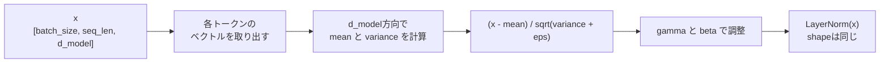

# 第13章 正規化

## 13.1 平均とは何か

この章では、**正規化**について学びます。

Transformerでは、特に **Layer Normalization** が重要です。

Layer Normalizationは、値のスケールを整えて、学習を安定させるために使われます。

その前提として、まず「平均」「分散」「標準偏差」を理解します。

まず、平均から見ます。

平均とは、複数の値を足して、個数で割ったものです。

たとえば、次の値があるとします。

```text
[2.0, 4.0, 6.0]
```

平均は、全部足して3で割ります。

```text
平均 = (2.0 + 4.0 + 6.0) / 3
平均 = 12.0 / 3
平均 = 4.0
```

つまり、この値の平均は `4.0` です。

平均は、そのデータ全体の中心のような値です。

```text
[2.0, 4.0, 6.0]
```

では、真ん中あたりに `4.0` があります。

もう少し別の例を見ます。

```text
[10.0, 10.0, 10.0]
```

平均は次の通りです。

```text
平均 = (10.0 + 10.0 + 10.0) / 3
平均 = 10.0
```

すべて同じ値なので、平均も `10.0` です。

次に、次の値を考えます。

```text
[1.0, 2.0, 100.0]
```

平均は次のようになります。

```text
平均 = (1.0 + 2.0 + 100.0) / 3
平均 = 103.0 / 3
平均 = 34.333...
```

この場合、`100.0` という大きな値に引っ張られて、平均が大きくなっています。

平均は便利ですが、データの広がりまでは表しません。

たとえば、次の2つのデータを考えます。

```text
A = [4.0, 4.0, 4.0]
B = [2.0, 4.0, 6.0]
```

どちらも平均は `4.0` です。

しかし、Aはすべて同じ値です。

Bは、値にばらつきがあります。

```text
A: ばらつきがない
B: ばらつきがある
```

この「ばらつき」を表すために使うのが、次に見る分散と標準偏差です。

TransformerのLayer Normalizationでも、平均を計算します。

たとえば、あるトークンのベクトルが次のようだったとします。

```text
x = [2.0, 4.0, 6.0]
```

このベクトルの平均は `4.0` です。

Layer Normalizationでは、この平均を使って、値の中心をそろえます。

```text
x - 平均
```

つまり、

```text
[2.0, 4.0, 6.0] - 4.0
=
[-2.0, 0.0, 2.0]
```

となります。

この操作によって、値の中心が0に近づきます。

---

## 13.2 分散とは何か

**分散**は、値が平均からどれくらい散らばっているかを表す値です。

まず、次のデータを考えます。

```text
x = [2.0, 4.0, 6.0]
```

平均は `4.0` です。

```text
平均 = 4.0
```

各値が平均からどれくらい離れているかを見ます。

```text
2.0 - 4.0 = -2.0
4.0 - 4.0 = 0.0
6.0 - 4.0 = 2.0
```

つまり、平均との差は次のようになります。

```text
[-2.0, 0.0, 2.0]
```

この差をそのまま足すと、プラスとマイナスが打ち消し合ってしまいます。

```text
-2.0 + 0.0 + 2.0 = 0.0
```

これでは、ばらつきがあるのに0になってしまいます。

そこで、平均との差を二乗します。

```text
(-2.0)^2 = 4.0
0.0^2 = 0.0
2.0^2 = 4.0
```

二乗すると、すべて0以上になります。

```text
[4.0, 0.0, 4.0]
```

これらの平均を取ります。

```text
分散 = (4.0 + 0.0 + 4.0) / 3
分散 = 8.0 / 3
分散 = 2.666...
```

これが分散です。

まとめると、分散は次の手順で計算します。

```text
1. 平均を計算する
2. 各値から平均を引く
3. それぞれを二乗する
4. その平均を取る
```

式のイメージは次の通りです。

```text
分散 = 平均からの差の二乗の平均
```

分散が小さいほど、値は平均の近くに集まっています。

```text
分散が小さい
↓
値のばらつきが小さい
```

分散が大きいほど、値は平均から大きく離れています。

```text
分散が大きい
↓
値のばらつきが大きい
```

たとえば、次のデータを考えます。

```text
A = [4.0, 4.0, 4.0]
B = [2.0, 4.0, 6.0]
C = [0.0, 4.0, 8.0]
```

どれも平均は `4.0` です。

しかし、ばらつきは違います。

```text
A: ばらつきなし
B: 少しばらつく
C: もっとばらつく
```

分散は次のようになります。

```text
Aの分散: 0.0
Bの分散: 2.666...
Cの分散: 10.666...
```

このように、分散は値の広がりを表します。

Layer Normalizationでは、この分散を使って、値のスケールをそろえます。

---

## 13.3 標準偏差とは何か

**標準偏差**は、分散の平方根です。

分散は、平均との差を二乗して計算しました。

そのため、元の値と単位感が少し変わります。

たとえば、元の値が次のようだったとします。

```text
x = [2.0, 4.0, 6.0]
```

この分散は、先ほど計算したように、

```text
分散 = 2.666...
```

です。

標準偏差は、この平方根です。

```text
標準偏差 = sqrt(分散)
標準偏差 = sqrt(2.666...)
標準偏差 ≒ 1.633
```

標準偏差は、値が平均からだいたいどれくらい離れているかを表す値として見られます。

```text
標準偏差が小さい
↓
値が平均の近くに集まっている

標準偏差が大きい
↓
値が平均から大きく散らばっている
```

たとえば、次の2つのデータを考えます。

```text
A = [4.0, 4.0, 4.0]
B = [2.0, 4.0, 6.0]
```

Aはすべて同じ値なので、標準偏差は0です。

```text
Aの標準偏差 = 0
```

Bはばらつきがあるので、標準偏差は0より大きくなります。

```text
Bの標準偏差 ≒ 1.633
```

Layer Normalizationでは、平均との差を標準偏差で割ります。

```text
正規化された値 = (x - 平均) / 標準偏差
```

たとえば、

```text
x = [2.0, 4.0, 6.0]
平均 = 4.0
標準偏差 ≒ 1.633
```

なら、

```text
x - 平均 = [-2.0, 0.0, 2.0]
```

これを標準偏差で割ると、

```text
[-2.0 / 1.633, 0.0 / 1.633, 2.0 / 1.633]
=
[-1.225, 0.0, 1.225]
```

となります。

この操作によって、値の中心が0になり、スケールもある程度そろいます。

この「中心をそろえ、スケールをそろえる」という考え方が正規化です。

---

## 13.4 正規化とは何か

**正規化**とは、値の中心やスケールをそろえる操作です。

ニューラルネットワークでは、値が大きすぎたり小さすぎたりすると、学習が不安定になることがあります。

そのため、途中の値を扱いやすい範囲に整えることがあります。

これが正規化です。

よく使われる基本形は次の通りです。

```text
正規化された値 = (x - 平均) / 標準偏差
```

この式には、2つの操作が含まれています。

まず、平均を引きます。

```text
x - 平均
```

これによって、値の中心を0に近づけます。

次に、標準偏差で割ります。

```text
(x - 平均) / 標準偏差
```

これによって、値のばらつきの大きさをそろえます。

たとえば、次のデータを考えます。

```text
x = [2.0, 4.0, 6.0]
```

平均は `4.0` です。

```text
x - 平均 = [-2.0, 0.0, 2.0]
```

標準偏差は約 `1.633` です。

```text
(x - 平均) / 標準偏差
=
[-1.225, 0.0, 1.225]
```

正規化後の値は、平均がほぼ0になります。

```text
平均 ≒ 0
```

また、標準偏差はほぼ1になります。

```text
標準偏差 ≒ 1
```

このように、正規化は値を扱いやすい形に整えます。

ニューラルネットワークでは、層を重ねるにつれて、値のスケールが変わっていくことがあります。

```text
ある層では値が大きくなる
別の層では値が小さくなる
層を重ねると分布が変わる
```

このような状態だと、学習が不安定になりやすいです。

正規化を入れると、各層の入力や出力のスケールを整えやすくなります。

Transformerでは、Layer Normalizationによって、各トークンのベクトルを正規化します。

---

## 13.5 なぜ値のスケールを整えるのか

ニューラルネットワークでは、値のスケールが重要です。

値が大きすぎると、計算が不安定になることがあります。

値が小さすぎると、勾配が小さくなり、学習が進みにくくなることがあります。

たとえば、ニューラルネットワークでは、次のような計算が何度も行われます。

```text
線形変換
活性化関数
softmax
正規化
残差接続
```

これらの計算を何層も重ねると、途中の値の大きさが変わっていきます。

もし、ある層の出力が非常に大きくなったとします。

```text
[100.0, 200.0, -150.0]
```

このような大きな値が次の層に入ると、softmaxが極端になったり、勾配が不安定になったりする可能性があります。

逆に、値が非常に小さくなったとします。

```text
[0.0001, -0.0002, 0.0003]
```

このような値が続くと、信号が弱くなり、学習が進みにくくなることがあります。

深いニューラルネットワークでは、このようなスケールの問題が積み重なります。

Transformerは、何層ものブロックを重ねます。

```text
Transformer block 1
↓
Transformer block 2
↓
Transformer block 3
↓
...
```

そのため、各層で値のスケールを整えることが重要です。

Layer Normalizationは、このために使われます。

```text
値の中心をそろえる
値のばらつきをそろえる
↓
学習を安定させる
```

また、正規化は勾配の流れにも関係します。

値のスケールが極端だと、勾配も極端になりやすくなります。

```text
値が大きすぎる
↓
勾配が大きくなりすぎることがある

値が小さすぎる
↓
勾配が小さくなりすぎることがある
```

正規化によって値のスケールを整えると、勾配も扱いやすくなり、学習が安定しやすくなります。

この章では、正規化を次のように理解します。

```text
正規化とは、ニューラルネットワークの中を流れる値のスケールを整えるための操作である
```

---

## 13.6 Layer Normalizationの直感

Transformerで使われる代表的な正規化が **Layer Normalization** です。

Layer Normalizationは、各トークンのベクトルごとに正規化を行います。

Transformerの中のテンソルは、よく次のshapeになります。

```text
[batch_size, seq_len, d_model]
```

ここで、

```text
batch_size: 文の数
seq_len: トークン数
d_model: 各トークンのベクトル次元
```

です。

Layer Normalizationでは、基本的に最後の次元である `d_model` に沿って平均と分散を計算します。

つまり、各トークンのベクトルごとに正規化します。

たとえば、1つのトークンのベクトルが次のようだったとします。

```text
x = [2.0, 4.0, 6.0]
```

このベクトルについて平均と標準偏差を計算します。

```text
平均 = 4.0
標準偏差 ≒ 1.633
```

そして正規化します。

```text
(x - 平均) / 標準偏差
=
[-1.225, 0.0, 1.225]
```

これを、各トークンごとに行います。

たとえば、2個のトークンがあるとします。

```text
token_1 = [2.0, 4.0, 6.0]
token_2 = [10.0, 20.0, 30.0]
```

Layer Normalizationでは、`token_1` と `token_2` を別々に正規化します。

```text
token_1の平均と分散を計算して正規化する
token_2の平均と分散を計算して正規化する
```

つまり、トークンごとに、そのベクトルの中で正規化するということです。

図にすると、`batch_size` や `seq_len` 方向ではなく、各トークンの `d_model` 方向を整える操作です。



ここが、Batch Normalizationとは違う点です。

Batch Normalizationは、バッチ方向の統計量を使うことがあります。

一方、Layer Normalizationは、各サンプル、各トークンの内部で正規化します。

Transformerでは、可変長の系列や小さいバッチでも扱いやすいので、Layer Normalizationがよく使われます。

Layer Normalizationの基本式は次のように考えられます。

```text
LayerNorm(x) = (x - mean) / sqrt(variance + eps)
```

ここで、`eps` はとても小さい値です。

標準偏差が0に近い場合に、0で割ることを防ぐために入れます。

```text
eps = 1e-5
```

のような値がよく使われます。

実際のLayerNormでは、この正規化の後に、学習可能なスケールとシフトを加えます。

```text
output = gamma * normalized_x + beta
```

ここで、

```text
gamma: 学習可能なスケール
beta: 学習可能なシフト
```

です。

なぜわざわざ正規化した後に、またスケールとシフトを入れるのでしょうか。

理由は、モデルが必要に応じて表現のスケールや中心を調整できるようにするためです。

```text
正規化で安定させる
ただし、必要なら学習によってスケールやシフトを戻せるようにする
```

この柔軟性が重要です。

---

## 13.7 TransformerにLayerNormが必要な理由

Transformerでは、LayerNormが非常に重要です。

理由は、Transformerが深いネットワークだからです。

Transformer blockは、主に次の部品からできています。

```text
Self-Attention
Feed Forward Network
Residual Connection
Layer Normalization
```

これを何層も重ねます。

```text
Block 1
↓
Block 2
↓
Block 3
↓
...
```

層を重ねると、途中の値の分布が変わりやすくなります。

```text
ある層では値が大きくなる
次の層ではさらに大きくなる
別の場所では小さくなる
```

値のスケールが安定しないと、学習も安定しにくくなります。

LayerNormは、各層で値のスケールを整えます。

```text
入力
↓
LayerNorm
↓
扱いやすいスケールの値
```

これにより、深いネットワークでも学習しやすくなります。

Transformerでは、残差接続も重要です。

残差接続では、入力にサブレイヤーの出力を足します。

```text
x + Sublayer(x)
```

このような加算を何度も行うと、値のスケールが変わりやすくなります。

LayerNormは、そのスケールを整える役割を持ちます。

元論文のTransformerでは、次のような形が使われています。

```text
LayerNorm(x + Sublayer(x))
```

これは、サブレイヤーの出力を入力に足してからLayerNormする形です。

この形は、現在では **Post-LN** と呼ばれることがあります。

一方、最近のTransformer実装では、次のような形もよく使われます。

```text
x + Sublayer(LayerNorm(x))
```

これは、先にLayerNormしてからサブレイヤーに通し、その出力を元の `x` に足す形です。

この形は **Pre-LN** と呼ばれることがあります。

この教科書では、まず細かい違いに深入りしなくて大丈夫です。

重要なのは、TransformerではLayerNormが次のために使われるということです。

```text
値のスケールを整える
深いネットワークの学習を安定させる
残差接続と組み合わせて使う
```

特に、『Attention Is All You Need』を読むと、次のような式が出てきます。

```text
LayerNorm(x + Sublayer(x))
```

この式は、次のように読めます。

```text
サブレイヤーの出力を元の入力に足す
その結果をLayerNormで正規化する
```

この理解ができれば、Transformerの構造図がかなり読みやすくなります。

---

## 13.8 PyTorchで平均・分散・標準偏差を確認する

ここでは、PyTorchで平均、分散、標準偏差を確認します。

まず、1つのベクトルを用意します。

```python
import torch

x = torch.tensor([2.0, 4.0, 6.0])

mean = x.mean()
var = x.var(unbiased=False)
std = x.std(unbiased=False)

print("x:", x)
print("mean:", mean)
print("var:", var)
print("std:", std)
```

出力は次のようになります。

```text
x: tensor([2., 4., 6.])
mean: tensor(4.)
var: tensor(2.6667)
std: tensor(1.6330)
```

ここで、`unbiased=False` としている点に注意してください。

```python
x.var(unbiased=False)
x.std(unbiased=False)
```

これは、値の個数 `N` で割る分散を計算するためです。

LayerNormの理解では、この形で考える方がわかりやすいです。

次に、正規化してみます。

```python
x_norm = (x - mean) / std

print("x_norm:", x_norm)
print("mean of x_norm:", x_norm.mean())
print("std of x_norm:", x_norm.std(unbiased=False))
```

出力は次のようになります。

```text
x_norm: tensor([-1.2247,  0.0000,  1.2247])
mean of x_norm: tensor(0.)
std of x_norm: tensor(1.)
```

正規化後の平均は0です。

標準偏差は1です。

これが正規化の基本です。

```text
平均を引く
標準偏差で割る
↓
平均0、標準偏差1に近づく
```

次に、2つのトークンを持つ行列を考えます。

```python
import torch

x = torch.tensor([
    [2.0, 4.0, 6.0],
    [10.0, 20.0, 30.0],
])

mean = x.mean(dim=-1, keepdim=True)
var = x.var(dim=-1, keepdim=True, unbiased=False)
std = torch.sqrt(var)

x_norm = (x - mean) / std

print("x:")
print(x)
print("mean:")
print(mean)
print("std:")
print(std)
print("x_norm:")
print(x_norm)
print("x_norm mean:")
print(x_norm.mean(dim=-1))
print("x_norm std:")
print(x_norm.std(dim=-1, unbiased=False))
```

出力は次のようになります。

```text
x:
tensor([[ 2.,  4.,  6.],
        [10., 20., 30.]])

mean:
tensor([[ 4.],
        [20.]])

std:
tensor([[1.6330],
        [8.1650]])

x_norm:
tensor([[-1.2247,  0.0000,  1.2247],
        [-1.2247,  0.0000,  1.2247]])

x_norm mean:
tensor([0., 0.])

x_norm std:
tensor([1., 1.])
```

ここでは、各行ごとに正規化しています。

つまり、各トークンのベクトルごとに平均と標準偏差を計算しています。

これはLayerNormの考え方に近いです。

---

## 13.9 PyTorchでLayerNormを確認する

PyTorchには、LayerNormを行うための `nn.LayerNorm` があります。

まず、簡単な例を見ます。

```python
import torch
import torch.nn as nn

x = torch.tensor([
    [2.0, 4.0, 6.0],
    [10.0, 20.0, 30.0],
])

layer_norm = nn.LayerNorm(3)

y = layer_norm(x)

print("x:")
print(x)
print("y:")
print(y)
print("y mean:")
print(y.mean(dim=-1))
print("y std:")
print(y.std(dim=-1, unbiased=False))
```

出力は、おおよそ次のようになります。

```text
x:
tensor([[ 2.,  4.,  6.],
        [10., 20., 30.]])

y:
tensor([[-1.2247,  0.0000,  1.2247],
        [-1.2247,  0.0000,  1.2247]], grad_fn=<NativeLayerNormBackward0>)

y mean:
tensor([0., 0.], grad_fn=<MeanBackward1>)

y std:
tensor([1., 1.], grad_fn=<StdBackward0>)
```

`nn.LayerNorm(3)` は、最後の次元のサイズが3であることを意味します。

```text
最後の次元3に沿って正規化する
```

次に、Transformerでよく出る3次元テンソルに対してLayerNormを使います。

```python
import torch
import torch.nn as nn

batch_size = 2
seq_len = 4
d_model = 8

x = torch.randn(batch_size, seq_len, d_model)

layer_norm = nn.LayerNorm(d_model)

y = layer_norm(x)

print("x.shape:", x.shape)
print("y.shape:", y.shape)

print("mean over d_model:")
print(y.mean(dim=-1))

print("std over d_model:")
print(y.std(dim=-1, unbiased=False))
```

出力は次のようになります。

```text
x.shape: torch.Size([2, 4, 8])
y.shape: torch.Size([2, 4, 8])

mean over d_model:
tensor([[ 0.0000,  0.0000,  0.0000,  0.0000],
        [ 0.0000,  0.0000,  0.0000,  0.0000]], grad_fn=<MeanBackward1>)

std over d_model:
tensor([[1.0000, 1.0000, 1.0000, 1.0000],
        [1.0000, 1.0000, 1.0000, 1.0000]], grad_fn=<StdBackward0>)
```

多少の丸め誤差はありますが、各トークンごとに、最後の次元の平均が0、標準偏差が1になっています。

shapeは変わりません。

```text
x: [batch_size, seq_len, d_model]
y: [batch_size, seq_len, d_model]
```

LayerNormは、値を正規化しますが、テンソルのshapeは変えません。

これはTransformer実装で重要です。

なぜなら、残差接続で元の `x` と足し合わせるためには、shapeが同じである必要があるからです。

```text
x + Sublayer(x)
```

この加算をするには、`x` と `Sublayer(x)` のshapeが同じでなければなりません。

LayerNormはshapeを変えないので、Transformer blockの中で使いやすいのです。

---

## 13.10 LayerNormのgammaとbeta

LayerNormでは、正規化したあとに、学習可能なスケールとシフトを適用します。

式で書くと、次のようになります。

```text
y = gamma * normalized_x + beta
```

ここで、

```text
gamma: スケールを調整する学習可能パラメータ
beta: 位置をずらす学習可能パラメータ
```

です。

`gamma` と `beta` は、最後の次元ごとに持ちます。

たとえば、`d_model = 8` なら、

```text
gamma: [8]
beta:  [8]
```

です。

PyTorchで確認してみます。

```python
import torch
import torch.nn as nn

d_model = 8

layer_norm = nn.LayerNorm(d_model)

print("weight shape:", layer_norm.weight.shape)
print("bias shape:", layer_norm.bias.shape)
print("weight:")
print(layer_norm.weight)
print("bias:")
print(layer_norm.bias)
```

出力は次のようになります。

```text
weight shape: torch.Size([8])
bias shape: torch.Size([8])
weight:
Parameter containing:
tensor([1., 1., 1., 1., 1., 1., 1., 1.], requires_grad=True)

bias:
Parameter containing:
tensor([0., 0., 0., 0., 0., 0., 0., 0.], requires_grad=True)
```

PyTorchでは、`gamma` は `weight` という名前で持たれます。

`beta` は `bias` という名前で持たれます。

初期値は通常、

```text
gamma = 1
beta = 0
```

です。

つまり、最初は正規化した値をそのまま出します。

```text
y = 1 * normalized_x + 0
```

学習が進むと、モデルは必要に応じて `gamma` と `beta` を調整します。

これは、正規化で値を整えつつ、必要な表現力を失わないようにするためです。

もし、正規化だけをしてスケールやシフトを一切戻せないと、モデルにとって不便な場合があります。

そこで、

```text
いったん正規化して安定させる
その後、必要なら学習によってスケールや中心を調整する
```

という形にしています。

Transformerでは、LayerNormの `weight` と `bias` も学習対象のパラメータです。

そのため、`loss.backward()` によって勾配が計算され、optimizerによって更新されます。

---

## 13.11 残差接続とLayerNorm

Transformerでは、LayerNormは残差接続と一緒に出てきます。

残差接続とは、入力をサブレイヤーの出力に足す仕組みです。

```text
x + Sublayer(x)
```

ここで、`Sublayer` はSelf-AttentionやFeed Forward Networkなどです。

たとえば、Self-Attentionのサブレイヤーを考えると、

```text
x
↓
Self-Attention
↓
Sublayer(x)
```

これを元の `x` に足します。

```text
x + Sublayer(x)
```

この残差接続には、いくつかの重要な役割があります。

まず、元の情報を次の層へ流しやすくします。

```text
変換後の情報だけでなく、元の情報も残す
```

また、勾配が流れやすくなるという利点もあります。

深いネットワークでは、勾配が途中で弱くなったり、学習が不安定になったりしやすいです。

残差接続があると、勾配が比較的通りやすい経路ができます。

```text
loss
↓
残差経路を通って前の層へ
```

ただし、残差接続では値を足し合わせるので、スケールが変わることがあります。

```text
x
+
Sublayer(x)
```

足し算を何層も繰り返すと、値の分布が変化しやすくなります。

そこで、LayerNormを組み合わせます。

元論文の形では、次のように書かれます。

```text
LayerNorm(x + Sublayer(x))
```

これは、次の流れです。

```text
x
↓
Sublayer(x)
↓
x + Sublayer(x)
↓
LayerNorm
```

つまり、サブレイヤーの出力を元の入力に足してから正規化します。

一方、最近の実装では、次のような形も多く使われます。

```text
x + Sublayer(LayerNorm(x))
```

これは、先に正規化してからサブレイヤーに通し、その結果を元の `x` に足す形です。

この違いは、Post-LNとPre-LNの違いです。

```text
Post-LN:
LayerNorm(x + Sublayer(x))

Pre-LN:
x + Sublayer(LayerNorm(x))
```

最初は、この違いを完全に理解しなくても構いません。

まず重要なのは、Transformerでは次の2つがセットでよく使われるということです。

```text
Residual Connection
Layer Normalization
```

これらは、深いTransformerを安定して学習させるために重要な部品です。

---

## 13.12 PyTorchで残差接続とLayerNormを確認する

ここでは、PyTorchで残差接続とLayerNormの形を確認します。

まず、Transformerでよく出るshapeの入力を用意します。

```python
import torch
import torch.nn as nn

batch_size = 2
seq_len = 4
d_model = 8

x = torch.randn(batch_size, seq_len, d_model)
```

サブレイヤーの代わりに、ここでは簡単な線形層を使います。

```python
sublayer = nn.Linear(d_model, d_model)
layer_norm = nn.LayerNorm(d_model)
```

サブレイヤーの出力を計算します。

```python
sublayer_out = sublayer(x)
```

shapeを確認します。

```python
print("x:", x.shape)
print("sublayer_out:", sublayer_out.shape)
```

出力は次のようになります。

```text
x: torch.Size([2, 4, 8])
sublayer_out: torch.Size([2, 4, 8])
```

shapeが同じなので、足し算できます。

```python
residual = x + sublayer_out
```

次に、LayerNormをかけます。

```python
y = layer_norm(residual)

print("residual:", residual.shape)
print("y:", y.shape)
```

出力は次のようになります。

```text
residual: torch.Size([2, 4, 8])
y: torch.Size([2, 4, 8])
```

これは、Post-LNの形です。

```text
LayerNorm(x + Sublayer(x))
```

全体のコードは次のようになります。

```python
import torch
import torch.nn as nn

batch_size = 2
seq_len = 4
d_model = 8

x = torch.randn(batch_size, seq_len, d_model)

sublayer = nn.Linear(d_model, d_model)
layer_norm = nn.LayerNorm(d_model)

sublayer_out = sublayer(x)

residual = x + sublayer_out

y = layer_norm(residual)

print("x:", x.shape)
print("sublayer_out:", sublayer_out.shape)
print("residual:", residual.shape)
print("y:", y.shape)
```

出力は次のようになります。

```text
x: torch.Size([2, 4, 8])
sublayer_out: torch.Size([2, 4, 8])
residual: torch.Size([2, 4, 8])
y: torch.Size([2, 4, 8])
```

次に、Pre-LNの形も見ます。

```python
import torch
import torch.nn as nn

batch_size = 2
seq_len = 4
d_model = 8

x = torch.randn(batch_size, seq_len, d_model)

sublayer = nn.Linear(d_model, d_model)
layer_norm = nn.LayerNorm(d_model)

y = x + sublayer(layer_norm(x))

print("x:", x.shape)
print("y:", y.shape)
```

出力は次のようになります。

```text
x: torch.Size([2, 4, 8])
y: torch.Size([2, 4, 8])
```

この形は、

```text
x + Sublayer(LayerNorm(x))
```

です。

どちらの形でも、入力と出力のshapeは同じです。

```text
[batch_size, seq_len, d_model]
```

Transformer blockを何層も重ねられるのは、各blockの入力と出力のshapeが同じだからです。

```text
Block 1: [B, T, C] → [B, T, C]
Block 2: [B, T, C] → [B, T, C]
Block 3: [B, T, C] → [B, T, C]
```

ここで、

```text
B = batch_size
T = seq_len
C = d_model
```

です。

---

## 13.13 LayerNormを手で実装する

最後に、LayerNormに近い処理を手で実装してみます。

PyTorchの `nn.LayerNorm` を使えば簡単ですが、理解のために自分で書いてみます。

まず、入力を用意します。

```python
import torch

x = torch.tensor([
    [2.0, 4.0, 6.0],
    [10.0, 20.0, 30.0],
])
```

最後の次元に沿って平均を計算します。

```python
mean = x.mean(dim=-1, keepdim=True)
```

分散を計算します。

```python
var = x.var(dim=-1, keepdim=True, unbiased=False)
```

`eps` を用意します。

```python
eps = 1e-5
```

正規化します。

```python
x_norm = (x - mean) / torch.sqrt(var + eps)
```

結果を確認します。

```python
print("x_norm:")
print(x_norm)

print("mean:")
print(x_norm.mean(dim=-1))

print("std:")
print(x_norm.std(dim=-1, unbiased=False))
```

全体のコードは次の通りです。

```python
import torch

x = torch.tensor([
    [2.0, 4.0, 6.0],
    [10.0, 20.0, 30.0],
])

eps = 1e-5

mean = x.mean(dim=-1, keepdim=True)
var = x.var(dim=-1, keepdim=True, unbiased=False)

x_norm = (x - mean) / torch.sqrt(var + eps)

print("x:")
print(x)

print("mean:")
print(mean)

print("var:")
print(var)

print("x_norm:")
print(x_norm)

print("x_norm mean:")
print(x_norm.mean(dim=-1))

print("x_norm std:")
print(x_norm.std(dim=-1, unbiased=False))
```

出力は次のようになります。

```text
x:
tensor([[ 2.,  4.,  6.],
        [10., 20., 30.]])

mean:
tensor([[ 4.],
        [20.]])

var:
tensor([[ 2.6667],
        [66.6667]])

x_norm:
tensor([[-1.2247,  0.0000,  1.2247],
        [-1.2247,  0.0000,  1.2247]])

x_norm mean:
tensor([0., 0.])

x_norm std:
tensor([1.0000, 1.0000])
```

次に、gammaとbetaも加えてみます。

```python
gamma = torch.ones(3)
beta = torch.zeros(3)

y = gamma * x_norm + beta

print(y)
```

初期状態では、`gamma = 1`, `beta = 0` なので、`y` は `x_norm` と同じです。

```text
y = x_norm
```

もし、gammaとbetaを変えると、スケールとシフトが変わります。

```python
gamma = torch.tensor([1.0, 2.0, 0.5])
beta = torch.tensor([0.0, 1.0, -1.0])

y = gamma * x_norm + beta

print(y)
```

このように、LayerNormは次の処理をしています。

```text
平均を引く
分散で割る
gammaでスケールする
betaでシフトする
```

式でまとめると、

```text
y = gamma * (x - mean) / sqrt(var + eps) + beta
```

です。

---

## 13.14 まとめ

この章では、正規化について学びました。

まず、平均は値の中心を表します。

```text
平均 = 値の合計 / 個数
```

分散は、値が平均からどれくらい散らばっているかを表します。

```text
分散 = 平均からの差の二乗の平均
```

標準偏差は、分散の平方根です。

```text
標準偏差 = sqrt(分散)
```

正規化は、値の中心とスケールを整える操作です。

基本形は次の通りです。

```text
正規化された値 = (x - 平均) / 標準偏差
```

これによって、値の平均は0、標準偏差は1に近づきます。

ニューラルネットワークでは、値のスケールが大きすぎたり小さすぎたりすると、学習が不安定になることがあります。

そのため、正規化によって値を扱いやすい範囲に整えます。

Transformerでは、Layer Normalizationが使われます。

LayerNormは、通常、最後の次元である `d_model` に沿って正規化します。

```text
x: [batch_size, seq_len, d_model]
↓ LayerNorm(d_model)
y: [batch_size, seq_len, d_model]
```

LayerNormはshapeを変えません。

各トークンのベクトルごとに、平均と分散を計算して正規化します。

```text
各トークンのd_model次元ベクトル
↓
平均と分散を計算
↓
正規化
```

また、LayerNormには学習可能なパラメータがあります。

```text
gamma: スケール
beta: シフト
```

PyTorchでは、それぞれ次の名前で持たれます。

```text
layer_norm.weight
layer_norm.bias
```

Transformerでは、LayerNormは残差接続と組み合わせて使われます。

元論文では、次のような形が出てきます。

```text
LayerNorm(x + Sublayer(x))
```

これは、

```text
サブレイヤーの出力を元の入力に足す
その結果をLayerNormで正規化する
```

という意味です。

最近の実装では、次のようなPre-LNの形もよく使われます。

```text
x + Sublayer(LayerNorm(x))
```

この章で特に重要なのは、次の理解です。

```text
正規化は値のスケールを整える操作である
LayerNormは各トークンのベクトルごとに正規化する
LayerNormはshapeを変えない
TransformerではLayerNormと残差接続が重要である
LayerNormは深いネットワークの学習を安定させる
```

次章では、いよいよAttentionの数式を読みます。

ここまでに学んだ、

```text
ベクトル
内積
行列積
転置
線形変換
softmax
shape
```

を使って、Transformerの中心式を分解します。

```text
Attention(Q, K, V) = softmax(QK^T / sqrt(d_k))V
```

この式が読めるようになると、Transformerの中心部分がかなり見えてきます。
