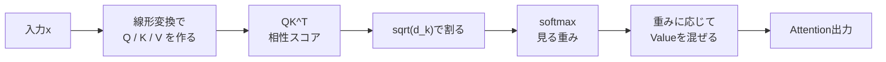
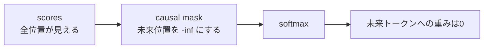

# 第14章 Attentionの数式を読む

**この章のゴール**

`Attention(Q, K, V) = softmax(QK^T / sqrt(d_k))V` を、日本語とPyTorchコードの両方で説明できるようになること。

## 14.1 Transformerの中心式

この章では、Transformerの中心にあるAttentionの数式を読みます。

Transformerを理解する上で、最初に越えるべき山は次の式です。

```text
Attention(Q, K, V) = softmax(QK^T / sqrt(d_k))V
```

初めて見ると難しそうに見えるかもしれません。

しかし、ここまで学んできた内容に分解すると、それほど特別なことはしていません。

この式の中で使われている主な要素は、次の通りです。

```text
ベクトル
行列
転置
行列積
内積
softmax
スカラー倍
重み付き和
shape
```

つまり、この式は、これまで学んできた道具の組み合わせです。

大まかに言うと、Attentionは次の処理をしています。

```text
QueryとKeyの内積で、トークン同士の相性スコアを作る
↓
スコアをsqrt(d_k)で割って調整する
↓
softmaxで重みに変換する
↓
その重みでValueを混ぜる
```

この流れを図にすると、次のようになります。



同じ流れをshapeの表として見ると、次のようになります。

| 段階 | 計算 | shape | 意味 |
|---|---|---|---|
| 入力 | `x` | `[batch_size, seq_len, d_model]` | 各トークンのベクトル |
| Q/K/V | `w_q(x)`, `w_k(x)`, `w_v(x)` | `q`, `k`: `[batch_size, seq_len, d_k]`<br/>`v`: `[batch_size, seq_len, d_v]` | Attention用の3種類の表現を作る |
| score | `q @ k.transpose(-2, -1)` | `[batch_size, seq_len, seq_len]` | 各Queryと各Keyの相性スコア |
| scale | `scores / sqrt(d_k)` | `[batch_size, seq_len, seq_len]` | スコアの大きさを調整する |
| weight | `softmax(scores, dim=-1)` | `[batch_size, seq_len, seq_len]` | 各Queryが各Keyをどれくらい見るか |
| 出力 | `weights @ v` | `[batch_size, seq_len, d_v]` | Valueを重みに応じて混ぜた新しい表現 |

もっと短く言えば、次のようになります。

```text
どのトークンをどれくらい見るかを計算して、
その重みに応じて情報を混ぜる
```

たとえば、あるトークンが文中の他のトークンを見るとき、

```text
1番目のトークンを強く見る
2番目のトークンを少し見る
3番目のトークンはあまり見ない
```

という重みを作ります。

その重みを使って、各トークンのValueを混ぜます。

この「見る重み」を作る仕組みがAttentionです。

Transformerでは、このAttentionを各層で何度も使います。

そのため、この式を読めるようになることは、Transformer理解の大きな土台になります。

この章では、次の式を一つずつ分解していきます。

```text
Attention(Q, K, V) = softmax(QK^T / sqrt(d_k))V
```

---

## 14.2 `Attention(Q, K, V) = softmax(QK^T / sqrt(d_k))V`

まず、式全体を見ます。

```text
Attention(Q, K, V) = softmax(QK^T / sqrt(d_k))V
```

左辺は、Attentionという関数を表しています。

```text
Attention(Q, K, V)
```

これは、

```text
Q, K, V を入力として受け取り、
Attentionの出力を返す
```

という意味です。

ここで、Q、K、Vはそれぞれ次の意味を持ちます。

```text
Q: Query
K: Key
V: Value
```

直感的には、次のように考えます。

```text
Query: 自分が探しているもの
Key: 自分が持っているラベル
Value: 実際に渡す中身
```

Attentionでは、まずQueryとKeyの相性を計算します。

```text
QK^T
```

これは、QueryとKeyの内積をまとめて計算する部分です。

次に、そのスコアを `sqrt(d_k)` で割ります。

```text
QK^T / sqrt(d_k)
```

これは、スコアが大きくなりすぎるのを防ぐための調整です。

次に、softmaxをかけます。

```text
softmax(QK^T / sqrt(d_k))
```

これによって、相性スコアが重みに変換されます。

最後に、その重みをValueに掛けます。

```text
softmax(QK^T / sqrt(d_k))V
```

これによって、重みに応じてValueを混ぜます。

つまり、式全体は次のように読めます。

```text
QueryとKeyの相性を計算する
↓
スコアを調整する
↓
softmaxで重みにする
↓
その重みでValueを混ぜる
```

この式の中で一番重要なのは、次の流れです。

```text
score = QK^T
weight = softmax(score / sqrt(d_k))
output = weight V
```

実装では、かなり近い形で次のように書けます。

```python
scores = q @ k.transpose(-2, -1)
scores = scores / math.sqrt(d_k)
weights = torch.softmax(scores, dim=-1)
out = weights @ v
```

これがAttentionの中心部分です。

---

## 14.3 Q, K, Vのshape

Attentionの式を理解するには、shapeを追うことが非常に重要です。

まず、1つの文だけを考えます。

トークン数を `seq_len` とします。

QueryとKeyの次元数を `d_k` とします。

Valueの次元数を `d_v` とします。

このとき、Q、K、Vのshapeは次のようになります。

```text
Q: [seq_len, d_k]
K: [seq_len, d_k]
V: [seq_len, d_v]
```

たとえば、トークン数が4個で、`d_k = 3`、`d_v = 5` なら、次のようになります。

```text
Q: [4, 3]
K: [4, 3]
V: [4, 5]
```

ここで、QとKの最後の次元が同じであることが重要です。

```text
Q: [seq_len, d_k]
K: [seq_len, d_k]
```

なぜなら、QueryとKeyの内積を計算するからです。

内積を計算するには、2つのベクトルの次元数が同じである必要があります。

```text
Query: [d_k]
Key:   [d_k]

Query・Key → スカラー
```

一方、Valueの次元数 `d_v` は、理屈の上では `d_k` と違っていても構いません。

```text
V: [seq_len, d_v]
```

なぜなら、Valueは相性スコアを作るためではなく、最後に重みに応じて混ぜられる中身だからです。

Attentionの出力shapeは、Valueの最後の次元に依存します。

```text
output: [seq_len, d_v]
```

実際のTransformerでは、多くの場合、最終的に `d_model` に戻るように設計します。

また、バッチ付きの場合は、先頭に `batch_size` が付きます。

```text
Q: [batch_size, seq_len, d_k]
K: [batch_size, seq_len, d_k]
V: [batch_size, seq_len, d_v]
```

たとえば、

```text
batch_size = 2
seq_len = 4
d_k = 3
d_v = 5
```

なら、shapeは次のようになります。

```text
Q: [2, 4, 3]
K: [2, 4, 3]
V: [2, 4, 5]
```

PyTorchでは、このバッチ付きのshapeを扱うことが多いです。

```python
import torch

batch_size = 2
seq_len = 4
d_k = 3
d_v = 5

q = torch.randn(batch_size, seq_len, d_k)
k = torch.randn(batch_size, seq_len, d_k)
v = torch.randn(batch_size, seq_len, d_v)

print("q:", q.shape)
print("k:", k.shape)
print("v:", v.shape)
```

出力は次のようになります。

```text
q: torch.Size([2, 4, 3])
k: torch.Size([2, 4, 3])
v: torch.Size([2, 4, 5])
```

このshapeを出発点として、Attentionの式を追っていきます。

---

## 14.4 `QK^T` で何を計算しているのか

Attentionの最初の重要な計算は、次の部分です。

```text
QK^T
```

これは、QueryとKeyの内積をまとめて計算しています。

まず、1つの文だけを考えます。

```text
Q: [seq_len, d_k]
K: [seq_len, d_k]
```

このまま `QK` を計算することはできません。

```text
[seq_len, d_k] @ [seq_len, d_k]
```

内側の次元が一致しないからです。

そこで、`K` を転置します。

```text
K^T: [d_k, seq_len]
```

すると、次の行列積ができます。

```text
QK^T: [seq_len, d_k] @ [d_k, seq_len]
```

結果のshapeは次のようになります。

```text
[seq_len, seq_len]
```

この `[seq_len, seq_len]` の行列は、各トークン同士の相性スコアを表します。

たとえば、`seq_len = 4` なら、結果は4×4の行列です。

```text
[
  [q1・k1, q1・k2, q1・k3, q1・k4],
  [q2・k1, q2・k2, q2・k3, q2・k4],
  [q3・k1, q3・k2, q3・k3, q3・k4],
  [q4・k1, q4・k2, q4・k3, q4・k4]
]
```

ここで、`q2・k3` は、

```text
2番目のトークンのQueryが、
3番目のトークンのKeyとどれくらい相性がよいか
```

を表します。

つまり、2番目のトークンが3番目のトークンを見るスコアです。

Attentionでは、すべてのトークンが、すべてのトークンを見る可能性があります。

```text
token_1 → token_1, token_2, token_3, token_4
token_2 → token_1, token_2, token_3, token_4
token_3 → token_1, token_2, token_3, token_4
token_4 → token_1, token_2, token_3, token_4
```

この全組み合わせのスコアを、`QK^T` によって一度に計算しています。

バッチ付きの場合は、次のようになります。

```text
Q: [batch_size, seq_len, d_k]
K: [batch_size, seq_len, d_k]
```

PyTorchでは、最後の2次元だけを転置します。

```text
K.transpose(-2, -1): [batch_size, d_k, seq_len]
```

そして行列積を計算します。

```text
QK^T:
[batch_size, seq_len, d_k] @ [batch_size, d_k, seq_len]
→ [batch_size, seq_len, seq_len]
```

PyTorchで確認します。

```python
import torch

batch_size = 2
seq_len = 4
d_k = 3

q = torch.randn(batch_size, seq_len, d_k)
k = torch.randn(batch_size, seq_len, d_k)

scores = q @ k.transpose(-2, -1)

print("q:", q.shape)
print("k:", k.shape)
print("k^T:", k.transpose(-2, -1).shape)
print("scores:", scores.shape)
```

出力は次のようになります。

```text
q: torch.Size([2, 4, 3])
k: torch.Size([2, 4, 3])
k^T: torch.Size([2, 3, 4])
scores: torch.Size([2, 4, 4])
```

この `scores` がAttention scoreです。

```text
scores: [batch_size, seq_len, seq_len]
```

各バッチごとに、トークン同士の相性スコア表ができています。

---

## 14.5 `sqrt(d_k)` で割る理由

Attentionの式では、`QK^T` をそのままsoftmaxに入れるのではなく、`sqrt(d_k)` で割ります。

```text
QK^T / sqrt(d_k)
```

これは、スコアの大きさを調整するためです。

QueryとKeyの内積は、次元数 `d_k` の分だけ掛け算して足し合わせます。

たとえば、`d_k = 3` なら、内積は次のような形です。

```text
q・k = q1*k1 + q2*k2 + q3*k3
```

`d_k = 64` なら、64個の項を足します。

```text
q・k = q1*k1 + q2*k2 + ... + q64*k64
```

次元数が大きくなると、内積の値も大きくなりやすくなります。

内積スコアが大きくなりすぎると、softmaxが極端になります。

たとえば、次のようなスコアを考えます。

```text
[20.0, 1.0, 0.0]
```

softmaxをかけると、ほとんど1番目だけに重みが集まります。

```text
[ほぼ1.0, ほぼ0.0, ほぼ0.0]
```

このようにsoftmaxが極端になると、学習が不安定になりやすくなります。

そこで、Transformerでは、softmaxに入れる前に `sqrt(d_k)` で割ります。

```text
scores = QK^T / sqrt(d_k)
```

たとえば、`d_k = 64` なら、

```text
sqrt(d_k) = sqrt(64) = 8
```

なので、スコアを8で割ります。

```text
scores = QK^T / 8
```

これにより、softmaxに入る値のスケールを抑えます。

この処理を含むAttentionは、**scaled dot-product attention** と呼ばれます。

```text
dot-product:
QueryとKeyの内積を使う

scaled:
sqrt(d_k)で割ってスケールを調整する
```

PyTorchでは、次のように書きます。

```python
import math

scores = q @ k.transpose(-2, -1)
scores = scores / math.sqrt(d_k)
```

または、次のように1行で書くこともあります。

```python
scores = (q @ k.transpose(-2, -1)) / math.sqrt(d_k)
```

ここで重要なのは、`sqrt(d_k)` で割ることによって、Attention scoreのスケールを調整しているということです。

```text
QK^T
↓
スコアが大きくなりすぎる可能性がある
↓
sqrt(d_k)で割る
↓
softmaxが極端になりすぎるのを防ぐ
```

---

## 14.6 softmaxで重みに変換する

次に、スケーリングしたスコアにsoftmaxをかけます。

```text
softmax(QK^T / sqrt(d_k))
```

ここで、softmaxは最後の次元に沿ってかけます。

バッチ付きの場合、Attention scoreのshapeは次の通りです。

```text
scores: [batch_size, seq_len, seq_len]
```

この最後の `seq_len` は、

```text
各Queryが、どのKeyを見るか
```

を表す次元です。

そのため、最後の次元にsoftmaxをかけます。

```python
weights = torch.softmax(scores, dim=-1)
```

これにより、各Queryごとに、全Keyへの重みの合計が1になります。

たとえば、あるQueryについて、スコアが次のようだったとします。

```text
[2.0, 1.0, 0.0]
```

softmaxをかけると、次のようになります。

```text
[0.665, 0.245, 0.090]
```

これは、

```text
1番目のKeyを強く見る
2番目のKeyを少し見る
3番目のKeyはあまり見ない
```

という重みです。

Attention score行列全体に対しては、各行ごとにsoftmaxをかけることになります。

```text
scores = [
  [2.0, 1.0, 0.0],
  [0.5, 1.5, 0.0],
  [1.0, 1.0, 2.0]
]
```

softmax後は、おおよそ次のようになります。

```text
weights = [
  [0.665, 0.245, 0.090],
  [0.231, 0.629, 0.140],
  [0.212, 0.212, 0.576]
]
```

各行の合計は1です。

```text
1行目: 0.665 + 0.245 + 0.090 = 1.000
2行目: 0.231 + 0.629 + 0.140 = 1.000
3行目: 0.212 + 0.212 + 0.576 = 1.000
```

この `weights` がAttention weightです。

```text
Attention score
↓ softmax
Attention weight
```

Attention weightは、各トークンが他のトークンをどれくらい参照するかを表します。

```text
weights[i, j]
=
i番目のトークンがj番目のトークンを見る重み
```

バッチ付きの場合は、次のように考えます。

```text
weights[b, i, j]
=
b番目の文で、
i番目のトークンが、
j番目のトークンを見る重み
```

PyTorchで確認します。

```python
import torch

scores = torch.tensor([
    [2.0, 1.0, 0.0],
    [0.5, 1.5, 0.0],
    [1.0, 1.0, 2.0],
])

weights = torch.softmax(scores, dim=-1)

print(weights)
print(weights.sum(dim=-1))
```

出力は次のようになります。

```text
tensor([[0.6652, 0.2447, 0.0900],
        [0.2312, 0.6285, 0.1402],
        [0.2119, 0.2119, 0.5761]])
tensor([1.0000, 1.0000, 1.0000])
```

このように、softmaxによって、相性スコアは重みに変換されます。

---

## 14.7 重み付き和としてValueを混ぜる

softmaxでAttention weightを作ったら、最後にValueを混ぜます。

式では次の部分です。

```text
softmax(QK^T / sqrt(d_k))V
```

ここで、

```text
weights = softmax(QK^T / sqrt(d_k))
```

と置くと、Attentionの出力は次のように書けます。

```text
out = weights V
```

shapeを見ます。

1つの文だけなら、次の通りです。

```text
weights: [seq_len, seq_len]
V:       [seq_len, d_v]
```

この行列積は計算できます。

```text
[seq_len, seq_len] @ [seq_len, d_v] → [seq_len, d_v]
```

つまり、出力は次のshapeになります。

```text
out: [seq_len, d_v]
```

これは、各トークンに対する新しいベクトル表現です。

中身を見てみます。

たとえば、あるトークンのAttention weightが次のようだったとします。

```text
[0.6, 0.3, 0.1]
```

Valueが次のようだったとします。

```text
v1 = [1.0, 0.0]
v2 = [0.0, 2.0]
v3 = [3.0, 1.0]
```

このトークンの出力は、Valueの重み付き和になります。

```text
out = 0.6*v1 + 0.3*v2 + 0.1*v3
```

計算すると、

```text
0.6*v1 = [0.6, 0.0]
0.3*v2 = [0.0, 0.6]
0.1*v3 = [0.3, 0.1]
```

これらを足します。

```text
out = [0.6, 0.0] + [0.0, 0.6] + [0.3, 0.1]
out = [0.9, 0.7]
```

つまり、このトークンの新しい表現は、他のトークンのValueを重みに応じて混ぜたものになります。

```text
強く見ているトークンのValueは強く反映される
あまり見ていないトークンのValueは少しだけ反映される
```

これがAttentionの出力です。

すべてのトークンについて、同じことをまとめて計算したものが、

```text
weights @ V
```

です。

PyTorchで確認します。

```python
import torch

weights = torch.tensor([
    [0.6, 0.3, 0.1],
    [0.2, 0.7, 0.1],
    [0.1, 0.2, 0.7],
])

V = torch.tensor([
    [1.0, 0.0],
    [0.0, 2.0],
    [3.0, 1.0],
])

out = weights @ V

print(out)
print(out.shape)
```

出力は次のようになります。

```text
tensor([[0.9000, 0.7000],
        [0.5000, 1.5000],
        [2.2000, 1.1000]])
torch.Size([3, 2])
```

shapeは次の通りです。

```text
weights: [3, 3]
V:       [3, 2]

out:     [3, 2]
```

このように、Attentionの最後では、Attention weightを使ってValueを混ぜています。

---

## 14.8 Self-Attentionを一行ずつ分解する

ここでは、Self-Attentionの計算をPyTorchで一行ずつ分解します。

まず、入力 `x` を用意します。

```python
import torch
import torch.nn as nn
import math

batch_size = 2
seq_len = 4
d_model = 8
d_k = 8
d_v = 8

x = torch.randn(batch_size, seq_len, d_model)

print("x:", x.shape)
```

出力は次のようになります。

```text
x: torch.Size([2, 4, 8])
```

これは、

```text
2個の文
各文は4トークン
各トークンは8次元ベクトル
```

という意味です。

次に、Q/K/Vを作るための線形層を用意します。

```python
w_q = nn.Linear(d_model, d_k)
w_k = nn.Linear(d_model, d_k)
w_v = nn.Linear(d_model, d_v)
```

入力 `x` からQ/K/Vを作ります。

```python
q = w_q(x)
k = w_k(x)
v = w_v(x)

print("q:", q.shape)
print("k:", k.shape)
print("v:", v.shape)
```

出力は次のようになります。

```text
q: torch.Size([2, 4, 8])
k: torch.Size([2, 4, 8])
v: torch.Size([2, 4, 8])
```

次に、QueryとKeyの内積をまとめて計算します。

```python
scores = q @ k.transpose(-2, -1)

print("scores:", scores.shape)
```

出力は次のようになります。

```text
scores: torch.Size([2, 4, 4])
```

shapeは次のように変わっています。

```text
q:                   [2, 4, 8]
k.transpose(-2, -1): [2, 8, 4]

scores:              [2, 4, 4]
```

次に、`sqrt(d_k)` で割ります。

```python
scores = scores / math.sqrt(d_k)
```

shapeは変わりません。

```text
scores: [2, 4, 4]
```

次に、softmaxをかけてAttention weightを作ります。

```python
weights = torch.softmax(scores, dim=-1)

print("weights:", weights.shape)
print(weights.sum(dim=-1))
```

出力は次のようになります。

```text
weights: torch.Size([2, 4, 4])
tensor([[1.0000, 1.0000, 1.0000, 1.0000],
        [1.0000, 1.0000, 1.0000, 1.0000]], grad_fn=<SumBackward1>)
```

各Queryについて、全Keyへの重みの合計が1になっています。

最後に、Valueを混ぜます。

```python
out = weights @ v

print("out:", out.shape)
```

出力は次のようになります。

```text
out: torch.Size([2, 4, 8])
```

shapeの流れは次の通りです。

```text
weights: [2, 4, 4]
v:       [2, 4, 8]

out:     [2, 4, 8]
```

全体のコードをまとめると、次のようになります。

```python
import torch
import torch.nn as nn
import math

batch_size = 2
seq_len = 4
d_model = 8
d_k = 8
d_v = 8

x = torch.randn(batch_size, seq_len, d_model)

w_q = nn.Linear(d_model, d_k)
w_k = nn.Linear(d_model, d_k)
w_v = nn.Linear(d_model, d_v)

q = w_q(x)
k = w_k(x)
v = w_v(x)

scores = q @ k.transpose(-2, -1)
scores = scores / math.sqrt(d_k)

weights = torch.softmax(scores, dim=-1)

out = weights @ v

print("x:", x.shape)
print("q:", q.shape)
print("k:", k.shape)
print("v:", v.shape)
print("scores:", scores.shape)
print("weights:", weights.shape)
print("out:", out.shape)
```

出力は次のようになります。

```text
x: torch.Size([2, 4, 8])
q: torch.Size([2, 4, 8])
k: torch.Size([2, 4, 8])
v: torch.Size([2, 4, 8])
scores: torch.Size([2, 4, 4])
weights: torch.Size([2, 4, 4])
out: torch.Size([2, 4, 8])
```

このコードが、Self-Attentionの中心部分です。

ただし、実際のTransformerでは、さらに次の要素が加わります。

```text
mask
Multi-Head Attention
出力線形層
Dropout
Residual Connection
LayerNorm
```

この章では、まずAttentionの中心式を読めるようになることを目的にしています。

---

## 14.9 Attentionを関数として実装する

ここでは、Attentionを関数として実装します。

まず、Q、K、Vを受け取って、Attentionの出力を返す関数を書きます。

```python
import torch
import math

def scaled_dot_product_attention(q, k, v):
    d_k = q.size(-1)

    scores = q @ k.transpose(-2, -1)
    scores = scores / math.sqrt(d_k)

    weights = torch.softmax(scores, dim=-1)

    out = weights @ v

    return out, weights
```

この関数は、次の式に対応しています。

```text
Attention(Q, K, V) = softmax(QK^T / sqrt(d_k))V
```

各行は、数式の各部分に対応しています。

```python
d_k = q.size(-1)
```

これは、Queryの最後の次元を取り出しています。

```text
d_k
```

次に、Attention scoreを計算します。

```python
scores = q @ k.transpose(-2, -1)
```

これは、

```text
QK^T
```

に対応します。

次に、スケーリングします。

```python
scores = scores / math.sqrt(d_k)
```

これは、

```text
QK^T / sqrt(d_k)
```

に対応します。

次に、softmaxをかけます。

```python
weights = torch.softmax(scores, dim=-1)
```

これは、

```text
softmax(QK^T / sqrt(d_k))
```

に対応します。

最後に、Valueを混ぜます。

```python
out = weights @ v
```

これは、

```text
softmax(QK^T / sqrt(d_k))V
```

に対応します。

動かしてみます。

```python
import torch
import math

def scaled_dot_product_attention(q, k, v):
    d_k = q.size(-1)

    scores = q @ k.transpose(-2, -1)
    scores = scores / math.sqrt(d_k)

    weights = torch.softmax(scores, dim=-1)

    out = weights @ v

    return out, weights

batch_size = 2
seq_len = 4
d_k = 8
d_v = 8

q = torch.randn(batch_size, seq_len, d_k)
k = torch.randn(batch_size, seq_len, d_k)
v = torch.randn(batch_size, seq_len, d_v)

out, weights = scaled_dot_product_attention(q, k, v)

print("q:", q.shape)
print("k:", k.shape)
print("v:", v.shape)
print("weights:", weights.shape)
print("out:", out.shape)
print("weights row sums:")
print(weights.sum(dim=-1))
```

出力は次のようになります。

```text
q: torch.Size([2, 4, 8])
k: torch.Size([2, 4, 8])
v: torch.Size([2, 4, 8])
weights: torch.Size([2, 4, 4])
out: torch.Size([2, 4, 8])
weights row sums:
tensor([[1.0000, 1.0000, 1.0000, 1.0000],
        [1.0000, 1.0000, 1.0000, 1.0000]])
```

この関数が理解できれば、Attentionの中心式はかなり理解できています。

---

## 14.10 maskが必要になる場合

ここまでのAttentionでは、すべてのトークンがすべてのトークンを見られる前提でした。

```text
token_1 → token_1, token_2, token_3, ...
token_2 → token_1, token_2, token_3, ...
token_3 → token_1, token_2, token_3, ...
```

しかし、言語モデル、特にGPTのようなDecoder-only Transformerでは、未来のトークンを見てはいけません。

たとえば、次の文を考えます。

```text
I love dogs
```

次トークン予測では、`I` の位置で `love` や `dogs` を見てはいけません。

```text
I の位置:
見てよい: I
見てはいけない: love, dogs
```

`I love` の位置では、`dogs` を見てはいけません。

```text
love の位置:
見てよい: I, love
見てはいけない: dogs
```

なぜなら、未来の正解を見てしまうと、次トークン予測の学習にならないからです。

そのため、Decoder-onlyのSelf-Attentionでは、未来方向を隠すmaskを使います。

これを **causal mask** と呼びます。

たとえば、`seq_len = 4` の場合、見てよい位置を1、見てはいけない位置を0で表すと、次のようになります。

```text
[
  [1, 0, 0, 0],
  [1, 1, 0, 0],
  [1, 1, 1, 0],
  [1, 1, 1, 1]
]
```

これは、各位置が自分より未来の位置を見ないようにするmaskです。

maskを使うと、Attention scoreから未来の位置が消えます。



Attention scoreに対して、見てはいけない位置を非常に小さい値にします。

```text
scores[mask == 0] = -inf
```

すると、softmax後にその位置の重みはほぼ0になります。

PyTorchで簡単に書くと、次のようになります。

```python
import torch
import math

batch_size = 2
seq_len = 4
d_k = 8

q = torch.randn(batch_size, seq_len, d_k)
k = torch.randn(batch_size, seq_len, d_k)

scores = q @ k.transpose(-2, -1)
scores = scores / math.sqrt(d_k)

mask = torch.tril(torch.ones(seq_len, seq_len))

scores = scores.masked_fill(mask == 0, float("-inf"))

weights = torch.softmax(scores, dim=-1)

print("mask:")
print(mask)

print("weights:")
print(weights)

print("weights row sums:")
print(weights.sum(dim=-1))
```

`torch.tril` は、下三角行列を作る関数です。

```text
tril
=
lower triangular
=
下三角
```

maskは次のようになります。

```text
tensor([[1., 0., 0., 0.],
        [1., 1., 0., 0.],
        [1., 1., 1., 0.],
        [1., 1., 1., 1.]])
```

softmax後、未来の位置の重みは0になります。

このmaskは、『Attention Is All You Need』のDecoder側や、GPT系のDecoder-only Transformerを理解するときに重要です。

ただし、Encoder側のSelf-Attentionでは、通常は未来を隠す必要はありません。

```text
Encoder:
入力文全体を見てよい

Decoder:
未来の出力トークンを見てはいけない
```

この章では、まずAttentionの基本式を理解することが中心です。

maskは、その基本式に「見てはいけない場所を隠す」処理を加えたものだと考えるとよいです。

---

## 14.11 Self-AttentionとCross-Attention

ここまで主にSelf-Attentionを扱ってきました。

Self-Attentionでは、Q、K、Vが同じ入力列から作られます。

```text
x
↓
Q = xW_Q
K = xW_K
V = xW_V
```

つまり、同じ文の中で、各トークンが他のトークンを見ます。

```text
同じ系列の中でAttentionする
```

これがSelf-Attentionです。

一方、Encoder-Decoder Transformerでは、Decoder側に **Cross-Attention** もあります。

Cross-Attentionでは、QはDecoder側から作り、KとVはEncoder側の出力から作ります。

```text
Decoder側の状態
↓
Q

Encoder側の出力
↓
K, V
```

これは、Decoderが出力を作るときに、Encoderが読んだ入力文を参照するためのAttentionです。

たとえば、機械翻訳を考えます。

```text
入力文: I love dogs
出力文: 私は犬が好きです
```

Encoderは入力文を読みます。

```text
I love dogs
↓
Encoder
↓
Encoder output
```

Decoderは日本語の文を生成します。

そのとき、DecoderはEncoder outputを見る必要があります。

```text
Decoderの現在の状態
↓
Cross-AttentionでEncoder outputを見る
↓
次の日本語トークンを予測する
```

このときのAttentionは、Self-Attentionとは少し違います。

Self-Attentionでは、Q、K、Vが同じ系列から来ます。

```text
Q: 同じ系列
K: 同じ系列
V: 同じ系列
```

Cross-Attentionでは、QとK/Vの出どころが違います。

```text
Q: Decoder側
K: Encoder側
V: Encoder側
```

ただし、Attentionの数式自体は同じです。

```text
Attention(Q, K, V) = softmax(QK^T / sqrt(d_k))V
```

違うのは、Q、K、Vをどこから作るかです。

```text
Self-Attention:
Q, K, Vを同じ入力から作る

Cross-Attention:
QをDecoderから作り、K,VをEncoder出力から作る
```

GPTのようなDecoder-only Transformerでは、基本的にCross-Attentionはありません。

主にcausal mask付きのSelf-Attentionを使います。

BERTのようなEncoder-only Transformerでは、入力全体を見られるSelf-Attentionを使います。

元論文のTransformerは、機械翻訳用のEncoder-Decoder構造なので、Encoder Self-Attention、Decoder Self-Attention、Encoder-Decoder Attentionが登場します。

この違いを押さえておくと、Transformer系モデルの構造を理解しやすくなります。

---

## 14.12 PyTorchでmask付きAttentionを関数にする

ここでは、maskを受け取れるAttention関数を書きます。

```python
import torch
import math

def scaled_dot_product_attention(q, k, v, mask=None):
    d_k = q.size(-1)

    scores = q @ k.transpose(-2, -1)
    scores = scores / math.sqrt(d_k)

    if mask is not None:
        scores = scores.masked_fill(mask == 0, float("-inf"))

    weights = torch.softmax(scores, dim=-1)

    out = weights @ v

    return out, weights
```

この関数では、`mask` が指定された場合だけ、見てはいけない位置を `-inf` にしています。

```python
if mask is not None:
    scores = scores.masked_fill(mask == 0, float("-inf"))
```

`-inf` にした位置は、softmax後に重みがほぼ0になります。

試してみます。

```python
import torch
import math

def scaled_dot_product_attention(q, k, v, mask=None):
    d_k = q.size(-1)

    scores = q @ k.transpose(-2, -1)
    scores = scores / math.sqrt(d_k)

    if mask is not None:
        scores = scores.masked_fill(mask == 0, float("-inf"))

    weights = torch.softmax(scores, dim=-1)

    out = weights @ v

    return out, weights

batch_size = 1
seq_len = 4
d_k = 8
d_v = 8

q = torch.randn(batch_size, seq_len, d_k)
k = torch.randn(batch_size, seq_len, d_k)
v = torch.randn(batch_size, seq_len, d_v)

mask = torch.tril(torch.ones(seq_len, seq_len))

out, weights = scaled_dot_product_attention(q, k, v, mask)

print("mask:")
print(mask)

print("weights:")
print(weights)

print("out:", out.shape)
```

出力される `weights` では、未来方向の重みが0になります。

たとえば、1番目のトークンは1番目だけを見ます。

```text
[1, 0, 0, 0]
```

2番目のトークンは1番目と2番目だけを見ます。

```text
[重み, 重み, 0, 0]
```

3番目のトークンは1番目から3番目までを見ます。

```text
[重み, 重み, 重み, 0]
```

このように、maskを使うことで、Attentionの見える範囲を制御できます。

---

## 14.13 Attentionの式を日本語で説明する

ここまで来たら、Attentionの式を日本語で説明できるか確認します。

式は次の通りです。

```text
Attention(Q, K, V) = softmax(QK^T / sqrt(d_k))V
```

まず、Q、K、Vを説明します。

```text
QはQueryで、自分が探しているものを表す
KはKeyで、自分がどんな情報を持っているかを表す
VはValueで、実際に渡す中身を表す
```

次に、`QK^T` を説明します。

```text
QK^Tは、すべてのQueryとすべてのKeyの内積をまとめて計算したもの
```

これは、トークン同士の相性スコアです。

```text
各トークンが、各トークンをどれくらい見るべきかのスコア
```

次に、`sqrt(d_k)` で割る理由です。

```text
内積の値が大きくなりすぎるのを防ぐために、sqrt(d_k)で割ってスケールを調整する
```

次に、softmaxです。

```text
softmaxは、相性スコアを合計1の重みに変換する
```

この重みは、どのトークンをどれくらい見るかを表します。

```text
Attention weight
```

最後に、`V` を掛ける部分です。

```text
Attention weightをValueに掛けることで、重みに応じてValueを混ぜる
```

全体を一文で言うと、次のようになります。

```text
Attentionは、QueryとKeyの内積でトークン同士の相性を計算し、そのスコアをsoftmaxで重みに変換し、その重みに応じてValueを混ぜる仕組みである。
```

さらに短く言うなら、次のようになります。

```text
Attentionは、各トークンが他のトークンをどれくらい参照するかを計算し、その情報を混ぜて新しい表現を作る仕組みである。
```

この説明が自分の言葉でできるようになれば、Attentionの中心はかなり理解できています。

---

## 14.14 まとめ

この章では、Attentionの中心式を読みました。

式は次の通りです。

```text
Attention(Q, K, V) = softmax(QK^T / sqrt(d_k))V
```

この式は、次の処理に分解できます。

```text
QK^T
↓
QueryとKeyの内積で相性スコアを作る

/ sqrt(d_k)
↓
スコアの大きさを調整する

softmax
↓
相性スコアを重みに変換する

weights @ V
↓
重みに応じてValueを混ぜる
```

Q、K、Vは次の意味を持ちます。

```text
Q: Query
K: Key
V: Value
```

直感的には、次のように考えられます。

```text
Query: 自分が探しているもの
Key: 自分が持っているラベル
Value: 実際に渡す中身
```

Self-Attentionでは、Q、K、Vは同じ入力から作られます。

```text
q = W_Q(x)
k = W_K(x)
v = W_V(x)
```

Attention scoreのshapeは次のようになります。

```text
Q: [batch_size, seq_len, d_k]
K: [batch_size, seq_len, d_k]

QK^T: [batch_size, seq_len, seq_len]
```

この `[seq_len, seq_len]` は、各トークンが各トークンを見るためのスコア表です。

softmaxをかけると、Attention weightになります。

```text
weights: [batch_size, seq_len, seq_len]
```

各行の合計は1になります。

```text
各Queryについて、全Keyへの重みの合計が1
```

最後に、Valueを混ぜます。

```text
out = weights @ V
```

shapeは次のようになります。

```text
weights: [batch_size, seq_len, seq_len]
V:       [batch_size, seq_len, d_v]

out:     [batch_size, seq_len, d_v]
```

この章で特に重要なのは、次の理解です。

```text
QK^Tはトークン同士の相性スコアを作る
sqrt(d_k)で割るのはスコアのスケールを調整するため
softmaxはスコアを重みに変換する
weights @ VはValueを重みに応じて混ぜる
Attentionの出力は、文脈を反映した新しいトークン表現である
```

また、Decoder-only Transformerでは、未来のトークンを見ないようにmaskを使います。

```text
causal mask
```

見てはいけない位置を `-inf` にすることで、softmax後の重みを0にできます。

```text
scores = scores.masked_fill(mask == 0, -inf)
```

### 確認問題

次の式を、PyTorchの計算に対応させて説明してください。

```text
Attention(Q, K, V) = softmax(QK^T / sqrt(d_k))V
```

答えは、たとえば次のようになります。

```python
scores = q @ k.transpose(-2, -1)
scores = scores / math.sqrt(d_k)
weights = torch.softmax(scores, dim=-1)
out = weights @ v
```

`examples/03_attention.py` を実行すると、shapeとcausal maskの動きをまとめて確認できます。

### よくある誤解

Attention weightは、Valueそのものではありません。

Attention weightは、Valueをどの割合で混ぜるかを決める重みです。

また、causal maskはValueを消すのではなく、softmax前のscoreを `-inf` にして、未来位置の重みを0にします。

この章を理解すると、Transformerの中心部分であるSelf-Attentionの数式が読めるようになります。

次章では、ここまで学んだ数学を使って、PyTorchで小さなAttention計算をさらに実装として確認します。

数式を読むだけでなく、実際にテンソルを作り、shapeを追いながら、Attentionがどのように動くかを確かめます。
