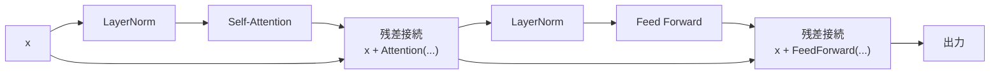

# 第15章 実装で確認する数学

## 15.1 この章の目的

ここまで、Transformerを理解するために必要な数学を学んできました。

具体的には、次のような内容です。

```text
スカラー
ベクトル
行列
テンソル
shape
内積
行列積
転置
線形変換
softmax
確率分布
cross entropy
微分
勾配
勾配降下法
LayerNorm
Attentionの数式
```

この章では、それらをPyTorchで実際に確認します。

目的は、数学を「読める」だけでなく、「コードとして動かせる」ようにすることです。

Transformerを実装するとき、数式だけを眺めていても理解しにくいことがあります。

たとえば、次の式があります。

```text
Attention(Q, K, V) = softmax(QK^T / sqrt(d_k))V
```

この式を見て、

```text
QK^T は何をしているのか
softmax はどの次元にかけるのか
V を掛けるとshapeはどうなるのか
```

を理解するには、実際にテンソルを作ってshapeを確認するのが効果的です。

この章では、次の順番で確認します。

```text
ベクトルをPyTorchで作る
行列積をPyTorchで計算する
softmaxを自分で実装する
cross entropyを手計算してPyTorchと比べる
勾配降下法を小さな例で実装する
Q/K/Vを作ってAttentionを計算する
PyTorchのテンソルでshapeを確認する
```

ここで重要なのは、難しいモデルをいきなり作ることではありません。

まず、小さなテンソルで、1つずつ意味を確認します。

```text
小さい例で理解する
↓
shapeを追えるようになる
↓
Transformer実装に進む
```

この章のコードは、すべて学習用の小さな例です。

実用的な性能を出すためのコードではありません。

目的は、Transformer実装の前に、数学とPyTorchの対応を確認することです。

---

## 15.2 ベクトルをPythonで作る

まず、ベクトルをPyTorchで作ります。

ベクトルは、数を一列に並べたものです。

```text
[1.0, 2.0, 3.0]
```

PyTorchでは、`torch.tensor` を使って作れます。

```python
import torch

x = torch.tensor([1.0, 2.0, 3.0])

print(x)
print(x.shape)
```

出力は次のようになります。

```text
tensor([1., 2., 3.])
torch.Size([3])
```

shapeは次の通りです。

```text
[3]
```

これは、3個の要素を持つベクトルです。

次に、ベクトル同士の足し算をします。

```python
import torch

a = torch.tensor([1.0, 2.0, 3.0])
b = torch.tensor([4.0, 5.0, 6.0])

c = a + b

print(c)
```

出力は次のようになります。

```text
tensor([5., 7., 9.])
```

これは、対応する要素同士を足しています。

```text
[1.0, 2.0, 3.0] + [4.0, 5.0, 6.0]
=
[5.0, 7.0, 9.0]
```

次に、スカラー倍をします。

```python
import torch

a = torch.tensor([1.0, 2.0, 3.0])

b = 2.0 * a

print(b)
```

出力は次のようになります。

```text
tensor([2., 4., 6.])
```

これは、各要素を2倍しています。

```text
2.0 * [1.0, 2.0, 3.0]
=
[2.0, 4.0, 6.0]
```

次に、ベクトルの長さを計算します。

```python
import torch

a = torch.tensor([3.0, 4.0])

length = torch.norm(a)

print(length)
```

出力は次のようになります。

```text
tensor(5.)
```

これは、次の計算に対応しています。

```text
sqrt(3.0^2 + 4.0^2)
=
sqrt(9.0 + 16.0)
=
sqrt(25.0)
=
5.0
```

次に、ベクトル同士の距離を計算します。

```python
import torch

a = torch.tensor([1.0, 2.0])
b = torch.tensor([4.0, 6.0])

distance = torch.norm(b - a)

print(distance)
```

出力は次のようになります。

```text
tensor(5.)
```

これは、次の計算です。

```text
b - a = [3.0, 4.0]

距離 = sqrt(3.0^2 + 4.0^2)
距離 = 5.0
```

ここまでで、ベクトルの基本操作を確認しました。

```text
ベクトル作成: torch.tensor([...])
足し算: a + b
スカラー倍: 2.0 * a
長さ: torch.norm(a)
距離: torch.norm(b - a)
```

Transformerでは、トークンは最終的にベクトルとして扱われます。

そのため、これらの操作はすべて土台になります。

---

## 15.3 行列をPythonで作る

次に、行列を作ります。

行列は、数を縦横に並べたものです。

```text
[
  [1.0, 2.0, 3.0],
  [4.0, 5.0, 6.0]
]
```

PyTorchでは、次のように書きます。

```python
import torch

x = torch.tensor([
    [1.0, 2.0, 3.0],
    [4.0, 5.0, 6.0],
])

print(x)
print(x.shape)
```

出力は次のようになります。

```text
tensor([[1., 2., 3.],
        [4., 5., 6.]])
torch.Size([2, 3])
```

shapeは次の通りです。

```text
[2, 3]
```

これは、2行3列の行列です。

Transformerでは、複数のトークンのベクトルをまとめると行列になります。

たとえば、3個のトークンがあり、それぞれが4次元ベクトルなら、shapeは次のようになります。

```text
[3, 4]
```

PyTorchで作ると、次のようになります。

```python
import torch

x = torch.tensor([
    [0.10,  0.20, -0.30, 0.40],
    [0.55, -0.12,  0.08, 0.31],
    [0.02,  0.77, -0.45, 0.19],
])

print(x)
print(x.shape)
```

出力は次のようになります。

```text
torch.Size([3, 4])
```

これは、

```text
seq_len = 3
d_model = 4
```

という意味です。

```text
3個のトークン
各トークンは4次元ベクトル
```

次に、バッチ付きのテンソルを作ります。

実際のTransformerでは、複数の文をまとめて処理することが多いです。

その場合、shapeは次のようになります。

```text
[batch_size, seq_len, d_model]
```

PyTorchでランダムに作ると、次のようになります。

```python
import torch

batch_size = 2
seq_len = 3
d_model = 4

x = torch.randn(batch_size, seq_len, d_model)

print(x.shape)
```

出力は次のようになります。

```text
torch.Size([2, 3, 4])
```

これは、

```text
2個の文
各文は3トークン
各トークンは4次元ベクトル
```

という意味です。

Transformerの実装では、このshapeを非常によく使います。

```text
[batch_size, seq_len, d_model]
```

このshapeを見たら、まず次のように読めるようになることが重要です。

```text
batch_size: まとめて処理する文の数
seq_len: トークン数
d_model: 各トークンのベクトル次元
```

---

## 15.4 行列積をPythonで計算する

次に、行列積を確認します。

行列積は、Transformerで非常に重要です。

特に、Attentionでは次の計算が出てきます。

```text
QK^T
```

まず、普通の行列積から見ます。

```python
import torch

A = torch.tensor([
    [1.0, 2.0],
    [3.0, 4.0],
])

B = torch.tensor([
    [10.0, 20.0, 30.0],
    [40.0, 50.0, 60.0],
])

C = A @ B

print(C)
print(C.shape)
```

出力は次のようになります。

```text
tensor([[ 90., 120., 150.],
        [190., 260., 330.]])
torch.Size([2, 3])
```

shapeを追うと、次のようになります。

```text
A: [2, 2]
B: [2, 3]

C: [2, 3]
```

行列積のルールは次の通りです。

```text
[a, b] @ [b, c] → [a, c]
```

この例では、

```text
[2, 2] @ [2, 3] → [2, 3]
```

です。

次に、Transformerでよく出るshapeを見ます。

```python
import torch

seq_len = 4
d_k = 3

Q = torch.randn(seq_len, d_k)
K = torch.randn(seq_len, d_k)

scores = Q @ K.T

print("Q:", Q.shape)
print("K:", K.shape)
print("K.T:", K.T.shape)
print("scores:", scores.shape)
```

出力は次のようになります。

```text
Q: torch.Size([4, 3])
K: torch.Size([4, 3])
K.T: torch.Size([3, 4])
scores: torch.Size([4, 4])
```

shapeは次の通りです。

```text
Q:   [seq_len, d_k]
K:   [seq_len, d_k]
K.T: [d_k, seq_len]

QK^T: [seq_len, seq_len]
```

つまり、

```text
[4, 3] @ [3, 4] → [4, 4]
```

です。

この `[4, 4]` は、4個のトークン同士の相性スコアです。

次に、バッチ付きで確認します。

```python
import torch

batch_size = 2
seq_len = 4
d_k = 3

Q = torch.randn(batch_size, seq_len, d_k)
K = torch.randn(batch_size, seq_len, d_k)

scores = Q @ K.transpose(-2, -1)

print("Q:", Q.shape)
print("K:", K.shape)
print("K transposed:", K.transpose(-2, -1).shape)
print("scores:", scores.shape)
```

出力は次のようになります。

```text
Q: torch.Size([2, 4, 3])
K: torch.Size([2, 4, 3])
K transposed: torch.Size([2, 3, 4])
scores: torch.Size([2, 4, 4])
```

バッチ付きでは、`.T` ではなく、次のように書くことが多いです。

```python
K.transpose(-2, -1)
```

これは、最後の2次元だけを入れ替えるという意味です。

```text
[batch_size, seq_len, d_k]
↓
[batch_size, d_k, seq_len]
```

Attentionの実装では、この形が非常によく出てきます。

---

## 15.5 softmaxを自分で実装する

次に、softmaxを自分で実装します。

softmaxは、スコアを合計1の重みに変換する関数です。

まず、PyTorchの `torch.softmax` を使います。

```python
import torch

scores = torch.tensor([2.0, 1.0, 0.0])

weights = torch.softmax(scores, dim=0)

print(weights)
print(weights.sum())
```

出力は次のようになります。

```text
tensor([0.6652, 0.2447, 0.0900])
tensor(1.)
```

softmaxの出力は、すべて0以上で、合計が1になります。

次に、自分でsoftmaxを書きます。

softmaxの式は次の通りです。

```text
softmax(x_i) = exp(x_i) / Σ exp(x_j)
```

コードにすると、次のようになります。

```python
import torch

def softmax(x):
    exp_x = torch.exp(x)
    return exp_x / exp_x.sum()

scores = torch.tensor([2.0, 1.0, 0.0])

weights = softmax(scores)

print(weights)
print(weights.sum())
```

出力は次のようになります。

```text
tensor([0.6652, 0.2447, 0.0900])
tensor(1.)
```

ただし、この実装は大きな値に弱いです。

たとえば、次のような値を考えます。

```python
scores = torch.tensor([1000.0, 1001.0, 1002.0])
```

このまま `torch.exp` を取ると、値が大きすぎて問題が起きることがあります。

そこで、最大値を引いてからsoftmaxを計算します。

```python
import torch

def stable_softmax(x):
    x = x - x.max()
    exp_x = torch.exp(x)
    return exp_x / exp_x.sum()

scores = torch.tensor([1000.0, 1001.0, 1002.0])

weights = stable_softmax(scores)

print(weights)
print(weights.sum())
```

出力は次のようになります。

```text
tensor([0.0900, 0.2447, 0.6652])
tensor(1.)
```

これは、PyTorchの `torch.softmax` と同じ結果になります。

```python
import torch

scores = torch.tensor([1000.0, 1001.0, 1002.0])

weights1 = stable_softmax(scores)
weights2 = torch.softmax(scores, dim=0)

print(weights1)
print(weights2)
print(torch.allclose(weights1, weights2))
```

出力は次のようになります。

```text
tensor([0.0900, 0.2447, 0.6652])
tensor([0.0900, 0.2447, 0.6652])
True
```

次に、行列の各行にsoftmaxをかけます。

Attentionでは、各Queryごとに、全Keyへの重みを作ります。

そのため、最後の次元にsoftmaxをかけます。

```python
import torch

scores = torch.tensor([
    [2.0, 1.0, 0.0],
    [0.5, 1.5, 0.0],
    [1.0, 1.0, 2.0],
])

weights = torch.softmax(scores, dim=-1)

print(weights)
print(weights.sum(dim=-1))
```

出力は次のようになります。

```text
tensor([[0.6652, 0.2447, 0.0900],
        [0.2312, 0.6285, 0.1402],
        [0.2119, 0.2119, 0.5761]])
tensor([1.0000, 1.0000, 1.0000])
```

各行の合計が1になっています。

Attentionでは、このようにsoftmaxを使います。

```text
scores:  [batch_size, seq_len, seq_len]
weights: [batch_size, seq_len, seq_len]
```

最後の次元に沿ってsoftmaxをかけることで、各Queryが全Keyを見る重みを作ります。

---

## 15.6 cross entropyを自分で計算する

次に、cross entropyを確認します。

cross entropyは、正解トークンにどれだけ高い確率を割り当てたかを見る損失です。

基本は次の通りです。

```text
loss = -log(正解トークンの確率)
```

まず、logitsを用意します。

```python
import torch
import torch.nn.functional as F

logits = torch.tensor([0.1, 0.2, -0.5, 2.0, 0.0])
target = torch.tensor(3)
```

ここでは、語彙サイズが5で、正解トークンIDが3だとします。

まず、softmaxで確率分布にします。

```python
probs = torch.softmax(logits, dim=-1)

print(probs)
print(probs.sum())
```

出力は次のようになります。

```text
tensor([0.0895, 0.0989, 0.0491, 0.5967, 0.0659])
tensor(1.)
```

正解トークンIDは3なので、正解確率を取り出します。

```python
p_correct = probs[target]

print(p_correct)
```

出力は次のようになります。

```text
tensor(0.5967)
```

cross entropy lossは、次のように計算します。

```python
manual_loss = -torch.log(p_correct)

print(manual_loss)
```

出力は次のようになります。

```text
tensor(0.5163)
```

次に、PyTorchの `F.cross_entropy` と比べます。

`F.cross_entropy` は、logitsにバッチ次元が必要です。

```python
loss = F.cross_entropy(
    logits.unsqueeze(0),
    target.unsqueeze(0)
)

print(loss)
```

出力は次のようになります。

```text
tensor(0.5163)
```

手計算と同じになりました。

ここで重要なのは、`F.cross_entropy` にはsoftmax後の確率ではなく、softmax前のlogitsを渡すことです。

```text
正しい:
F.cross_entropy(logits, targets)

避ける:
F.cross_entropy(torch.softmax(logits), targets)
```

次に、バッチ付き・系列付きのshapeで確認します。

```python
import torch
import torch.nn.functional as F

batch_size = 2
seq_len = 3
vocab_size = 5

logits = torch.randn(batch_size, seq_len, vocab_size)

targets = torch.tensor([
    [1, 3, 4],
    [0, 2, 3],
])

print("logits:", logits.shape)
print("targets:", targets.shape)
```

出力は次のようになります。

```text
logits: torch.Size([2, 3, 5])
targets: torch.Size([2, 3])
```

言語モデルでは、logitsのshapeは通常次のようになります。

```text
[batch_size, seq_len, vocab_size]
```

targetsのshapeは次のようになります。

```text
[batch_size, seq_len]
```

`F.cross_entropy` に渡すために、batchとseq_lenをまとめます。

```python
B, T, V = logits.shape

loss = F.cross_entropy(
    logits.reshape(B * T, V),
    targets.reshape(B * T)
)

print(loss)
```

shapeは次のように変換されています。

```text
logits:
[batch_size, seq_len, vocab_size]
↓
[batch_size * seq_len, vocab_size]

targets:
[batch_size, seq_len]
↓
[batch_size * seq_len]
```

つまり、すべての位置をまとめて分類問題として扱っています。

---

## 15.7 勾配降下法を小さな例で実装する

次に、勾配降下法を小さな例で確認します。

最小化したい関数を次のようにします。

```text
loss = (w - 5)^2
```

この関数は、`w = 5` のときに最小になります。

まず、`w = 0` から始めます。

```python
import torch

w = torch.tensor(0.0, requires_grad=True)

learning_rate = 0.1

for step in range(10):
    loss = (w - 5) ** 2

    loss.backward()

    with torch.no_grad():
        w -= learning_rate * w.grad

    w.grad.zero_()

    print(step, "w:", float(w), "loss:", float(loss))
```

出力は、おおよそ次のようになります。

```text
0 w: 1.0 loss: 25.0
1 w: 1.8 loss: 16.0
2 w: 2.44 loss: 10.24
3 w: 2.952 loss: 6.5536
4 w: 3.3616 loss: 4.1943
5 w: 3.6893 loss: 2.6844
6 w: 3.9514 loss: 1.7180
7 w: 4.1611 loss: 1.0995
8 w: 4.3289 loss: 0.7037
9 w: 4.4631 loss: 0.4504
```

`w` が5に近づいています。

lossも小さくなっています。

このコードの流れは次の通りです。

```text
1. lossを計算する
2. loss.backward()で勾配を計算する
3. 勾配の逆方向にwを更新する
4. w.gradをリセットする
5. 繰り返す
```

更新式は次の通りです。

```text
w = w - learning_rate * gradient
```

PyTorchでは、勾配は `w.grad` に入ります。

```python
w -= learning_rate * w.grad
```

ただし、パラメータ更新は計算グラフに含めたくないので、`torch.no_grad()` の中で行います。

```python
with torch.no_grad():
    w -= learning_rate * w.grad
```

また、PyTorchでは勾配が蓄積されるので、毎回リセットします。

```python
w.grad.zero_()
```

次に、optimizerを使う形でも書いてみます。

```python
import torch

w = torch.tensor(0.0, requires_grad=True)

optimizer = torch.optim.SGD([w], lr=0.1)

for step in range(10):
    loss = (w - 5) ** 2

    optimizer.zero_grad()
    loss.backward()
    optimizer.step()

    print(step, "w:", float(w), "loss:", float(loss))
```

こちらの方が、実際のニューラルネットワークの学習に近い形です。

```text
optimizer.zero_grad()
loss.backward()
optimizer.step()
```

この3行は、PyTorchの学習ループの基本です。

---

## 15.8 小さな線形モデルを学習する

次に、線形モデルを学習します。

データは、次の関係に従っているとします。

```text
y = 2x + 1
```

たとえば、次のようなデータです。

```text
x = 1 → y = 3
x = 2 → y = 5
x = 3 → y = 7
x = 4 → y = 9
```

この関係を、`nn.Linear` で学習します。

```python
import torch
import torch.nn as nn
import torch.nn.functional as F

x = torch.tensor([
    [1.0],
    [2.0],
    [3.0],
    [4.0],
])

y_true = torch.tensor([
    [3.0],
    [5.0],
    [7.0],
    [9.0],
])

model = nn.Linear(1, 1)

optimizer = torch.optim.SGD(model.parameters(), lr=0.01)

for step in range(1000):
    y_pred = model(x)

    loss = F.mse_loss(y_pred, y_true)

    optimizer.zero_grad()
    loss.backward()
    optimizer.step()

print("weight:", model.weight.data)
print("bias:", model.bias.data)
print("loss:", loss.item())
```

学習がうまくいくと、weightは2に近づき、biasは1に近づきます。

```text
weight ≒ 2
bias ≒ 1
```

この例の流れは、ニューラルネットワークの学習そのものです。

```text
入力x
↓
model
↓
予測y_pred
↓
正解y_trueと比較
↓
loss
↓
backward
↓
optimizer step
```

Transformerでも、基本の流れは同じです。

```text
token_ids
↓
Transformer
↓
logits
↓
cross entropy loss
↓
backward
↓
optimizer step
```

モデルが大きくなっても、学習ループの考え方は変わりません。

---

## 15.9 embeddingと出力層で小さな言語モデル風にする

次に、言語モデルに少し近い形を作ります。

ここでは、本物のTransformerはまだ使いません。

embeddingと出力層だけで、次トークン予測の形を確認します。

まず、トークンID列を用意します。

```python
import torch
import torch.nn as nn
import torch.nn.functional as F

token_ids = torch.tensor([
    [1, 2, 3, 4, 5],
    [2, 3, 4, 5, 6],
])
```

次トークン予測では、入力と正解を1つずらします。

```python
inputs = token_ids[:, :-1]
targets = token_ids[:, 1:]

print("inputs:")
print(inputs)
print("targets:")
print(targets)
```

出力は次のようになります。

```text
inputs:
tensor([[1, 2, 3, 4],
        [2, 3, 4, 5]])

targets:
tensor([[2, 3, 4, 5],
        [3, 4, 5, 6]])
```

これは、次の予測を学習するという意味です。

```text
1 の次は 2
2 の次は 3
3 の次は 4
4 の次は 5
```

次に、embeddingと出力層を作ります。

```python
vocab_size = 10
d_model = 8

embedding = nn.Embedding(vocab_size, d_model)
output_layer = nn.Linear(d_model, vocab_size)
```

forward計算をします。

```python
hidden = embedding(inputs)
logits = output_layer(hidden)

print("inputs:", inputs.shape)
print("hidden:", hidden.shape)
print("logits:", logits.shape)
print("targets:", targets.shape)
```

出力は次のようになります。

```text
inputs: torch.Size([2, 4])
hidden: torch.Size([2, 4, 8])
logits: torch.Size([2, 4, 10])
targets: torch.Size([2, 4])
```

shapeの流れは次の通りです。

```text
inputs:
[batch_size, seq_len]

embedding後:
hidden: [batch_size, seq_len, d_model]

出力層後:
logits: [batch_size, seq_len, vocab_size]

targets:
[batch_size, seq_len]
```

次に、cross entropy lossを計算します。

```python
B, T, V = logits.shape

loss = F.cross_entropy(
    logits.reshape(B * T, V),
    targets.reshape(B * T)
)

print(loss)
```

最後に、学習ループにします。

```python
import torch
import torch.nn as nn
import torch.nn.functional as F

token_ids = torch.tensor([
    [1, 2, 3, 4, 5],
    [2, 3, 4, 5, 6],
])

inputs = token_ids[:, :-1]
targets = token_ids[:, 1:]

vocab_size = 10
d_model = 8

embedding = nn.Embedding(vocab_size, d_model)
output_layer = nn.Linear(d_model, vocab_size)

params = list(embedding.parameters()) + list(output_layer.parameters())
optimizer = torch.optim.AdamW(params, lr=0.01)

for step in range(100):
    hidden = embedding(inputs)
    logits = output_layer(hidden)

    B, T, V = logits.shape

    loss = F.cross_entropy(
        logits.reshape(B * T, V),
        targets.reshape(B * T)
    )

    optimizer.zero_grad()
    loss.backward()
    optimizer.step()

    if step % 20 == 0:
        print(step, "loss:", float(loss))
```

このコードは非常に小さいですが、言語モデル学習の骨格を含んでいます。

```text
token_ids
↓
inputs, targetsを作る
↓
embedding
↓
logits
↓
cross entropy
↓
backward
↓
optimizer step
```

本物のTransformerでは、embeddingと出力層の間にTransformer blockが入ります。

```text
embedding
↓
Transformer blocks
↓
output layer
```

しかし、loss計算と学習ループは基本的に同じです。

---

## 15.10 Q/K/Vを作ってAttentionを計算する

次に、Q/K/Vを作ってAttentionを計算します。

まず、入力 `x` を用意します。

```python
import torch
import torch.nn as nn
import math

batch_size = 2
seq_len = 4
d_model = 8

x = torch.randn(batch_size, seq_len, d_model)

print("x:", x.shape)
```

出力は次のようになります。

```text
x: torch.Size([2, 4, 8])
```

次に、Q/K/Vを作る線形層を用意します。

```python
w_q = nn.Linear(d_model, d_model)
w_k = nn.Linear(d_model, d_model)
w_v = nn.Linear(d_model, d_model)
```

入力からQ/K/Vを作ります。

```python
q = w_q(x)
k = w_k(x)
v = w_v(x)

print("q:", q.shape)
print("k:", k.shape)
print("v:", v.shape)
```

出力は次のようになります。

```text
q: torch.Size([2, 4, 8])
k: torch.Size([2, 4, 8])
v: torch.Size([2, 4, 8])
```

次に、Attention scoreを計算します。

```python
scores = q @ k.transpose(-2, -1)

print("scores:", scores.shape)
```

出力は次のようになります。

```text
scores: torch.Size([2, 4, 4])
```

shapeは次の通りです。

```text
q:                   [2, 4, 8]
k.transpose(-2, -1): [2, 8, 4]

scores:              [2, 4, 4]
```

次に、`sqrt(d_k)` で割ります。

```python
d_k = q.size(-1)

scores = scores / math.sqrt(d_k)
```

次に、softmaxをかけます。

```python
weights = torch.softmax(scores, dim=-1)

print("weights:", weights.shape)
print("weights row sums:")
print(weights.sum(dim=-1))
```

出力は次のようになります。

```text
weights: torch.Size([2, 4, 4])
weights row sums:
tensor([[1.0000, 1.0000, 1.0000, 1.0000],
        [1.0000, 1.0000, 1.0000, 1.0000]], grad_fn=<SumBackward1>)
```

最後に、Valueを混ぜます。

```python
out = weights @ v

print("out:", out.shape)
```

出力は次のようになります。

```text
out: torch.Size([2, 4, 8])
```

全体のコードは次の通りです。

```python
import torch
import torch.nn as nn
import math

batch_size = 2
seq_len = 4
d_model = 8

x = torch.randn(batch_size, seq_len, d_model)

w_q = nn.Linear(d_model, d_model)
w_k = nn.Linear(d_model, d_model)
w_v = nn.Linear(d_model, d_model)

q = w_q(x)
k = w_k(x)
v = w_v(x)

d_k = q.size(-1)

scores = q @ k.transpose(-2, -1)
scores = scores / math.sqrt(d_k)

weights = torch.softmax(scores, dim=-1)

out = weights @ v

print("x:", x.shape)
print("q:", q.shape)
print("k:", k.shape)
print("v:", v.shape)
print("scores:", scores.shape)
print("weights:", weights.shape)
print("out:", out.shape)
```

このコードは、Self-Attentionの中心部分です。

数式と対応させると、次のようになります。

```text
scores = q @ k.transpose(-2, -1)
        = QK^T

scores = scores / sqrt(d_k)
        = QK^T / sqrt(d_k)

weights = softmax(scores)
        = softmax(QK^T / sqrt(d_k))

out = weights @ v
        = softmax(QK^T / sqrt(d_k))V
```

つまり、この数式をそのままPyTorchに落とすと、ほぼこのコードになります。

---

## 15.11 Attentionを関数として実装する

前節のAttention計算を関数にします。

```python
import torch
import math

def scaled_dot_product_attention(q, k, v):
    d_k = q.size(-1)

    scores = q @ k.transpose(-2, -1)
    scores = scores / math.sqrt(d_k)

    weights = torch.softmax(scores, dim=-1)

    out = weights @ v

    return out, weights
```

この関数は、次の式に対応しています。

```text
Attention(Q, K, V) = softmax(QK^T / sqrt(d_k))V
```

動かしてみます。

```python
import torch
import math

def scaled_dot_product_attention(q, k, v):
    d_k = q.size(-1)

    scores = q @ k.transpose(-2, -1)
    scores = scores / math.sqrt(d_k)

    weights = torch.softmax(scores, dim=-1)

    out = weights @ v

    return out, weights

batch_size = 2
seq_len = 4
d_k = 8
d_v = 8

q = torch.randn(batch_size, seq_len, d_k)
k = torch.randn(batch_size, seq_len, d_k)
v = torch.randn(batch_size, seq_len, d_v)

out, weights = scaled_dot_product_attention(q, k, v)

print("q:", q.shape)
print("k:", k.shape)
print("v:", v.shape)
print("weights:", weights.shape)
print("out:", out.shape)
print("weights row sums:")
print(weights.sum(dim=-1))
```

出力は次のようになります。

```text
q: torch.Size([2, 4, 8])
k: torch.Size([2, 4, 8])
v: torch.Size([2, 4, 8])
weights: torch.Size([2, 4, 4])
out: torch.Size([2, 4, 8])
weights row sums:
tensor([[1.0000, 1.0000, 1.0000, 1.0000],
        [1.0000, 1.0000, 1.0000, 1.0000]])
```

この関数では、次のことをしています。

```text
qとkの内積でスコアを作る
sqrt(d_k)で割る
softmaxで重みにする
重みに応じてvを混ぜる
```

この関数を理解できれば、Attentionの中心は実装できています。

ただし、本物のTransformerでは、さらに次の要素が入ります。

```text
mask
Multi-Head Attention
出力projection
Dropout
Residual Connection
LayerNorm
```

この章では、まず中心部分だけを確認しています。

---

## 15.12 causal mask付きAttentionを実装する

Decoder-only Transformer、つまりGPT系のモデルでは、未来のトークンを見てはいけません。

そのため、causal maskを使います。

まず、maskなしのAttentionでは、すべてのトークンがすべてのトークンを見られます。

```text
token_1 → token_1, token_2, token_3, token_4
token_2 → token_1, token_2, token_3, token_4
token_3 → token_1, token_2, token_3, token_4
token_4 → token_1, token_2, token_3, token_4
```

しかし、次トークン予測では、未来を見てはいけません。

```text
token_1 → token_1 だけ
token_2 → token_1, token_2
token_3 → token_1, token_2, token_3
token_4 → token_1, token_2, token_3, token_4
```

これを表すmaskは次のようになります。

```text
[
  [1, 0, 0, 0],
  [1, 1, 0, 0],
  [1, 1, 1, 0],
  [1, 1, 1, 1]
]
```

PyTorchでは、`torch.tril` を使って作れます。

```python
import torch

seq_len = 4

mask = torch.tril(torch.ones(seq_len, seq_len))

print(mask)
```

出力は次のようになります。

```text
tensor([[1., 0., 0., 0.],
        [1., 1., 0., 0.],
        [1., 1., 1., 0.],
        [1., 1., 1., 1.]])
```

次に、mask付きAttention関数を書きます。

```python
import torch
import math

def scaled_dot_product_attention(q, k, v, mask=None):
    d_k = q.size(-1)

    scores = q @ k.transpose(-2, -1)
    scores = scores / math.sqrt(d_k)

    if mask is not None:
        scores = scores.masked_fill(mask == 0, float("-inf"))

    weights = torch.softmax(scores, dim=-1)

    out = weights @ v

    return out, weights
```

maskを使って動かします。

```python
import torch
import math

def scaled_dot_product_attention(q, k, v, mask=None):
    d_k = q.size(-1)

    scores = q @ k.transpose(-2, -1)
    scores = scores / math.sqrt(d_k)

    if mask is not None:
        scores = scores.masked_fill(mask == 0, float("-inf"))

    weights = torch.softmax(scores, dim=-1)

    out = weights @ v

    return out, weights

batch_size = 1
seq_len = 4
d_k = 8
d_v = 8

q = torch.randn(batch_size, seq_len, d_k)
k = torch.randn(batch_size, seq_len, d_k)
v = torch.randn(batch_size, seq_len, d_v)

mask = torch.tril(torch.ones(seq_len, seq_len))

out, weights = scaled_dot_product_attention(q, k, v, mask)

print("mask:")
print(mask)

print("weights:")
print(weights)

print("weights row sums:")
print(weights.sum(dim=-1))

print("out:", out.shape)
```

このとき、未来方向の重みは0になります。

たとえば、1番目のトークンは未来を見られないので、重みは次のような形になります。

```text
[1.0, 0.0, 0.0, 0.0]
```

2番目のトークンは、1番目と2番目だけを見ます。

```text
[重み, 重み, 0.0, 0.0]
```

このように、maskを使うことで、Attentionの見える範囲を制御できます。

Decoder-only Transformerを実装するときには、このcausal maskが重要です。

---

## 15.13 LayerNormと残差接続を実装で確認する

Transformer blockでは、Attentionだけでなく、LayerNormと残差接続も重要です。

ここでは、簡単な形で確認します。

まず、入力を用意します。

```python
import torch
import torch.nn as nn

batch_size = 2
seq_len = 4
d_model = 8

x = torch.randn(batch_size, seq_len, d_model)
```

サブレイヤーの代わりに、簡単な線形層を使います。

```python
sublayer = nn.Linear(d_model, d_model)
layer_norm = nn.LayerNorm(d_model)
```

Post-LNの形を確認します。

```text
LayerNorm(x + Sublayer(x))
```

PyTorchでは次のようになります。

```python
sublayer_out = sublayer(x)

y = layer_norm(x + sublayer_out)

print("x:", x.shape)
print("sublayer_out:", sublayer_out.shape)
print("y:", y.shape)
```

出力は次のようになります。

```text
x: torch.Size([2, 4, 8])
sublayer_out: torch.Size([2, 4, 8])
y: torch.Size([2, 4, 8])
```

shapeは変わりません。

```text
[batch_size, seq_len, d_model]
```

次に、Pre-LNの形を確認します。

```text
x + Sublayer(LayerNorm(x))
```

PyTorchでは次のようになります。

```python
y = x + sublayer(layer_norm(x))

print("x:", x.shape)
print("y:", y.shape)
```

出力は次のようになります。

```text
x: torch.Size([2, 4, 8])
y: torch.Size([2, 4, 8])
```

こちらもshapeは変わりません。

Transformer blockを何層も重ねられるのは、入力と出力のshapeが同じだからです。

```text
Block 1: [B, T, C] → [B, T, C]
Block 2: [B, T, C] → [B, T, C]
Block 3: [B, T, C] → [B, T, C]
```

ここで、

```text
B = batch_size
T = seq_len
C = d_model
```

です。

残差接続とLayerNormは、Transformerの安定した学習に重要です。

この章ではまず、実装上の形を押さえます。

```python
x + sublayer(x)
layer_norm(...)
```

または、

```python
x + sublayer(layer_norm(x))
```

です。

---

## 15.14 小さなSelf-Attentionモジュールを作る

ここまでの内容をまとめて、小さなSelf-Attentionモジュールを作ります。

これはMulti-Headではなく、単一headのSelf-Attentionです。

```python
import torch
import torch.nn as nn
import math

class SelfAttention(nn.Module):
    def __init__(self, d_model):
        super().__init__()

        self.w_q = nn.Linear(d_model, d_model)
        self.w_k = nn.Linear(d_model, d_model)
        self.w_v = nn.Linear(d_model, d_model)

    def forward(self, x, mask=None):
        q = self.w_q(x)
        k = self.w_k(x)
        v = self.w_v(x)

        d_k = q.size(-1)

        scores = q @ k.transpose(-2, -1)
        scores = scores / math.sqrt(d_k)

        if mask is not None:
            scores = scores.masked_fill(mask == 0, float("-inf"))

        weights = torch.softmax(scores, dim=-1)

        out = weights @ v

        return out, weights
```

使ってみます。

```python
batch_size = 2
seq_len = 4
d_model = 8

x = torch.randn(batch_size, seq_len, d_model)

attention = SelfAttention(d_model)

out, weights = attention(x)

print("x:", x.shape)
print("weights:", weights.shape)
print("out:", out.shape)
```

出力は次のようになります。

```text
x: torch.Size([2, 4, 8])
weights: torch.Size([2, 4, 4])
out: torch.Size([2, 4, 8])
```

causal mask付きでも使えます。

```python
mask = torch.tril(torch.ones(seq_len, seq_len))

out, weights = attention(x, mask)

print("mask:", mask.shape)
print("weights:", weights.shape)
print("out:", out.shape)
```

出力は次のようになります。

```text
mask: torch.Size([4, 4])
weights: torch.Size([2, 4, 4])
out: torch.Size([2, 4, 8])
```

このモジュールは、TransformerのSelf-Attentionの基本部分です。

ただし、本物のTransformerでは、さらにMulti-Head Attentionにします。

Multi-Head Attentionでは、`d_model` を複数のheadに分けて、それぞれでAttentionを計算します。

```text
単一head:
1種類のAttention

Multi-Head:
複数種類のAttentionを並列に行う
```

この章では、単一headで中心の計算を理解することを優先します。

---

## 15.15 小さなTransformer風ブロックを作る

最後に、Self-Attention、LayerNorm、残差接続、Feed Forward Networkを組み合わせて、小さなTransformer風ブロックを作ります。

ここでは、Pre-LNの形にします。

```text
x = x + Attention(LayerNorm(x))
x = x + FeedForward(LayerNorm(x))
```

図にすると、Pre-LNのTransformer blockは次の流れになります。



まず、SelfAttentionを用意します。

```python
import torch
import torch.nn as nn
import torch.nn.functional as F
import math

class SelfAttention(nn.Module):
    def __init__(self, d_model):
        super().__init__()

        self.w_q = nn.Linear(d_model, d_model)
        self.w_k = nn.Linear(d_model, d_model)
        self.w_v = nn.Linear(d_model, d_model)

    def forward(self, x, mask=None):
        q = self.w_q(x)
        k = self.w_k(x)
        v = self.w_v(x)

        d_k = q.size(-1)

        scores = q @ k.transpose(-2, -1)
        scores = scores / math.sqrt(d_k)

        if mask is not None:
            scores = scores.masked_fill(mask == 0, float("-inf"))

        weights = torch.softmax(scores, dim=-1)

        out = weights @ v

        return out
```

次に、Feed Forward Networkを作ります。

```python
class FeedForward(nn.Module):
    def __init__(self, d_model, d_ff):
        super().__init__()

        self.net = nn.Sequential(
            nn.Linear(d_model, d_ff),
            nn.GELU(),
            nn.Linear(d_ff, d_model),
        )

    def forward(self, x):
        return self.net(x)
```

Transformer風ブロックを作ります。

```python
class TransformerBlock(nn.Module):
    def __init__(self, d_model, d_ff):
        super().__init__()

        self.attn = SelfAttention(d_model)
        self.ff = FeedForward(d_model, d_ff)

        self.ln1 = nn.LayerNorm(d_model)
        self.ln2 = nn.LayerNorm(d_model)

    def forward(self, x, mask=None):
        x = x + self.attn(self.ln1(x), mask)
        x = x + self.ff(self.ln2(x))
        return x
```

動かしてみます。

```python
batch_size = 2
seq_len = 4
d_model = 8
d_ff = 32

x = torch.randn(batch_size, seq_len, d_model)

block = TransformerBlock(d_model, d_ff)

mask = torch.tril(torch.ones(seq_len, seq_len))

y = block(x, mask)

print("x:", x.shape)
print("y:", y.shape)
```

出力は次のようになります。

```text
x: torch.Size([2, 4, 8])
y: torch.Size([2, 4, 8])
```

入力と出力のshapeは同じです。

```text
[batch_size, seq_len, d_model]
```

これにより、Transformer blockを何層も重ねられます。

```python
blocks = nn.Sequential(
    TransformerBlock(d_model, d_ff),
    TransformerBlock(d_model, d_ff),
    TransformerBlock(d_model, d_ff),
)
```

ただし、`nn.Sequential` だとmaskを渡しにくいので、実際には `nn.ModuleList` を使うことが多いです。

この段階では、次の構造を理解できれば十分です。

```text
入力x
↓
LayerNorm
↓
Self-Attention
↓
残差接続

↓
LayerNorm
↓
Feed Forward
↓
残差接続

↓
出力
```

これがTransformer blockの基本形です。

---

## 15.16 この章のまとめ

この章では、ここまで学んだ数学をPyTorchで確認しました。

まず、ベクトルを作りました。

```python
x = torch.tensor([1.0, 2.0, 3.0])
```

ベクトルの足し算、スカラー倍、長さ、距離を確認しました。

```python
a + b
2.0 * a
torch.norm(a)
torch.norm(b - a)
```

次に、行列とテンソルを作りました。

```python
x = torch.randn(batch_size, seq_len, d_model)
```

Transformerでよく出るshapeは次の通りです。

```text
[batch_size, seq_len, d_model]
```

次に、行列積を確認しました。

```python
C = A @ B
```

Attentionで重要なのは、次の計算です。

```python
scores = Q @ K.transpose(-2, -1)
```

これは、数式では次の部分に対応します。

```text
QK^T
```

次に、softmaxを確認しました。

```python
weights = torch.softmax(scores, dim=-1)
```

softmaxは、スコアを合計1の重みに変換します。

Attentionでは、各Queryが全Keyを見る重みを作ります。

次に、cross entropyを確認しました。

```python
loss = F.cross_entropy(logits, targets)
```

言語モデルでは、logitsとtargetsのshapeを次のように扱います。

```text
logits:  [batch_size, seq_len, vocab_size]
targets: [batch_size, seq_len]
```

loss計算では、batchとseq_lenをまとめます。

```python
B, T, V = logits.shape

loss = F.cross_entropy(
    logits.reshape(B * T, V),
    targets.reshape(B * T)
)
```

次に、勾配降下法を確認しました。

```python
optimizer.zero_grad()
loss.backward()
optimizer.step()
```

この3行は、PyTorchの学習ループの基本です。

次に、Q/K/Vを作ってAttentionを計算しました。

```python
q = w_q(x)
k = w_k(x)
v = w_v(x)

scores = q @ k.transpose(-2, -1)
weights = torch.softmax(scores, dim=-1)
out = weights @ v
```

これは、次の数式に対応しています。

```text
Attention(Q, K, V) = softmax(QK^T / sqrt(d_k))V
```

さらに、causal mask付きAttentionも確認しました。

```python
mask = torch.tril(torch.ones(seq_len, seq_len))
scores = scores.masked_fill(mask == 0, float("-inf"))
```

最後に、Self-Attention、LayerNorm、残差接続、Feed Forward Networkを組み合わせて、小さなTransformer風ブロックを作りました。

```text
x = x + Attention(LayerNorm(x))
x = x + FeedForward(LayerNorm(x))
```

この章で特に重要なのは、次の理解です。

```text
数学の式はPyTorchのテンソル計算に対応している
Transformer実装ではshapeを追うことが非常に重要である
Attentionの中心式は数行のPyTorchコードで書ける
loss.backward()によって勾配が計算される
optimizer.step()によってパラメータが更新される
```

次章では、この数学編の最後として、Transformer実装に進む前の確認を行います。

これまで学んだ内容をチェックリストとして整理し、次に「ニューラルネットワークの基本」または「Transformer実装」に進むための準備を確認します。
