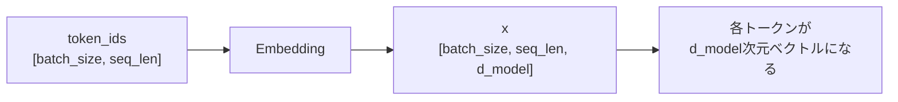

# 第2章 数・スカラー・ベクトル・行列

## 2.1 スカラーとは何か

まず、いちばん基本になるのは「数」です。

数学では、普通の1つの数のことを **スカラー** と呼びます。

たとえば、次のようなものはすべてスカラーです。

```text
3
-1
0.5
2.718
```

スカラーは、1つの値です。

機械学習では、スカラーはさまざまな場所に出てきます。

たとえば、次のような値はスカラーです。

```text
損失の値
学習率
確率
重みの1要素
バイアスの1要素
```

具体的には、モデルの予測がどれくらい間違っていたかを表す損失 `loss` は、基本的には1つの数です。

```text
loss = 1.23
```

この `1.23` はスカラーです。

学習率もスカラーです。

```text
learning_rate = 0.001
```

この `0.001` もスカラーです。

Transformerでは、スカラーだけを単独で扱うことは少ないです。

多くの場合、たくさんのスカラーを並べて、ベクトル、行列、テンソルとして扱います。

しかし、ベクトルも行列もテンソルも、中身を細かく見ればスカラーの集まりです。

```text
スカラーが並ぶとベクトルになる
ベクトルが並ぶと行列になる
行列がさらに並ぶとテンソルになる
```

そのため、まずは「スカラーは1つの数」と理解しておけば十分です。

---

## 2.2 ベクトルとは何か

**ベクトル** は、数を一列に並べたものです。

たとえば、次のようなものです。

```text
[1.0, 2.0, 3.0]
```

これは3つの数を並べたベクトルです。

このベクトルには、3つの要素があります。

```text
1.0
2.0
3.0
```

このようなベクトルを、3次元ベクトルと呼ぶことがあります。

ここでいう「3次元」は、空間の縦・横・高さという意味ではなく、「数が3個並んでいる」という意味です。

機械学習では、ベクトルは非常によく使われます。

たとえば、単語やトークンをベクトルで表すことがあります。

```text
"dog" → [0.12, -0.44, 0.87, 0.03]
```

このように、単語を数値の並びに変換したものを **埋め込みベクトル**、または **embedding vector** と呼びます。

Transformerでは、文章をそのまま処理するのではなく、まず各トークンをベクトルに変換します。

たとえば、次のような文があるとします。

```text
I love dogs
```

これをトークンに分けると、単純化すれば次のようになります。

```text
["I", "love", "dogs"]
```

それぞれのトークンをベクトルにすると、次のようになります。

```text
"I"    → [0.10, 0.20, -0.30, 0.40]
"love" → [0.55, -0.12, 0.08, 0.31]
"dogs" → [0.02, 0.77, -0.45, 0.19]
```

この時点で、文章は「文字の列」ではなく、「ベクトルの列」になります。

```text
文章
↓
トークン列
↓
ベクトル列
```

Transformerは、このベクトル列を入力として処理します。

つまり、Transformerを理解するためには、まず「データはベクトルとして扱われる」という感覚が必要です。

---

## 2.3 行列とは何か

**行列** は、数を縦横に並べたものです。

たとえば、次のようなものです。

```text
[
  [1.0, 2.0, 3.0],
  [4.0, 5.0, 6.0]
]
```

これは、2行3列の行列です。

```text
行の数: 2
列の数: 3
```

shapeで書くと、次のようになります。

```text
[2, 3]
```

行列は、「ベクトルを並べたもの」として見ることができます。

たとえば、次の行列は、3次元ベクトルが2本並んでいると考えられます。

```text
[
  [1.0, 2.0, 3.0],
  [4.0, 5.0, 6.0]
]
```

1行目は次のベクトルです。

```text
[1.0, 2.0, 3.0]
```

2行目は次のベクトルです。

```text
[4.0, 5.0, 6.0]
```

Transformerでは、複数のトークンのベクトルをまとめて行列として扱います。

たとえば、3個のトークンがあり、それぞれが4次元ベクトルで表されているとします。

```text
"I"    → [0.10, 0.20, -0.30, 0.40]
"love" → [0.55, -0.12, 0.08, 0.31]
"dogs" → [0.02, 0.77, -0.45, 0.19]
```

これをまとめると、次のような行列になります。

```text
[
  [0.10,  0.20, -0.30, 0.40],
  [0.55, -0.12,  0.08, 0.31],
  [0.02,  0.77, -0.45, 0.19]
]
```

この行列のshapeは、次のようになります。

```text
[3, 4]
```

ここで、3はトークン数です。

4は各トークンのベクトルの次元数です。

Transformerの用語で書くと、次のようになります。

```text
seq_len = 3
d_model = 4
```

したがって、この入力のshapeは次のように書けます。

```text
[seq_len, d_model]
```

このように、文章をベクトル列にしたものは、実装上は行列として扱えます。

---

## 2.4 テンソルとは何か

**テンソル** は、スカラー、ベクトル、行列をさらに一般化したものです。

いきなり「テンソル」と言われると難しく感じるかもしれません。

しかし、最初は次のように理解すれば十分です。

```text
スカラー: 0次元のテンソル
ベクトル: 1次元のテンソル
行列: 2次元のテンソル
それ以上の多次元配列: テンソル
```

たとえば、スカラーは1つの数です。

```text
3.14
```

ベクトルは1次元の並びです。

```text
[1.0, 2.0, 3.0]
```

行列は2次元の並びです。

```text
[
  [1.0, 2.0, 3.0],
  [4.0, 5.0, 6.0]
]
```

では、3次元のテンソルはどういうものか。

たとえば、行列が複数枚並んだものだと考えるとわかりやすいです。

```text
[
  [
    [1.0, 2.0, 3.0],
    [4.0, 5.0, 6.0]
  ],
  [
    [7.0, 8.0, 9.0],
    [10.0, 11.0, 12.0]
  ]
]
```

これは、2行3列の行列が2枚あると考えられます。

shapeは次のようになります。

```text
[2, 2, 3]
```

Transformerでは、テンソルは非常に重要です。

なぜなら、実際の学習や推論では、1つの文章だけでなく、複数の文章をまとめて処理するからです。

たとえば、1つの文章が次のshapeで表されるとします。

```text
[seq_len, d_model]
```

複数の文章をまとめて処理する場合、先頭に `batch_size` という次元が追加されます。

```text
[batch_size, seq_len, d_model]
```

たとえば、次のようなshapeです。

```text
[2, 3, 4]
```

これは、次の意味です。

```text
batch_size = 2
seq_len = 3
d_model = 4
```

つまり、

```text
2個の文章がある
それぞれの文章は3トークンである
各トークンは4次元ベクトルで表される
```

という意味です。

Transformerの実装では、このような3次元テンソルを基本単位として扱うことが多いです。

---

## 2.5 Python / PyTorchでのshapeの考え方

ここから、PyTorchを使って実際にshapeを見てみます。

PyTorchでは、テンソルのshapeを `.shape` で確認できます。

まず、スカラーを作ります。

```python
import torch

x = torch.tensor(3.14)

print(x)
print(x.shape)
```

出力は次のようになります。

```text
tensor(3.1400)
torch.Size([])
```

スカラーは1つの数なので、shapeは空です。

```text
[]
```

次に、ベクトルを作ります。

```python
import torch

x = torch.tensor([1.0, 2.0, 3.0])

print(x)
print(x.shape)
```

出力は次のようになります。

```text
tensor([1., 2., 3.])
torch.Size([3])
```

これは、要素が3個あるベクトルです。

shapeは次のようになります。

```text
[3]
```

次に、行列を作ります。

```python
import torch

x = torch.tensor([
    [1.0, 2.0, 3.0],
    [4.0, 5.0, 6.0],
])

print(x)
print(x.shape)
```

出力は次のようになります。

```text
tensor([[1., 2., 3.],
        [4., 5., 6.]])
torch.Size([2, 3])
```

これは2行3列の行列です。

shapeは次のようになります。

```text
[2, 3]
```

次に、3次元テンソルを作ります。

```python
import torch

x = torch.tensor([
    [
        [1.0, 2.0, 3.0],
        [4.0, 5.0, 6.0],
    ],
    [
        [7.0, 8.0, 9.0],
        [10.0, 11.0, 12.0],
    ],
])

print(x)
print(x.shape)
```

出力は次のようになります。

```text
tensor([[[ 1.,  2.,  3.],
         [ 4.,  5.,  6.]],

        [[ 7.,  8.,  9.],
         [10., 11., 12.]]])
torch.Size([2, 2, 3])
```

このshapeは次の意味です。

```text
[2, 2, 3]
```

つまり、

```text
2個のかたまりがある
それぞれに2本のベクトルがある
それぞれのベクトルは3個の数を持つ
```

Transformerでは、このshapeを次のような意味で読むことが多いです。

```text
[batch_size, seq_len, d_model]
```

たとえば、次のようなテンソルがあるとします。

```python
import torch

batch_size = 2
seq_len = 3
d_model = 4

x = torch.randn(batch_size, seq_len, d_model)

print(x.shape)
```

出力は次のようになります。

```text
torch.Size([2, 3, 4])
```

これは、次の意味です。

```text
2個の文章をまとめて処理している
各文章は3トークンである
各トークンは4次元ベクトルである
```

このように、PyTorchではテンソルのshapeを見ることで、データがどのような構造を持っているかを確認できます。

---

## 2.6 shapeを読むことが実装力につながる

Transformerを実装するとき、shapeを読む力は非常に重要です。

なぜなら、多くのエラーはshapeの不一致によって起こるからです。

たとえば、行列積では、内側の次元が一致している必要があります。

```text
[a, b] @ [b, c] → [a, c]
```

具体例で見ると、次のようになります。

```text
[3, 4] @ [4, 5] → [3, 5]
```

この計算はできます。

なぜなら、左側の列数 `4` と、右側の行数 `4` が一致しているからです。

一方、次の計算はできません。

```text
[3, 4] @ [5, 6]
```

左側の列数は `4` です。

右側の行数は `5` です。

この2つが一致していないので、行列積はできません。

PyTorchで試すと、エラーになります。

```python
import torch

a = torch.randn(3, 4)
b = torch.randn(5, 6)

c = a @ b
```

このコードはエラーになります。

理由は、shapeが合っていないからです。

一方、次のコードは正しく動きます。

```python
import torch

a = torch.randn(3, 4)
b = torch.randn(4, 6)

c = a @ b

print(c.shape)
```

出力は次のようになります。

```text
torch.Size([3, 6])
```

つまり、

```text
[3, 4] @ [4, 6] → [3, 6]
```

です。

Transformerでは、このようなshapeの確認を何度も行います。

たとえば、Self-Attentionでは、次のような行列積が出てきます。

```text
QK^T
```

もし `Q` のshapeが次のようになっているとします。

```text
Q: [seq_len, d_k]
```

そして `K` のshapeも次のようになっているとします。

```text
K: [seq_len, d_k]
```

このままでは、次の行列積はできません。

```text
QK
```

なぜなら、

```text
[seq_len, d_k] @ [seq_len, d_k]
```

となり、内側の次元が一致しないからです。

そこで、`K` を転置します。

```text
K^T: [d_k, seq_len]
```

すると、次の計算ができます。

```text
QK^T: [seq_len, d_k] @ [d_k, seq_len] → [seq_len, seq_len]
```

この結果のshapeは、次のようになります。

```text
[seq_len, seq_len]
```

これは、各トークンが、各トークンをどれくらい見るかを表すスコア表です。

たとえば、`seq_len = 3` なら、次のような3×3の行列になります。

```text
[
  [score_1_1, score_1_2, score_1_3],
  [score_2_1, score_2_2, score_2_3],
  [score_3_1, score_3_2, score_3_3]
]
```

ここで、`score_2_3` は、2番目のトークンが3番目のトークンをどれくらい参照するかを表すスコアです。

このように、shapeを追うと、数式が何をしているかが見えやすくなります。

---

## 2.7 Transformerでよく出るshape

Transformerを学ぶと、いくつかのshapeが何度も出てきます。

まず、入力トークンIDのshapeです。

```text
[batch_size, seq_len]
```

これは、各トークンを整数IDで表したものです。

たとえば、2個の文章をまとめて処理し、それぞれが5トークンなら、shapeは次のようになります。

```text
[2, 5]
```

中身は、たとえば次のような整数です。

```text
[
  [12, 45, 98, 3, 7],
  [8, 21, 21, 56, 4]
]
```

ここでは、各整数がトークンIDです。

次に、embedding後のshapeです。

```text
[batch_size, seq_len, d_model]
```

トークンIDは整数ですが、Transformerは整数をそのまま計算するのではなく、各トークンをベクトルに変換します。

たとえば、`d_model = 4` なら、各トークンは4次元ベクトルになります。

そのため、shapeは次のようになります。

```text
[2, 5, 4]
```

これは、次の意味です。

```text
2個の文章
各文章は5トークン
各トークンは4次元ベクトル
```

この流れを図にすると、次のようになります。



PyTorchで書くと、次のようになります。

```python
import torch
import torch.nn as nn

batch_size = 2
seq_len = 5
vocab_size = 100
d_model = 4

token_ids = torch.tensor([
    [12, 45, 98, 3, 7],
    [8, 21, 21, 56, 4],
])

embedding = nn.Embedding(vocab_size, d_model)

x = embedding(token_ids)

print(token_ids.shape)
print(x.shape)
```

出力は次のようになります。

```text
torch.Size([2, 5])
torch.Size([2, 5, 4])
```

つまり、

```text
[batch_size, seq_len]
↓ embedding
[batch_size, seq_len, d_model]
```

です。

次に、Q, K, Vのshapeです。

Self-Attentionでは、入力 `x` から `Q`, `K`, `V` を作ります。

単純化すると、shapeは次のようになります。

```text
x: [batch_size, seq_len, d_model]

Q: [batch_size, seq_len, d_k]
K: [batch_size, seq_len, d_k]
V: [batch_size, seq_len, d_v]
```

多くの実装では、`d_k` や `d_v` は `d_model` と同じか、headごとに分割されたサイズになります。

最初は、簡単のために次のように考えてもよいです。

```text
d_k = d_model
d_v = d_model
```

その場合、shapeは次のようになります。

```text
Q: [batch_size, seq_len, d_model]
K: [batch_size, seq_len, d_model]
V: [batch_size, seq_len, d_model]
```

次に、Attention scoreのshapeです。

Attention scoreは、`QK^T` で計算します。

バッチを考慮すると、shapeは次のようになります。

```text
Q: [batch_size, seq_len, d_k]
K: [batch_size, seq_len, d_k]

K^T: [batch_size, d_k, seq_len]

QK^T: [batch_size, seq_len, seq_len]
```

ここで、最後の2次元が `[seq_len, seq_len]` になっています。

これは、各トークンが各トークンを見るためのスコア表です。

次に、Attention weightのshapeです。

Attention scoreにsoftmaxをかけると、Attention weightになります。

```text
scores:  [batch_size, seq_len, seq_len]
weights: [batch_size, seq_len, seq_len]
```

shapeは変わりません。

値の意味だけが変わります。

```text
score: 生の相性スコア
weight: 合計1になる重み
```

次に、Attentionの出力です。

Attention weightを `V` に掛けます。

```text
weights: [batch_size, seq_len, seq_len]
V:       [batch_size, seq_len, d_v]

out:     [batch_size, seq_len, d_v]
```

つまり、Attentionの出力は、各トークンの新しいベクトル表現です。

最初の入力と同じように、トークンごとにベクトルが出てきます。

```text
入力: [batch_size, seq_len, d_model]
出力: [batch_size, seq_len, d_v]
```

多くの場合、`d_v = d_model` として、出力も次のshapeになります。

```text
[batch_size, seq_len, d_model]
```

このように、Transformerでは、shapeを追うだけでもかなり理解が進みます。

---

## 2.8 PyTorchでTransformerらしいshapeを確認する

ここでは、まだAttentionの詳しい意味には踏み込みません。

目的は、Transformerでよく出るshapeをPyTorchで確認することです。

まず、入力となるトークンIDを用意します。

```python
import torch
import torch.nn as nn
import math

batch_size = 2
seq_len = 5
vocab_size = 100
d_model = 8

token_ids = torch.tensor([
    [12, 45, 98, 3, 7],
    [8, 21, 21, 56, 4],
])

print("token_ids:", token_ids.shape)
```

出力は次のようになります。

```text
token_ids: torch.Size([2, 5])
```

次に、embeddingでトークンIDをベクトルに変換します。

```python
embedding = nn.Embedding(vocab_size, d_model)

x = embedding(token_ids)

print("x:", x.shape)
```

出力は次のようになります。

```text
x: torch.Size([2, 5, 8])
```

これは、次の意味です。

```text
batch_size = 2
seq_len = 5
d_model = 8
```

つまり、

```text
2個の文章
各文章は5トークン
各トークンは8次元ベクトル
```

です。

次に、入力 `x` から `Q`, `K`, `V` を作ります。

```python
w_q = nn.Linear(d_model, d_model)
w_k = nn.Linear(d_model, d_model)
w_v = nn.Linear(d_model, d_model)

q = w_q(x)
k = w_k(x)
v = w_v(x)

print("q:", q.shape)
print("k:", k.shape)
print("v:", v.shape)
```

出力は次のようになります。

```text
q: torch.Size([2, 5, 8])
k: torch.Size([2, 5, 8])
v: torch.Size([2, 5, 8])
```

ここでは、`d_model = 8` のまま変換しているので、shapeは変わっていません。

ただし、中身の値は変わっています。

```text
x → q
x → k
x → v
```

という3種類の変換をしているからです。

次に、Attention scoreを計算します。

```python
scores = q @ k.transpose(-2, -1)

print("scores:", scores.shape)
```

出力は次のようになります。

```text
scores: torch.Size([2, 5, 5])
```

ここで重要なのは、`k.transpose(-2, -1)` です。

元の `k` のshapeは次の通りです。

```text
k: [2, 5, 8]
```

最後の2次元を入れ替えると、次のようになります。

```text
k.transpose(-2, -1): [2, 8, 5]
```

したがって、行列積は次のようになります。

```text
q:                   [2, 5, 8]
k.transpose(-2, -1): [2, 8, 5]

scores:              [2, 5, 5]
```

この `[5, 5]` は、5個のトークン同士の相性スコアです。

次に、スコアを調整してsoftmaxをかけます。

```python
scores = scores / math.sqrt(d_model)

weights = torch.softmax(scores, dim=-1)

print("weights:", weights.shape)
```

出力は次のようになります。

```text
weights: torch.Size([2, 5, 5])
```

softmaxをかけてもshapeは変わりません。

最後に、Attention weightを `v` に掛けます。

```python
out = weights @ v

print("out:", out.shape)
```

出力は次のようになります。

```text
out: torch.Size([2, 5, 8])
```

shapeを追うと、次のようになります。

```text
weights: [2, 5, 5]
v:       [2, 5, 8]

out:     [2, 5, 8]
```

つまり、Attentionの出力は、入力と同じように、

```text
[batch_size, seq_len, d_model]
```

の形になります。

このサンプル全体をまとめると、次のようになります。

```python
import torch
import torch.nn as nn
import math

batch_size = 2
seq_len = 5
vocab_size = 100
d_model = 8

token_ids = torch.tensor([
    [12, 45, 98, 3, 7],
    [8, 21, 21, 56, 4],
])

embedding = nn.Embedding(vocab_size, d_model)

x = embedding(token_ids)

w_q = nn.Linear(d_model, d_model)
w_k = nn.Linear(d_model, d_model)
w_v = nn.Linear(d_model, d_model)

q = w_q(x)
k = w_k(x)
v = w_v(x)

scores = q @ k.transpose(-2, -1)
scores = scores / math.sqrt(d_model)

weights = torch.softmax(scores, dim=-1)

out = weights @ v

print("token_ids:", token_ids.shape)
print("x:", x.shape)
print("q:", q.shape)
print("k:", k.shape)
print("v:", v.shape)
print("scores:", scores.shape)
print("weights:", weights.shape)
print("out:", out.shape)
```

実行すると、次のような出力になります。

```text
token_ids: torch.Size([2, 5])
x: torch.Size([2, 5, 8])
q: torch.Size([2, 5, 8])
k: torch.Size([2, 5, 8])
v: torch.Size([2, 5, 8])
scores: torch.Size([2, 5, 5])
weights: torch.Size([2, 5, 5])
out: torch.Size([2, 5, 8])
```

このコードの意味をすべて理解する必要は、今はまだありません。

この章で重要なのは、次の流れです。

```text
token_ids: [batch_size, seq_len]

embedding後:
x: [batch_size, seq_len, d_model]

Q/K/V:
q: [batch_size, seq_len, d_model]
k: [batch_size, seq_len, d_model]
v: [batch_size, seq_len, d_model]

Attention score:
scores: [batch_size, seq_len, seq_len]

Attention output:
out: [batch_size, seq_len, d_model]
```

このshapeの流れは、Transformerを実装するときに何度も出てきます。

---

## 2.9 まとめ

この章では、スカラー、ベクトル、行列、テンソルについて学びました。

まず、スカラーは1つの数です。

```text
3.14
```

ベクトルは、数を一列に並べたものです。

```text
[1.0, 2.0, 3.0]
```

行列は、数を縦横に並べたものです。

```text
[
  [1.0, 2.0, 3.0],
  [4.0, 5.0, 6.0]
]
```

テンソルは、それらをさらに一般化した多次元配列です。

Transformerでは、データは基本的にテンソルとして扱われます。

特に重要なのは、次のshapeです。

```text
[batch_size, seq_len, d_model]
```

これは、次の意味です。

```text
batch_size: まとめて処理する文章の数
seq_len: 各文章に含まれるトークン数
d_model: 各トークンを表すベクトルの次元数
```

Transformerの実装では、shapeを読む力が非常に重要です。

なぜなら、Self-Attention、Multi-Head Attention、Feed Forward Network、Layer Normalizationなど、ほとんどの処理でテンソルのshapeを正しく扱う必要があるからです。

特に、Attentionでは次のshapeがよく出てきます。

```text
x:       [batch_size, seq_len, d_model]

q:       [batch_size, seq_len, d_model]
k:       [batch_size, seq_len, d_model]
v:       [batch_size, seq_len, d_model]

scores:  [batch_size, seq_len, seq_len]

weights: [batch_size, seq_len, seq_len]

out:     [batch_size, seq_len, d_model]
```

### 確認問題

次のshapeの意味を説明してください。

```text
[2, 5, 4]
```

答えは、たとえば次のようになります。

```text
2個の文
各文は5トークン
各トークンは4次元ベクトル
```

### よくある誤解

`d_model` はトークンの個数ではありません。

`d_model` は、1つのトークンを表すベクトルの次元数です。

また、`seq_len` はベクトルの次元数ではありません。

`seq_len` は、文の中に並んでいるトークンの数です。

この章の段階では、Attentionの意味を完全に理解する必要はありません。

まずは、Transformerではデータがテンソルとして流れていき、そのshapeを追うことが大事だと理解できれば十分です。

次章では、ベクトルについてもう少し詳しく見ていきます。

ベクトルは、単なる数の並びではなく、単語やトークンの意味を表すための基本単位になります。

Transformerでは、すべてのトークンがベクトルとして扱われます。

そのため、ベクトルの足し算、スカラー倍、長さ、距離といった基本を理解することが、embeddingやAttentionを理解する土台になります。
