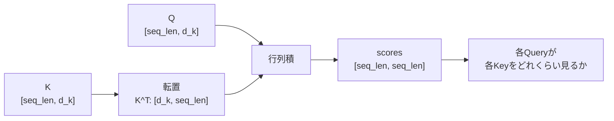

# 第5章 行列の基本

## 5.1 行列は「ベクトルをまとめたもの」である

前章では、内積について学びました。

内積は、2つのベクトルから1つのスカラーを作る計算でした。

```text
ベクトル × ベクトル → スカラー
```

Transformerでは、この内積を1つずつ計算するのではなく、たくさんの内積をまとめて計算します。

そのために使うのが **行列** です。

行列は、数を縦横に並べたものです。

たとえば、次のようなものです。

```text
[
  [1.0, 2.0, 3.0],
  [4.0, 5.0, 6.0]
]
```

これは2行3列の行列です。

shapeで書くと、次のようになります。

```text
[2, 3]
```

行列は、見方を変えると「ベクトルをまとめたもの」です。

たとえば、次の行列を考えます。

```text
X = [
  [1.0, 2.0, 3.0],
  [4.0, 5.0, 6.0],
  [7.0, 8.0, 9.0]
]
```

これは、3つのベクトルを縦に並べたものと見ることができます。

```text
x1 = [1.0, 2.0, 3.0]
x2 = [4.0, 5.0, 6.0]
x3 = [7.0, 8.0, 9.0]
```

つまり、

```text
X = [
  x1,
  x2,
  x3
]
```

と考えられます。

Transformerでは、この見方がとても重要です。

なぜなら、複数のトークンのベクトルをまとめて行列として扱うからです。

たとえば、3個のトークンがあり、それぞれが4次元ベクトルだとします。

```text
token_1 → [0.10,  0.20, -0.30, 0.40]
token_2 → [0.55, -0.12,  0.08, 0.31]
token_3 → [0.02,  0.77, -0.45, 0.19]
```

これをまとめると、次のような行列になります。

```text
X = [
  [0.10,  0.20, -0.30, 0.40],
  [0.55, -0.12,  0.08, 0.31],
  [0.02,  0.77, -0.45, 0.19]
]
```

shapeは次の通りです。

```text
[3, 4]
```

これは、Transformerの用語では次のように読めます。

```text
seq_len = 3
d_model = 4
```

つまり、

```text
3個のトークン
各トークンは4次元ベクトル
```

です。

このように、行列は「複数のベクトルをまとめたもの」として見ることができます。

Transformerでは、各トークンを1つずつ処理するのではなく、行列としてまとめて処理します。

これにより、計算を効率よく行うことができます。

---

## 5.2 行列は「変換」として見ることができる

行列には、もう1つ重要な見方があります。

それは、行列を **ベクトルを変換するもの** として見ることです。

たとえば、次のベクトルを考えます。

```text
x = [1.0, 2.0]
```

このベクトルに行列を掛けると、別のベクトルに変換できます。

```text
W = [
  [1.0, 0.0],
  [0.0, 2.0]
]
```

この行列を使うと、`x` は次のように変換されます。

```text
xW = [1.0, 4.0]
```

これは、2番目の成分が2倍になったと見ることができます。

別の行列を使えば、別の変換になります。

```text
W = [
  [0.0, 1.0],
  [1.0, 0.0]
]
```

この行列は、2つの成分を入れ替えるような変換になります。

```text
[1.0, 2.0] → [2.0, 1.0]
```

このように、行列はベクトルを別のベクトルへ変換します。

機械学習では、この見方が非常に重要です。

ニューラルネットワークの線形層は、基本的に次のような計算をしています。

```text
y = xW + b
```

ここで、

```text
x: 入力ベクトル
W: 重み行列
b: バイアスベクトル
y: 出力ベクトル
```

です。

つまり、線形層は入力ベクトル `x` を、重み行列 `W` によって別のベクトル `y` に変換しています。

Transformerでも同じです。

入力されたトークンのベクトルから、Query、Key、Valueを作るときに行列による変換を使います。

```text
xW_Q → q
xW_K → k
xW_V → v
```

つまり、

```text
入力ベクトル x
↓
Query用の行列で変換
↓
Queryベクトル q

入力ベクトル x
↓
Key用の行列で変換
↓
Keyベクトル k

入力ベクトル x
↓
Value用の行列で変換
↓
Valueベクトル v
```

です。

このように、行列は単なる数の表ではなく、「ベクトルを別の表現へ変換する道具」として使われます。

---

## 5.3 行列とベクトルの掛け算

ここでは、行列とベクトルの掛け算を見ていきます。

次の行列 `W` とベクトル `x` を考えます。

```text
W = [
  [1.0, 2.0],
  [3.0, 4.0],
  [5.0, 6.0]
]

x = [10.0, 20.0]
```

`W` のshapeは次の通りです。

```text
[3, 2]
```

`x` のshapeは次の通りです。

```text
[2]
```

このとき、`W @ x` を計算できます。

```text
[3, 2] @ [2] → [3]
```

結果は3次元ベクトルになります。

計算は、行列の各行とベクトルの内積です。

1行目は次のようになります。

```text
[1.0, 2.0]・[10.0, 20.0]
= 1.0*10.0 + 2.0*20.0
= 50.0
```

2行目は次のようになります。

```text
[3.0, 4.0]・[10.0, 20.0]
= 3.0*10.0 + 4.0*20.0
= 110.0
```

3行目は次のようになります。

```text
[5.0, 6.0]・[10.0, 20.0]
= 5.0*10.0 + 6.0*20.0
= 170.0
```

したがって、結果は次のようになります。

```text
W @ x = [50.0, 110.0, 170.0]
```

つまり、行列とベクトルの掛け算は、次のように考えられます。

```text
行列の各行とベクトルの内積を並べる
```

Transformerで重要なのは、「行列積は内積をまとめて計算している」という感覚です。

行列積を難しいものとして見るのではなく、

```text
たくさんの内積をまとめて計算する仕組み
```

として見ると、Attentionの式も理解しやすくなります。

PyTorchで確認してみます。

```python
import torch

W = torch.tensor([
    [1.0, 2.0],
    [3.0, 4.0],
    [5.0, 6.0],
])

x = torch.tensor([10.0, 20.0])

y = W @ x

print(y)
print(y.shape)
```

出力は次のようになります。

```text
tensor([ 50., 110., 170.])
torch.Size([3])
```

shapeも確認できます。

```text
W: [3, 2]
x: [2]

W @ x: [3]
```

このように、行列とベクトルの掛け算は、内側の次元が一致しているときに計算できます。

```text
[3, 2] @ [2] → [3]
```

---

## 5.4 行列と行列の掛け算

次に、行列と行列の掛け算を見ます。

行列と行列の掛け算も、基本的には内積の集まりです。

次の2つの行列を考えます。

```text
A = [
  [1.0, 2.0],
  [3.0, 4.0]
]

B = [
  [10.0, 20.0, 30.0],
  [40.0, 50.0, 60.0]
]
```

`A` のshapeは次の通りです。

```text
[2, 2]
```

`B` のshapeは次の通りです。

```text
[2, 3]
```

このとき、`A @ B` は計算できます。

```text
[2, 2] @ [2, 3] → [2, 3]
```

結果は2行3列の行列になります。

行列積の各要素は、左の行列の行ベクトルと、右の行列の列ベクトルの内積です。

まず、結果の1行1列目を計算します。

```text
Aの1行目: [1.0, 2.0]
Bの1列目: [10.0, 40.0]

1.0*10.0 + 2.0*40.0 = 90.0
```

次に、結果の1行2列目を計算します。

```text
Aの1行目: [1.0, 2.0]
Bの2列目: [20.0, 50.0]

1.0*20.0 + 2.0*50.0 = 120.0
```

次に、結果の1行3列目を計算します。

```text
Aの1行目: [1.0, 2.0]
Bの3列目: [30.0, 60.0]

1.0*30.0 + 2.0*60.0 = 150.0
```

同じように、2行目も計算します。

```text
Aの2行目: [3.0, 4.0]
Bの1列目: [10.0, 40.0]

3.0*10.0 + 4.0*40.0 = 190.0
```

```text
Aの2行目: [3.0, 4.0]
Bの2列目: [20.0, 50.0]

3.0*20.0 + 4.0*50.0 = 260.0
```

```text
Aの2行目: [3.0, 4.0]
Bの3列目: [30.0, 60.0]

3.0*30.0 + 4.0*60.0 = 330.0
```

したがって、結果は次のようになります。

```text
A @ B = [
  [90.0, 120.0, 150.0],
  [190.0, 260.0, 330.0]
]
```

PyTorchで確認してみます。

```python
import torch

A = torch.tensor([
    [1.0, 2.0],
    [3.0, 4.0],
])

B = torch.tensor([
    [10.0, 20.0, 30.0],
    [40.0, 50.0, 60.0],
])

C = A @ B

print(C)
print(C.shape)
```

出力は次のようになります。

```text
tensor([[ 90., 120., 150.],
        [190., 260., 330.]])
torch.Size([2, 3])
```

行列積のshapeは、次のように決まります。

```text
[a, b] @ [b, c] → [a, c]
```

内側の `b` が一致している必要があります。

たとえば、次の計算はできます。

```text
[2, 3] @ [3, 4] → [2, 4]
```

しかし、次の計算はできません。

```text
[2, 3] @ [5, 4]
```

内側の次元が一致していないからです。

```text
3 と 5 が一致していない
```

Transformerの実装では、このshapeのルールを何度も使います。

---

## 5.5 転置とは何か

**転置** とは、行列の行と列を入れ替える操作です。

たとえば、次の行列を考えます。

```text
A = [
  [1.0, 2.0, 3.0],
  [4.0, 5.0, 6.0]
]
```

この行列のshapeは次の通りです。

```text
[2, 3]
```

転置すると、行と列が入れ替わります。

```text
A^T = [
  [1.0, 4.0],
  [2.0, 5.0],
  [3.0, 6.0]
]
```

shapeは次のようになります。

```text
[3, 2]
```

つまり、

```text
[2, 3] → [3, 2]
```

です。

PyTorchでは、2次元行列の転置は `.T` で書けます。

```python
import torch

A = torch.tensor([
    [1.0, 2.0, 3.0],
    [4.0, 5.0, 6.0],
])

print(A)
print(A.shape)

print(A.T)
print(A.T.shape)
```

出力は次のようになります。

```text
tensor([[1., 2., 3.],
        [4., 5., 6.]])
torch.Size([2, 3])
tensor([[1., 4.],
        [2., 5.],
        [3., 6.]])
torch.Size([3, 2])
```

Transformerでは、転置が非常によく出てきます。

特に重要なのは、Attentionの中の次の部分です。

```text
QK^T
```

ここでは、`K` を転置しています。

なぜ転置する必要があるのでしょうか。

理由は、行列積のshapeを合わせるためです。

たとえば、`Q` と `K` のshapeが次のようになっているとします。

```text
Q: [seq_len, d_k]
K: [seq_len, d_k]
```

このまま `Q @ K` をしようとすると、次のshapeになります。

```text
[seq_len, d_k] @ [seq_len, d_k]
```

これは通常、計算できません。

内側の次元が、

```text
d_k と seq_len
```

になっていて、一致していないからです。

そこで、`K` を転置します。

```text
K^T: [d_k, seq_len]
```

すると、次の行列積が計算できます。

```text
QK^T: [seq_len, d_k] @ [d_k, seq_len] → [seq_len, seq_len]
```

この結果は、各Queryと各Keyの内積をまとめたスコア行列になります。

```text
[seq_len, seq_len]
```

つまり、転置は単なる見た目の入れ替えではありません。

Attentionでは、全トークン同士の相性をまとめて計算するために必要な操作です。

---

## 5.6 なぜ `K^T` が出てくるのか

ここでは、Attentionの式に出てくる `K^T` をもう少し詳しく見ます。

Self-Attentionでは、各トークンからQueryとKeyを作ります。

たとえば、3個のトークンがあり、各QueryとKeyが2次元だとします。

```text
q1 = [1.0, 0.0]
q2 = [0.0, 1.0]
q3 = [1.0, 1.0]
```

これをまとめたものが `Q` です。

```text
Q = [
  [1.0, 0.0],
  [0.0, 1.0],
  [1.0, 1.0]
]
```

shapeは次の通りです。

```text
Q: [3, 2]
```

同じように、Keyをまとめたものを `K` とします。

```text
k1 = [1.0, 0.0]
k2 = [0.0, 1.0]
k3 = [-1.0, 0.0]
```

```text
K = [
  [1.0,  0.0],
  [0.0,  1.0],
  [-1.0, 0.0]
]
```

shapeは次の通りです。

```text
K: [3, 2]
```

やりたいことは、すべてのQueryとすべてのKeyの内積を計算することです。

つまり、次の9個の値が欲しいわけです。

```text
q1・k1, q1・k2, q1・k3
q2・k1, q2・k2, q2・k3
q3・k1, q3・k2, q3・k3
```

これを3×3の行列として並べたいです。

```text
[
  [q1・k1, q1・k2, q1・k3],
  [q2・k1, q2・k2, q2・k3],
  [q3・k1, q3・k2, q3・k3]
]
```

この計算を行列積で一度に行うために、`K` を転置します。

`K` は次の形でした。

```text
K = [
  [ 1.0, 0.0],
  [ 0.0, 1.0],
  [-1.0, 0.0]
]
```

転置すると、次のようになります。

```text
K^T = [
  [1.0, 0.0, -1.0],
  [0.0, 1.0,  0.0]
]
```

shapeは次の通りです。

```text
K^T: [2, 3]
```

すると、`Q @ K^T` が計算できます。

```text
Q:   [3, 2]
K^T: [2, 3]

QK^T: [3, 3]
```

実際に計算すると、次のようになります。

```text
QK^T = [
  [ 1.0, 0.0, -1.0],
  [ 0.0, 1.0,  0.0],
  [ 1.0, 1.0, -1.0]
]
```

この行列の1行目は、`q1` と各Keyの内積です。

```text
[q1・k1, q1・k2, q1・k3]
```

2行目は、`q2` と各Keyの内積です。

```text
[q2・k1, q2・k2, q2・k3]
```

3行目は、`q3` と各Keyの内積です。

```text
[q3・k1, q3・k2, q3・k3]
```

つまり、`K^T` が出てくる理由は、すべてのQueryとKeyの内積をまとめて計算するためです。

```text
QK^T
=
すべてのQueryとすべてのKeyの内積表
```

---

## 5.7 `QK^T` のshapeを追う

Transformerの数式を読むとき、shapeを追うことは非常に重要です。

ここでは、`QK^T` のshapeを丁寧に追います。

まず、1つの文だけを考えます。

トークン数を `seq_len` とします。

各QueryとKeyの次元数を `d_k` とします。

すると、`Q` と `K` のshapeは次のようになります。

```text
Q: [seq_len, d_k]
K: [seq_len, d_k]
```

ここで、`K` を転置します。

```text
K^T: [d_k, seq_len]
```

すると、行列積は次のようになります。

```text
QK^T: [seq_len, d_k] @ [d_k, seq_len]
```

行列積のルールは次の通りでした。

```text
[a, b] @ [b, c] → [a, c]
```

したがって、

```text
[seq_len, d_k] @ [d_k, seq_len] → [seq_len, seq_len]
```

になります。

図にすると、`K` を転置してから `Q` と掛けることで、トークン同士の表ができます。



この `[seq_len, seq_len]` は、トークン同士の相性スコア表です。

たとえば、`seq_len = 4` なら、shapeは次のようになります。

```text
[4, 4]
```

中身は次のように考えられます。

```text
[
  [q1・k1, q1・k2, q1・k3, q1・k4],
  [q2・k1, q2・k2, q2・k3, q2・k4],
  [q3・k1, q3・k2, q3・k3, q3・k4],
  [q4・k1, q4・k2, q4・k3, q4・k4]
]
```

次に、バッチ付きの場合を考えます。

実際のTransformerでは、複数の文をまとめて処理するため、先頭に `batch_size` が付きます。

```text
Q: [batch_size, seq_len, d_k]
K: [batch_size, seq_len, d_k]
```

`K` の最後の2次元を転置します。

```text
K.transpose(-2, -1): [batch_size, d_k, seq_len]
```

すると、行列積は次のようになります。

```text
QK^T:
[batch_size, seq_len, d_k] @ [batch_size, d_k, seq_len]
→ [batch_size, seq_len, seq_len]
```

PyTorchでは、次のように書きます。

```python
import torch

batch_size = 2
seq_len = 4
d_k = 3

Q = torch.randn(batch_size, seq_len, d_k)
K = torch.randn(batch_size, seq_len, d_k)

scores = Q @ K.transpose(-2, -1)

print("Q:", Q.shape)
print("K:", K.shape)
print("K^T:", K.transpose(-2, -1).shape)
print("scores:", scores.shape)
```

出力は次のようになります。

```text
Q: torch.Size([2, 4, 3])
K: torch.Size([2, 4, 3])
K^T: torch.Size([2, 3, 4])
scores: torch.Size([2, 4, 4])
```

この結果は、次のshape変化に対応しています。

```text
Q:      [2, 4, 3]
K^T:    [2, 3, 4]

scores: [2, 4, 4]
```

つまり、

```text
batch_size = 2
seq_len = 4
d_k = 3
```

のとき、各文ごとに4×4のAttention score行列ができます。

```text
文1: [4, 4] のスコア行列
文2: [4, 4] のスコア行列
```

このように、`QK^T` のshapeを追えるようになると、Attentionの式がかなり読みやすくなります。

---

## 5.8 行列計算で複数トークンをまとめて処理する

Transformerの大きな特徴のひとつは、複数のトークンをまとめて計算しやすいことです。

RNNでは、トークンを左から右へ順番に処理する構造でした。

```text
token_1 → token_2 → token_3 → token_4
```

一方、Transformerでは、トークン列を行列としてまとめて処理します。

```text
[
  token_1のベクトル,
  token_2のベクトル,
  token_3のベクトル,
  token_4のベクトル
]
```

つまり、入力は次のような行列です。

```text
X: [seq_len, d_model]
```

ここで、各行が1つのトークンのベクトルです。

この `X` に重み行列を掛けることで、すべてのトークンをまとめて変換できます。

たとえば、Queryを作る場合は次のようになります。

```text
Q = XW_Q
```

shapeを追うと、次のようになります。

```text
X:   [seq_len, d_model]
W_Q: [d_model, d_k]

Q:   [seq_len, d_k]
```

この計算は、各トークンのベクトルに同じ変換を適用していると考えられます。

```text
token_1のベクトル → q1
token_2のベクトル → q2
token_3のベクトル → q3
token_4のベクトル → q4
```

これを1つずつ書くと、次のようになります。

```text
q1 = x1W_Q
q2 = x2W_Q
q3 = x3W_Q
q4 = x4W_Q
```

しかし、行列でまとめると、次の一行で済みます。

```text
Q = XW_Q
```

これは、計算の見通しをよくするだけでなく、GPUで高速に計算しやすい形でもあります。

KeyとValueも同じです。

```text
K = XW_K
V = XW_V
```

shapeは次のようになります。

```text
X:   [seq_len, d_model]

W_Q: [d_model, d_k]
W_K: [d_model, d_k]
W_V: [d_model, d_v]

Q:   [seq_len, d_k]
K:   [seq_len, d_k]
V:   [seq_len, d_v]
```

PyTorchで確認してみます。

```python
import torch

seq_len = 4
d_model = 6
d_k = 3
d_v = 5

X = torch.randn(seq_len, d_model)

W_Q = torch.randn(d_model, d_k)
W_K = torch.randn(d_model, d_k)
W_V = torch.randn(d_model, d_v)

Q = X @ W_Q
K = X @ W_K
V = X @ W_V

print("X:", X.shape)
print("Q:", Q.shape)
print("K:", K.shape)
print("V:", V.shape)
```

出力は次のようになります。

```text
X: torch.Size([4, 6])
Q: torch.Size([4, 3])
K: torch.Size([4, 3])
V: torch.Size([4, 5])
```

これは次のshape変化に対応しています。

```text
X:   [4, 6]

W_Q: [6, 3]
W_K: [6, 3]
W_V: [6, 5]

Q:   [4, 3]
K:   [4, 3]
V:   [4, 5]
```

このように、行列計算によって複数トークンをまとめて処理できます。

この考え方は、Transformer実装の中心になります。

---

## 5.9 PyTorchの `nn.Linear` と行列

ここまで、行列を直接作って、次のように掛け算してきました。

```python
Q = X @ W_Q
```

しかし、PyTorchでニューラルネットワークを書くときは、通常 `nn.Linear` を使います。

`nn.Linear` は、線形変換を行う層です。

数学的には、次のような計算をします。

```text
y = xW^T + b
```

ここで注意点があります。

数学の説明では、しばしば次のように書きます。

```text
y = xW + b
```

しかし、PyTorchの `nn.Linear(in_features, out_features)` の重みは、内部的には次のshapeを持っています。

```text
[out_features, in_features]
```

そのため、PyTorchの実装上は `W^T` を掛ける形になります。

ただし、最初は細かい内部表現にこだわりすぎなくて大丈夫です。

重要なのは、`nn.Linear` が次の変換をしていることです。

```text
最後の次元を in_features から out_features に変換する
```

たとえば、次のように書きます。

```python
import torch
import torch.nn as nn

seq_len = 4
d_model = 6
d_k = 3

X = torch.randn(seq_len, d_model)

linear_q = nn.Linear(d_model, d_k)

Q = linear_q(X)

print("X:", X.shape)
print("Q:", Q.shape)
```

出力は次のようになります。

```text
X: torch.Size([4, 6])
Q: torch.Size([4, 3])
```

つまり、

```text
[seq_len, d_model]
↓ nn.Linear(d_model, d_k)
[seq_len, d_k]
```

です。

バッチ付きでも同じです。

```python
import torch
import torch.nn as nn

batch_size = 2
seq_len = 4
d_model = 6
d_k = 3

X = torch.randn(batch_size, seq_len, d_model)

linear_q = nn.Linear(d_model, d_k)

Q = linear_q(X)

print("X:", X.shape)
print("Q:", Q.shape)
```

出力は次のようになります。

```text
X: torch.Size([2, 4, 6])
Q: torch.Size([2, 4, 3])
```

ここで重要なのは、`nn.Linear` が最後の次元だけを変換していることです。

```text
X: [batch_size, seq_len, d_model]
Q: [batch_size, seq_len, d_k]
```

先頭の次元である `batch_size` と `seq_len` はそのまま残ります。

```text
[2, 4, 6]
↓ 最後の次元 6 を 3 に変換
[2, 4, 3]
```

Transformerでは、Q, K, Vを作るときに、この `nn.Linear` を使うことが多いです。

```python
w_q = nn.Linear(d_model, d_k)
w_k = nn.Linear(d_model, d_k)
w_v = nn.Linear(d_model, d_v)

q = w_q(x)
k = w_k(x)
v = w_v(x)
```

このコードは、入力 `x` からQuery、Key、Valueを作っています。

shapeは次のようになります。

```text
x: [batch_size, seq_len, d_model]

q: [batch_size, seq_len, d_k]
k: [batch_size, seq_len, d_k]
v: [batch_size, seq_len, d_v]
```

このように、PyTorchの `nn.Linear` は、行列による変換をニューラルネットワークの層として扱いやすくしたものです。

---

## 5.10 行列積とAttentionのつながり

ここまで学んだ内容を、Attentionの式に接続します。

Transformerの中心式は次の通りです。

```text
Attention(Q, K, V) = softmax(QK^T / sqrt(d_k))V
```

この式の中には、行列積が2回出てきます。

```text
QK^T
```

と、

```text
softmax(...)V
```

です。

まず、`QK^T` を見ます。

```text
Q: [seq_len, d_k]
K: [seq_len, d_k]
K^T: [d_k, seq_len]

QK^T: [seq_len, seq_len]
```

これは、各Queryと各Keyの内積をまとめて計算しています。

つまり、

```text
全トークン同士の相性スコアを作る
```

計算です。

次に、`softmax(QK^T / sqrt(d_k))` を考えます。

これは、相性スコアを重みに変換したものです。

shapeは変わりません。

```text
scores:  [seq_len, seq_len]
weights: [seq_len, seq_len]
```

最後に、`weights @ V` を計算します。

```text
weights: [seq_len, seq_len]
V:       [seq_len, d_v]

out:     [seq_len, d_v]
```

これは、Attention weightを使って、Valueを混ぜている計算です。

各トークンが、他のトークンのValueをどれくらい取り込むかを表しています。

つまり、Attention全体は、行列積の視点から見ると次のようになります。

```text
QK^T:
各トークン同士の相性をまとめて計算する

softmax:
相性スコアを重みに変換する

weights @ V:
重みに応じてValueを混ぜる
```

PyTorchで非常に小さく書くと、次のようになります。

```python
import torch
import math

seq_len = 4
d_k = 3
d_v = 5

Q = torch.randn(seq_len, d_k)
K = torch.randn(seq_len, d_k)
V = torch.randn(seq_len, d_v)

scores = Q @ K.T
scores = scores / math.sqrt(d_k)

weights = torch.softmax(scores, dim=-1)

out = weights @ V

print("Q:", Q.shape)
print("K:", K.shape)
print("V:", V.shape)
print("scores:", scores.shape)
print("weights:", weights.shape)
print("out:", out.shape)
```

出力は次のようになります。

```text
Q: torch.Size([4, 3])
K: torch.Size([4, 3])
V: torch.Size([4, 5])
scores: torch.Size([4, 4])
weights: torch.Size([4, 4])
out: torch.Size([4, 5])
```

shapeの流れは次の通りです。

```text
Q:       [seq_len, d_k]
K:       [seq_len, d_k]
V:       [seq_len, d_v]

QK^T:    [seq_len, seq_len]

weights: [seq_len, seq_len]

out:     [seq_len, d_v]
```

この式を理解するために必要なのは、まさにこの章で学んだ行列の基本です。

```text
行列はベクトルをまとめたもの
行列はベクトルを変換するもの
行列積は内積をまとめたもの
転置は行と列を入れ替える操作
shapeを追うと計算の意味がわかる
```

Attentionの数式は難しそうに見えますが、分解すると行列積の組み合わせです。

---

## 5.11 よくあるshapeエラー

Transformerを実装していると、shapeエラーがよく起こります。

これは自然なことです。

特に、行列積では内側の次元が一致している必要があります。

```text
[a, b] @ [b, c] → [a, c]
```

たとえば、次の計算はできます。

```text
[4, 3] @ [3, 5] → [4, 5]
```

しかし、次の計算はできません。

```text
[4, 3] @ [4, 3]
```

内側の次元が、

```text
3 と 4
```

で一致していないからです。

Attentionでよくある間違いは、`K` を転置し忘れることです。

```python
scores = Q @ K
```

これは、`Q` と `K` が次のshapeなら失敗します。

```text
Q: [seq_len, d_k]
K: [seq_len, d_k]
```

なぜなら、

```text
[seq_len, d_k] @ [seq_len, d_k]
```

となり、内側の次元が一致しないからです。

正しくは、次のようにします。

```python
scores = Q @ K.T
```

または、バッチ付きなら次のようにします。

```python
scores = Q @ K.transpose(-2, -1)
```

バッチ付きで `.T` を使うと、意図しない転置になることがあるので注意が必要です。

たとえば、次のshapeを考えます。

```text
K: [batch_size, seq_len, d_k]
```

ここでやりたいのは、最後の2次元だけを入れ替えることです。

```text
[batch_size, seq_len, d_k]
↓
[batch_size, d_k, seq_len]
```

そのため、PyTorchでは次のように書きます。

```python
K.transpose(-2, -1)
```

これは、最後から2番目の次元と、最後の次元を入れ替えるという意味です。

shapeエラーが出たときは、まず次のように確認するとよいです。

```python
print(Q.shape)
print(K.shape)
print(K.transpose(-2, -1).shape)
```

そして、行列積のルールに当てはめます。

```text
[a, b] @ [b, c] → [a, c]
```

Transformerの実装では、エラー文を読むことも大事ですが、それ以上にshapeを自分で追えることが重要です。

---

## 5.12 まとめ

この章では、行列の基本について学びました。

行列は、数を縦横に並べたものです。

```text
[
  [1.0, 2.0, 3.0],
  [4.0, 5.0, 6.0]
]
```

shapeで表すと、次のようになります。

```text
[2, 3]
```

行列は、複数のベクトルをまとめたものとして見ることができます。

Transformerでは、複数のトークンのベクトルをまとめて行列として扱います。

```text
X: [seq_len, d_model]
```

ここで、各行が1つのトークンのベクトルです。

また、行列はベクトルを変換するものとしても見られます。

ニューラルネットワークの線形層は、基本的に次のような変換です。

```text
y = xW + b
```

Transformerでは、入力ベクトルからQuery、Key、Valueを作るときに行列による変換を使います。

```text
Q = XW_Q
K = XW_K
V = XW_V
```

行列積は、内積をまとめて計算する仕組みです。

```text
[a, b] @ [b, c] → [a, c]
```

Attentionでは、次の行列積が重要です。

```text
QK^T
```

これは、すべてのQueryとKeyの内積をまとめて計算しています。

shapeは次のようになります。

```text
Q:   [seq_len, d_k]
K:   [seq_len, d_k]
K^T: [d_k, seq_len]

QK^T: [seq_len, seq_len]
```

バッチ付きの場合は、次のようになります。

```text
Q: [batch_size, seq_len, d_k]
K: [batch_size, seq_len, d_k]

K.transpose(-2, -1): [batch_size, d_k, seq_len]

QK^T: [batch_size, seq_len, seq_len]
```

この `[seq_len, seq_len]` の行列は、トークン同士の相性スコアを表します。

また、Attentionでは最後に次の計算をします。

```text
weights @ V
```

shapeは次のようになります。

```text
weights: [seq_len, seq_len]
V:       [seq_len, d_v]

out:     [seq_len, d_v]
```

つまり、Attentionは行列積の組み合わせとして理解できます。

```text
QK^T
↓
相性スコアを作る

softmax
↓
重みに変換する

weights @ V
↓
Valueを混ぜる
```

この章で特に重要なのは、次の理解です。

```text
行列はベクトルをまとめたもの
行列はベクトルを変換するもの
行列積は内積をまとめたもの
転置によって行列積のshapeを合わせる
QK^Tは全トークン同士の相性スコア表である
```

次章では、線形変換について学びます。

行列を「変換」として見る考え方をもう少し深めます。

Transformerでは、embedding、Q/K/Vの生成、Feed Forward Network、出力層など、多くの場所で線形変換が使われます。

そのため、線形変換を理解することは、ニューラルネットワークとTransformerの内部構造を理解するための重要な土台になります。
