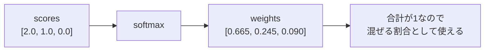

# 第7章 softmax

**この章のゴール**

softmaxがスコアの列を合計1の重みに変換することを理解し、Attention weightとして使われる理由を説明できるようになること。

## 7.1 softmaxとは何か

この章では、**softmax** について学びます。

softmaxは、Transformerを理解する上で非常に重要です。

特に、Self-Attentionでは次の式に出てきます。

```text
Attention(Q, K, V) = softmax(QK^T / sqrt(d_k))V
```

この中の、

```text
softmax(QK^T / sqrt(d_k))
```

が、Attention scoreをAttention weightに変換する部分です。

ざっくり言うと、softmaxは次のような関数です。

```text
数値の列を、合計が1になる重みに変換する関数
```

たとえば、次のような数値の列があるとします。

```text
[2.0, 1.0, 0.1]
```

これにsoftmaxをかけると、次のような値になります。

```text
[0.659, 0.242, 0.099]
```

この出力には、次の特徴があります。

```text
すべての値が0以上
合計すると1になる
元の値が大きいほど、softmax後の値も大きい
```

実際に合計すると、ほぼ1になります。

```text
0.659 + 0.242 + 0.099 = 1.000
```

この性質によって、softmaxの出力は「確率のような重み」として扱うことができます。

ただし、ここで少し注意が必要です。

softmaxの出力は、数学的には確率分布として解釈できます。

しかし、Attentionで使う場合は、「本当に確率である」と考えるよりも、まずは次のように理解するとよいです。

```text
どの要素をどれくらい強く見るかを表す重み
```

Self-Attentionでは、QueryとKeyの内積によって、トークン同士の相性スコアを作ります。

```text
QK^T
```

この時点では、値はただのスコアです。

たとえば、あるトークンが他の3つのトークンを見るスコアが次のようだったとします。

```text
[2.0, 1.0, 0.1]
```

これにsoftmaxをかけると、次のような重みになります。

```text
[0.659, 0.242, 0.099]
```

これは、次のように解釈できます。

```text
1番目のトークンを強く見る
2番目のトークンを少し見る
3番目のトークンはあまり見ない
```

このように、softmaxはAttention scoreをAttention weightに変換するために使われます。

---

## 7.2 数値の列を確率のような重みに変換する

softmaxの役割は、数値の列を「重み」に変換することです。

たとえば、次の3つのスコアを考えます。

```text
scores = [3.0, 1.0, 0.0]
```

このスコアは、次のように解釈できます。

```text
1番目の候補が一番よさそう
2番目の候補は少しよさそう
3番目の候補はあまりよくなさそう
```

しかし、このままでは「どれくらい見るか」という重みとして使いにくいです。

なぜなら、合計が1ではないからです。

```text
3.0 + 1.0 + 0.0 = 4.0
```

また、スコアにはマイナスの値が入ることもあります。

```text
scores = [2.0, -1.0, 0.5]
```

このままだと、「重み」としては扱いにくいです。

重みとして扱うには、次のような性質があると便利です。

```text
すべて0以上
合計が1
大きいスコアほど大きい重み
```

softmaxは、この性質を満たすように変換してくれます。

たとえば、

```text
scores = [3.0, 1.0, 0.0]
```

にsoftmaxをかけると、おおよそ次のようになります。

```text
weights = [0.844, 0.114, 0.042]
```

この値はすべて0以上です。

また、合計すると1になります。

```text
0.844 + 0.114 + 0.042 = 1.000
```

元のスコアで一番大きかった `3.0` は、softmax後も一番大きな重みになります。

```text
3.0 → 0.844
1.0 → 0.114
0.0 → 0.042
```

ここで重要なのは、softmaxは単に値を合計1に割るだけではないということです。

たとえば、次のように単純に合計で割る方法を考えます。

```text
[3.0, 1.0, 0.0] / 4.0 = [0.75, 0.25, 0.0]
```

これは合計1になります。

しかし、マイナスの値があると困ります。

```text
[2.0, -1.0, 0.5]
```

合計で割るだけでは、マイナスの重みが残ってしまいます。

softmaxは指数関数を使うことで、すべての値を正の値に変換してから正規化します。

そのため、元のスコアにマイナスがあっても、出力はすべて正になります。

```text
scores = [2.0, -1.0, 0.5]
softmax(scores) = [0.786, 0.039, 0.175]
```

このように、softmaxは「任意のスコア列」を「重みの列」に変換できます。

---

## 7.3 なぜ合計が1になるのか

softmaxの式は、次のように書けます。

```text
softmax(x_i) = exp(x_i) / Σ exp(x_j)
```

少し記号が出てきましたが、意味はそれほど難しくありません。

まず、入力として数値の列があるとします。

```text
x = [x_1, x_2, x_3]
```

それぞれの値に `exp` をかけます。

```text
exp(x_1), exp(x_2), exp(x_3)
```

`exp` は指数関数です。

ここでは、次のような性質だけ押さえておけば十分です。

```text
入力が大きいほど出力も大きい
どんな入力でも出力は正の値になる
```

たとえば、おおよそ次のようになります。

```text
exp(0) = 1
exp(1) = 2.718
exp(2) = 7.389
exp(-1) = 0.368
```

マイナスを入れても、出力は正です。

次に、すべての `exp` の値を合計します。

```text
exp(x_1) + exp(x_2) + exp(x_3)
```

最後に、それぞれの `exp(x_i)` をこの合計で割ります。

```text
exp(x_1) / 合計
exp(x_2) / 合計
exp(x_3) / 合計
```

だから、出力を全部足すと1になります。

実際に足してみると、

```text
exp(x_1) / 合計 + exp(x_2) / 合計 + exp(x_3) / 合計
= (exp(x_1) + exp(x_2) + exp(x_3)) / 合計
= 合計 / 合計
= 1
```

です。

つまり、softmaxは次の2段階の処理です。

```text
1. expでスコアを正の値にする
2. 合計で割って、合計1にする
```

たとえば、入力が次のような場合を考えます。

```text
x = [2.0, 1.0, 0.0]
```

まず、各値に `exp` をかけます。

```text
exp(2.0) = 7.389
exp(1.0) = 2.718
exp(0.0) = 1.000
```

合計します。

```text
7.389 + 2.718 + 1.000 = 11.107
```

それぞれを合計で割ります。

```text
7.389 / 11.107 = 0.665
2.718 / 11.107 = 0.245
1.000 / 11.107 = 0.090
```

したがって、

```text
softmax([2.0, 1.0, 0.0]) = [0.665, 0.245, 0.090]
```

になります。

このように、softmaxの出力は必ず合計1になります。

---

## 7.4 大きい値がより強調される理由

softmaxでは、大きい値がより大きな重みになります。

これは、softmaxが指数関数 `exp` を使っているからです。

指数関数は、入力が少し増えると、出力が大きく増えます。

たとえば、次の値を見てください。

```text
exp(0) = 1.000
exp(1) = 2.718
exp(2) = 7.389
exp(3) = 20.086
```

入力は1ずつ増えているだけですが、出力はどんどん大きくなっています。

そのため、softmaxでは、大きいスコアがかなり強調されます。

たとえば、次の2つを比べます。

```text
scores = [1.0, 0.0, 0.0]
```

softmaxをかけると、おおよそ次のようになります。

```text
[0.576, 0.212, 0.212]
```

1番目が一番大きいですが、他の値にもそれなりに重みがあります。

次に、スコアの差を大きくします。

```text
scores = [5.0, 0.0, 0.0]
```

softmaxをかけると、おおよそ次のようになります。

```text
[0.987, 0.007, 0.007]
```

今度は、1番目にほとんどの重みが集まりました。

このように、softmaxはスコアの差が大きいほど、出力の差も大きくなります。

Attentionで考えると、これは次の意味になります。

```text
あるトークンとの相性スコアが他より少し高い
↓
少し強く見る

あるトークンとの相性スコアが他よりかなり高い
↓
ほとんどそのトークンを見る
```

つまり、softmaxは「どの候補をどれくらい重視するか」を決める仕組みです。

ただし、スコアが大きくなりすぎると、softmaxの出力が極端になりすぎます。

たとえば、

```text
[100.0, 1.0, 0.0]
```

のような値をsoftmaxに入れると、ほぼ1番目だけを見るようになります。

Attentionでは、内積の値が大きくなりすぎると、このようにsoftmaxが極端になることがあります。

そこでTransformerでは、softmaxに入れる前に `sqrt(d_k)` で割ります。

```text
QK^T / sqrt(d_k)
```

これは、スコアの大きさを調整するためです。

この話は、後の章でもう一度扱います。

今は、次のように理解しておけば十分です。

```text
softmaxは大きい値を強調する
スコアが大きすぎると重みが極端になる
Transformerではsqrt(d_k)で割ってスコアを調整する
```

---

## 7.5 softmaxとargmaxの違い

softmaxと似た場面で出てくる言葉に、**argmax** があります。

argmaxは、「一番大きい値の位置を選ぶ」操作です。

たとえば、次のスコアがあるとします。

```text
scores = [2.0, 5.0, 1.0]
```

一番大きい値は `5.0` です。

その位置は2番目です。

0始まりのインデックスなら、位置は `1` です。

```text
argmax(scores) = 1
```

つまり、argmaxは「どれが一番か」を1つだけ選びます。

一方、softmaxは1つだけを選ぶのではなく、重みを分配します。

```text
softmax([2.0, 5.0, 1.0]) = [0.047, 0.936, 0.017]
```

この場合、2番目に非常に大きな重みがつきますが、他の候補も完全に0にはなりません。

つまり、argmaxとsoftmaxは次のように違います。

```text
argmax:
一番大きいものを1つ選ぶ

softmax:
各候補に重みを配る
```

Attentionでは、softmaxを使います。

なぜなら、Attentionでは「1つのトークンだけを見る」のではなく、「複数のトークンを重みに応じて混ぜる」からです。

たとえば、あるトークンが他のトークンを見る重みが次のようになったとします。

```text
[0.6, 0.3, 0.1]
```

これは、

```text
1番目のトークンを60%
2番目のトークンを30%
3番目のトークンを10%
```

のように混ぜることを意味します。

もしargmaxを使うと、一番大きいものだけを選ぶことになります。

```text
[0.6, 0.3, 0.1]
↓ argmax
1番目だけを見る
```

これでは、他のトークンの情報を柔らかく混ぜることができません。

softmaxを使うことで、Attentionは複数のトークンから情報をなめらかに取り込むことができます。

この「柔らかく選ぶ」という性質が、softmaxの重要な役割です。

```text
argmax = hard selection
softmax = soft selection
```

日本語で言えば、

```text
argmaxは「一つを選ぶ」
softmaxは「重みをつけて混ぜる」
```

です。

---

## 7.6 Attention weightとしてのsoftmax

Self-Attentionでは、まずQueryとKeyの内積でスコアを作ります。

```text
scores = QK^T
```

このスコアは、各トークン同士の相性を表します。

たとえば、3個のトークンがある場合、スコア行列は次のようになります。

```text
scores = [
  [2.0, 1.0, 0.0],
  [0.5, 1.5, 0.0],
  [1.0, 1.0, 2.0]
]
```

この行列の各行は、「あるQueryが各Keyをどれくらい見るか」を表しています。

1行目は、1番目のトークンのQueryが、各トークンのKeyとどれくらい相性がよいかを表します。

```text
[2.0, 1.0, 0.0]
```

これは、

```text
1番目のトークンを見るスコア: 2.0
2番目のトークンを見るスコア: 1.0
3番目のトークンを見るスコア: 0.0
```

という意味です。

このスコアにsoftmaxをかけます。

Attentionでは、通常、各行ごとにsoftmaxをかけます。

```text
softmax([2.0, 1.0, 0.0]) = [0.665, 0.245, 0.090]
```

これは、1番目のトークンが他のトークンを見る重みです。

図にすると、スコアの列が「合計1の重み」に変換されます。



```text
1番目を見る重み: 0.665
2番目を見る重み: 0.245
3番目を見る重み: 0.090
```

同じように、2行目、3行目にもsoftmaxをかけます。

```text
scores = [
  [2.0, 1.0, 0.0],
  [0.5, 1.5, 0.0],
  [1.0, 1.0, 2.0]
]

weights = softmax(scores, row-wise)
```

結果は、おおよそ次のようになります。

```text
weights = [
  [0.665, 0.245, 0.090],
  [0.231, 0.629, 0.140],
  [0.212, 0.212, 0.576]
]
```

各行の合計は1です。

```text
1行目: 0.665 + 0.245 + 0.090 = 1.000
2行目: 0.231 + 0.629 + 0.140 = 1.000
3行目: 0.212 + 0.212 + 0.576 = 1.000
```

この `weights` がAttention weightです。

次に、この重みを使ってValueを混ぜます。

```text
out = weights @ V
```

つまり、Attentionでは次の流れになります。

```text
QK^T
↓
トークン同士の相性スコア

softmax
↓
どのトークンをどれくらい見るかの重み

weights @ V
↓
重みに応じてValueを混ぜた出力
```

softmaxは、この真ん中の「スコアを重みに変換する」役割を持っています。

---

## 7.7 `softmax(QK^T / sqrt(d_k))` の意味

TransformerのAttentionでは、softmaxにそのまま `QK^T` を入れるのではなく、`sqrt(d_k)` で割ってから入れます。

```text
softmax(QK^T / sqrt(d_k))
```

この部分を分解して見ます。

まず、`QK^T` はQueryとKeyの内積をまとめて計算したものです。

```text
QK^T
=
各トークン同士の相性スコア
```

shapeは次のようになります。

```text
Q:   [seq_len, d_k]
K:   [seq_len, d_k]
K^T: [d_k, seq_len]

QK^T: [seq_len, seq_len]
```

ここで、`d_k` はQueryとKeyの次元数です。

内積は、対応する要素同士を掛けて足す計算でした。

次元数 `d_k` が大きくなると、足し合わせる項の数も増えます。

そのため、内積の値が大きくなりやすくなります。

たとえば、2次元の内積なら、2個の積を足します。

```text
a・b = a1*b1 + a2*b2
```

一方、64次元なら、64個の積を足します。

```text
a・b = a1*b1 + a2*b2 + ... + a64*b64
```

足す項が多いほど、値のスケールが大きくなりやすいです。

内積スコアが大きくなりすぎると、softmaxの出力が極端になります。

たとえば、

```text
scores = [20.0, 1.0, 0.0]
```

のような値をsoftmaxに入れると、ほぼ1番目だけに重みが集中します。

```text
softmax(scores) ≒ [1.0, 0.0, 0.0]
```

このようになると、softmaxの出力が硬くなりすぎます。

また、学習時の勾配も扱いにくくなります。

そこで、Transformerでは、`QK^T` を `sqrt(d_k)` で割ります。

```text
QK^T / sqrt(d_k)
```

これは、スコアの大きさを調整するためです。

たとえば、`d_k = 64` なら、

```text
sqrt(d_k) = sqrt(64) = 8
```

なので、スコアを8で割ります。

```text
QK^T / 8
```

このようにして、softmaxに入る値が大きくなりすぎるのを防ぎます。

この処理を含むAttentionは、**scaled dot-product attention** と呼ばれます。

```text
dot-product:
QueryとKeyの内積を使う

scaled:
sqrt(d_k)で割ってスケールを調整する
```

つまり、

```text
softmax(QK^T / sqrt(d_k))
```

は、次の意味です。

```text
QueryとKeyの内積で相性スコアを作る
そのスコアをsqrt(d_k)で割って調整する
softmaxで重みに変換する
```

---

## 7.8 softmaxの数値安定化

softmaxを実装するときには、数値安定性に注意する必要があります。

普通にsoftmaxを式通りに書くと、次のようになります。

```text
softmax(x_i) = exp(x_i) / Σ exp(x_j)
```

これをそのままPythonで実装すると、入力が大きいときに問題が起こることがあります。

たとえば、次のような値を考えます。

```text
x = [1000.0, 1001.0, 1002.0]
```

これに `exp` をかけると、非常に大きな値になります。

```text
exp(1000.0)
exp(1001.0)
exp(1002.0)
```

これらはコンピュータで扱うには大きすぎる値になります。

その結果、オーバーフローが起きることがあります。

そこで、softmaxを計算するときには、入力から最大値を引くことがよく行われます。

```text
x = [1000.0, 1001.0, 1002.0]
max(x) = 1002.0

x - max(x) = [-2.0, -1.0, 0.0]
```

このようにしてからsoftmaxを計算します。

実は、すべての値から同じ定数を引いても、softmaxの結果は変わりません。

```text
softmax(x) = softmax(x - max(x))
```

そのため、次のように計算しても問題ありません。

```text
softmax([1000.0, 1001.0, 1002.0])
=
softmax([-2.0, -1.0, 0.0])
```

こうすると、`exp` に入る値が大きくなりすぎるのを防げます。

実装では、次のようにします。

```python
import torch

x = torch.tensor([1000.0, 1001.0, 1002.0])

x_stable = x - x.max()

exp_x = torch.exp(x_stable)
softmax_x = exp_x / exp_x.sum()

print(softmax_x)
```

出力は次のようになります。

```text
tensor([0.0900, 0.2447, 0.6652])
```

PyTorchの `torch.softmax` は、内部でこのような数値安定性を考慮して実装されています。

そのため、通常は自分で毎回最大値を引く必要はありません。

```python
import torch

x = torch.tensor([1000.0, 1001.0, 1002.0])

y = torch.softmax(x, dim=0)

print(y)
```

出力は次のようになります。

```text
tensor([0.0900, 0.2447, 0.6652])
```

ただし、softmaxを自分で実装して理解する場合は、最大値を引く形で書くとよいです。

```python
def stable_softmax(x):
    x = x - x.max()
    exp_x = torch.exp(x)
    return exp_x / exp_x.sum()
```

Attentionの実装でも、通常はPyTorchの `torch.softmax` を使えば大丈夫です。

```python
weights = torch.softmax(scores, dim=-1)
```

ここで、`dim=-1` は最後の次元に沿ってsoftmaxをかけるという意味です。

Attention scoreのshapeが次のような場合、

```text
scores: [batch_size, seq_len, seq_len]
```

最後の次元は、「各QueryがどのKeyを見るか」を表します。

そのため、最後の次元にsoftmaxをかけます。

```text
weights = torch.softmax(scores, dim=-1)
```

---

## 7.9 PyTorchでsoftmaxを確認する

ここでは、PyTorchでsoftmaxを確認します。

まず、1次元のスコアにsoftmaxをかけます。

```python
import torch

scores = torch.tensor([2.0, 1.0, 0.0])

weights = torch.softmax(scores, dim=0)

print(weights)
print(weights.sum())
```

出力は次のようになります。

```text
tensor([0.6652, 0.2447, 0.0900])
tensor(1.)
```

softmax後の値は、すべて0以上で、合計が1になっています。

次に、2次元の行列にsoftmaxをかけます。

```python
import torch

scores = torch.tensor([
    [2.0, 1.0, 0.0],
    [0.5, 1.5, 0.0],
    [1.0, 1.0, 2.0],
])

weights = torch.softmax(scores, dim=-1)

print(weights)
print(weights.sum(dim=-1))
```

出力は次のようになります。

```text
tensor([[0.6652, 0.2447, 0.0900],
        [0.2312, 0.6285, 0.1402],
        [0.2119, 0.2119, 0.5761]])
tensor([1.0000, 1.0000, 1.0000])
```

ここで、`dim=-1` は最後の次元に沿ってsoftmaxをかけるという意味です。

この場合、各行ごとにsoftmaxがかかっています。

```text
1行目: [2.0, 1.0, 0.0] → [0.6652, 0.2447, 0.0900]
2行目: [0.5, 1.5, 0.0] → [0.2312, 0.6285, 0.1402]
3行目: [1.0, 1.0, 2.0] → [0.2119, 0.2119, 0.5761]
```

各行の合計は1になります。

```text
weights.sum(dim=-1)
=
[1.0, 1.0, 1.0]
```

Attentionでは、このように各Queryごとにsoftmaxをかけます。

つまり、各行が「どのKeyを見るか」の重みになります。

次に、3次元テンソルの場合を見ます。

```python
import torch

batch_size = 2
seq_len = 3

scores = torch.randn(batch_size, seq_len, seq_len)

weights = torch.softmax(scores, dim=-1)

print("scores.shape:", scores.shape)
print("weights.shape:", weights.shape)
print("row sums:")
print(weights.sum(dim=-1))
```

出力は次のようになります。

```text
scores.shape: torch.Size([2, 3, 3])
weights.shape: torch.Size([2, 3, 3])
row sums:
tensor([[1.0000, 1.0000, 1.0000],
        [1.0000, 1.0000, 1.0000]])
```

shapeは変わりません。

```text
scores:  [batch_size, seq_len, seq_len]
weights: [batch_size, seq_len, seq_len]
```

ただし、最後の次元ごとに合計が1になります。

```text
各Queryが、全Keyに対して持つ重みの合計が1
```

これがAttention weightです。

---

## 7.10 softmaxを自分で実装する

PyTorchには `torch.softmax` がありますが、理解のために自分でも実装してみます。

まず、単純なsoftmaxを実装します。

```python
import torch

def softmax(x):
    exp_x = torch.exp(x)
    return exp_x / exp_x.sum()

x = torch.tensor([2.0, 1.0, 0.0])

y = softmax(x)

print(y)
print(y.sum())
```

出力は次のようになります。

```text
tensor([0.6652, 0.2447, 0.0900])
tensor(1.)
```

この実装は、式そのものに対応しています。

```text
softmax(x_i) = exp(x_i) / Σ exp(x_j)
```

ただし、この実装には数値安定性の問題があります。

大きな値を入れると、`exp` が大きくなりすぎる可能性があります。

そこで、最大値を引く版を書きます。

```python
import torch

def stable_softmax(x):
    x = x - x.max()
    exp_x = torch.exp(x)
    return exp_x / exp_x.sum()

x = torch.tensor([1000.0, 1001.0, 1002.0])

y = stable_softmax(x)

print(y)
print(y.sum())
```

出力は次のようになります。

```text
tensor([0.0900, 0.2447, 0.6652])
tensor(1.)
```

PyTorchの `torch.softmax` と比べてみます。

```python
import torch

def stable_softmax(x):
    x = x - x.max()
    exp_x = torch.exp(x)
    return exp_x / exp_x.sum()

x = torch.tensor([1000.0, 1001.0, 1002.0])

y1 = stable_softmax(x)
y2 = torch.softmax(x, dim=0)

print(y1)
print(y2)
print(torch.allclose(y1, y2))
```

出力は次のようになります。

```text
tensor([0.0900, 0.2447, 0.6652])
tensor([0.0900, 0.2447, 0.6652])
True
```

ほぼ同じ結果になっています。

次に、行列の各行にsoftmaxをかける関数を書きます。

```python
import torch

def stable_softmax_last_dim(x):
    x = x - x.max(dim=-1, keepdim=True).values
    exp_x = torch.exp(x)
    return exp_x / exp_x.sum(dim=-1, keepdim=True)

scores = torch.tensor([
    [2.0, 1.0, 0.0],
    [0.5, 1.5, 0.0],
    [1.0, 1.0, 2.0],
])

weights = stable_softmax_last_dim(scores)

print(weights)
print(weights.sum(dim=-1))
```

出力は次のようになります。

```text
tensor([[0.6652, 0.2447, 0.0900],
        [0.2312, 0.6285, 0.1402],
        [0.2119, 0.2119, 0.5761]])
tensor([1.0000, 1.0000, 1.0000])
```

この実装で重要なのは、`keepdim=True` です。

```python
x.max(dim=-1, keepdim=True).values
```

これにより、最大値を取った後も次元を残します。

たとえば、`scores` のshapeが `[3, 3]` の場合、最大値のshapeは次のようになります。

```text
keepdim=False の場合: [3]
keepdim=True  の場合: [3, 1]
```

`[3, 1]` の形を残しておくと、元の `[3, 3]` から引きやすくなります。

```text
[3, 3] - [3, 1]
```

このような自動的な次元合わせを、broadcastと呼びます。

今は深く理解しなくてもよいですが、Transformer実装ではよく出てきます。

---

## 7.11 AttentionのsoftmaxをPyTorchで確認する

ここでは、Attentionの中でsoftmaxがどのように使われるかを確認します。

まず、Q、K、Vをランダムに作ります。

```python
import torch
import math

batch_size = 2
seq_len = 4
d_k = 3
d_v = 5

Q = torch.randn(batch_size, seq_len, d_k)
K = torch.randn(batch_size, seq_len, d_k)
V = torch.randn(batch_size, seq_len, d_v)
```

shapeは次の通りです。

```text
Q: [batch_size, seq_len, d_k]
K: [batch_size, seq_len, d_k]
V: [batch_size, seq_len, d_v]
```

次に、Attention scoreを計算します。

```python
scores = Q @ K.transpose(-2, -1)

print("scores.shape:", scores.shape)
```

出力は次のようになります。

```text
scores.shape: torch.Size([2, 4, 4])
```

shapeは次のように変化しています。

```text
Q:                   [2, 4, 3]
K.transpose(-2, -1): [2, 3, 4]

scores:              [2, 4, 4]
```

次に、`sqrt(d_k)` で割ります。

```python
scores = scores / math.sqrt(d_k)
```

そして、softmaxをかけます。

```python
weights = torch.softmax(scores, dim=-1)

print("weights.shape:", weights.shape)
print(weights.sum(dim=-1))
```

出力は次のようになります。

```text
weights.shape: torch.Size([2, 4, 4])
tensor([[1.0000, 1.0000, 1.0000, 1.0000],
        [1.0000, 1.0000, 1.0000, 1.0000]])
```

各行の合計が1になっています。

これは、各Queryが全Keyに対して持つ重みの合計が1であることを意味します。

最後に、Valueを混ぜます。

```python
out = weights @ V

print("out.shape:", out.shape)
```

出力は次のようになります。

```text
out.shape: torch.Size([2, 4, 5])
```

shapeを追うと、次のようになります。

```text
weights: [2, 4, 4]
V:       [2, 4, 5]

out:     [2, 4, 5]
```

このサンプル全体をまとめると、次のようになります。

```python
import torch
import math

batch_size = 2
seq_len = 4
d_k = 3
d_v = 5

Q = torch.randn(batch_size, seq_len, d_k)
K = torch.randn(batch_size, seq_len, d_k)
V = torch.randn(batch_size, seq_len, d_v)

scores = Q @ K.transpose(-2, -1)
scores = scores / math.sqrt(d_k)

weights = torch.softmax(scores, dim=-1)

out = weights @ V

print("Q:", Q.shape)
print("K:", K.shape)
print("V:", V.shape)
print("scores:", scores.shape)
print("weights:", weights.shape)
print("weights row sums:")
print(weights.sum(dim=-1))
print("out:", out.shape)
```

出力は次のようになります。

```text
Q: torch.Size([2, 4, 3])
K: torch.Size([2, 4, 3])
V: torch.Size([2, 4, 5])
scores: torch.Size([2, 4, 4])
weights: torch.Size([2, 4, 4])
weights row sums:
tensor([[1.0000, 1.0000, 1.0000, 1.0000],
        [1.0000, 1.0000, 1.0000, 1.0000]])
out: torch.Size([2, 4, 5])
```

このコードは、Self-Attentionの中心部分です。

この章では、特に次の部分を理解できれば十分です。

```text
scores = Q @ K.transpose(-2, -1)
scores = scores / math.sqrt(d_k)
weights = torch.softmax(scores, dim=-1)
```

つまり、

```text
内積でスコアを作る
スコアをsqrt(d_k)で調整する
softmaxで重みに変換する
```

という流れです。

---

## 7.12 まとめ

この章では、softmaxについて学びました。

softmaxは、数値の列を、合計が1になる重みに変換する関数です。

```text
scores = [2.0, 1.0, 0.0]

softmax(scores) = [0.665, 0.245, 0.090]
```

softmaxの出力には、次の性質があります。

```text
すべて0以上
合計が1
元のスコアが大きいほど大きい重みになる
```

softmaxの式は次の通りです。

```text
softmax(x_i) = exp(x_i) / Σ exp(x_j)
```

softmaxは、まず `exp` によって値を正にし、その後、合計で割ります。

```text
1. expで正の値にする
2. 合計で割って、合計1にする
```

softmaxとargmaxは似ていますが、役割が違います。

```text
argmax:
一番大きいものを1つ選ぶ

softmax:
各候補に重みを配る
```

Attentionでは、argmaxではなくsoftmaxを使います。

なぜなら、Attentionでは1つのトークンだけを選ぶのではなく、複数のトークンのValueを重みに応じて混ぜるからです。

Self-Attentionでは、まずQueryとKeyの内積でスコアを作ります。

```text
QK^T
```

そのスコアを `sqrt(d_k)` で割ります。

```text
QK^T / sqrt(d_k)
```

そしてsoftmaxをかけます。

```text
softmax(QK^T / sqrt(d_k))
```

これがAttention weightです。

```text
Attention score
↓ softmax
Attention weight
```

Attention weightは、各トークンが他のトークンをどれくらい見るかを表します。

```text
weights: [batch_size, seq_len, seq_len]
```

各行の合計は1になります。

```text
各Queryについて、全Keyへの重みの合計が1
```

そして最後に、Attention weightをValueに掛けます。

```text
out = weights @ V
```

これにより、各トークンは他のトークンの情報を重みに応じて取り込みます。

この章で特に重要なのは、次の理解です。

```text
softmaxはスコアを重みに変換する
Attentionではsoftmaxで「どのトークンを見るか」を決める
softmaxは最後の次元にかけることが多い
softmax後の各行の合計は1になる
QK^T / sqrt(d_k) にsoftmaxをかけたものがAttention weightである
```

### 確認問題

`scores` が次のようなshapeのとき、Attentionではどの次元にsoftmaxをかけることが多いでしょうか。

```text
scores: [batch_size, seq_len, seq_len]
```

答えは、最後の次元です。

```python
weights = torch.softmax(scores, dim=-1)
```

`examples/01_softmax.py` を実行すると、softmax後の各行の合計が1になることを確認できます。

### よくある誤解

softmaxは「一番大きいものを1つ選ぶ」操作ではありません。

1つ選ぶのはargmaxです。

softmaxは、候補全体に重みを配る操作です。

次章では、確率分布について学びます。

softmaxの出力は、確率分布として解釈できます。

言語モデルでは、最終的に次のトークン候補に対する確率分布を出します。

```text
次のトークンは "dog" である確率
次のトークンは "cat" である確率
次のトークンは "car" である確率
...
```

この考え方を理解すると、言語モデルの出力、cross entropy、学習の仕組みがさらに見えやすくなります。
