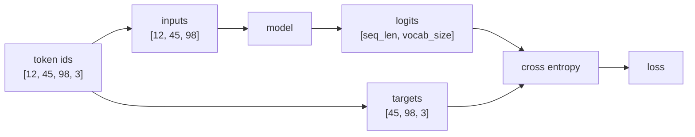

# 第9章 損失関数とクロスエントロピー

**この章のゴール**

cross entropyを「正解トークンに割り当てた確率を見るloss」として理解し、次トークン予測の `inputs` と `targets` を作れるようになること。

## 9.1 損失関数とは何か

この章では、**損失関数**と**クロスエントロピー**について学びます。

機械学習では、モデルの予測がどれくらい間違っているかを数値で表す必要があります。

この「間違いの大きさ」を表す関数が、損失関数です。

英語では、loss function と呼びます。

たとえば、あるモデルが次のように予測したとします。

```text
正解: dogs
予測: cats
```

これは間違いです。

しかし、機械学習では、単に「合っている」「間違っている」だけでは不十分です。

どれくらい悪い予測なのかを、数値で表す必要があります。

```text
少し悪い予測 → 小さめの損失
かなり悪い予測 → 大きめの損失
```

この損失の値を小さくするように、モデルのパラメータを更新します。

```text
予測する
↓
損失を計算する
↓
損失が小さくなる方向にパラメータを更新する
```

言語モデルの場合、モデルは次のトークンの確率分布を出します。

たとえば、文脈が次のようだったとします。

```text
I love
```

正解の次トークンが `dogs` だとします。

```text
I love dogs
```

モデルは語彙全体に対する確率分布を出します。

```text
I    : 0.05
you  : 0.10
love : 0.05
dogs : 0.70
.    : 0.10
```

この場合、正解である `dogs` の確率は `0.70` です。

これは比較的よい予測です。

一方、次のような予測だったらどうでしょうか。

```text
I    : 0.10
you  : 0.50
love : 0.20
dogs : 0.05
.    : 0.15
```

正解は `dogs` なのに、`dogs` の確率は `0.05` しかありません。

これは悪い予測です。

損失関数は、このような予測の悪さを数値にします。

```text
正解トークンの確率が高い
↓
損失は小さい

正解トークンの確率が低い
↓
損失は大きい
```

言語モデルでは、この損失関数として **クロスエントロピー** がよく使われます。

---

## 9.2 予測がどれくらい間違っているかを数値化する

損失関数の役割は、予測の間違いを数値化することです。

数値化できると、モデルを改善できます。

なぜなら、損失を小さくする方向を計算できるからです。

たとえば、非常に単純な予測問題を考えます。

```text
正解: 10
予測: 8
```

この場合、予測は2だけずれています。

```text
10 - 8 = 2
```

回帰問題では、このような差を使って損失を作ることがあります。

たとえば、二乗誤差です。

```text
loss = (正解 - 予測)^2
```

この例では、

```text
loss = (10 - 8)^2
loss = 2^2
loss = 4
```

です。

しかし、言語モデルでは、予測するものは数値そのものではありません。

予測するのは、次のトークンです。

```text
次のトークンは何か
```

このような問題は、分類問題として扱えます。

語彙が5個なら、5クラス分類です。

```text
0: I
1: you
2: love
3: dogs
4: .
```

モデルは、各クラスに対して確率を出します。

```text
[0.05, 0.10, 0.05, 0.70, 0.10]
```

正解が `dogs` なら、正解クラスは `3` です。

このとき、モデルの良し悪しは、正解クラスにどれだけ高い確率を割り当てたかで判断できます。

```text
正解 dogs の確率が高い → よい予測
正解 dogs の確率が低い → 悪い予測
```

クロスエントロピーは、この考え方を数式にしたものです。

基本的には、正解クラスの確率を見ます。

```text
正解クラスの確率
```

そして、その確率が高いほど損失を小さくし、低いほど損失を大きくします。

---

## 9.3 正解ラベルと予測分布

クロスエントロピーを理解するには、**正解ラベル**と**予測分布**を分けて考える必要があります。

まず、予測分布です。

モデルは、語彙全体に対する確率分布を出します。

たとえば、語彙が次の5個だとします。

```text
0: I
1: you
2: love
3: dogs
4: .
```

モデルの予測が次のようだったとします。

```text
I    : 0.05
you  : 0.10
love : 0.05
dogs : 0.70
.    : 0.10
```

配列で書くと、次のようになります。

```text
pred = [0.05, 0.10, 0.05, 0.70, 0.10]
```

これが予測分布です。

次に、正解ラベルです。

正解が `dogs` なら、正解ラベルは `3` です。

```text
target = 3
```

これは、語彙の中で `dogs` がインデックス3だからです。

機械学習では、正解ラベルをone-hotベクトルで表すこともあります。

`dogs` が正解なら、次のようになります。

```text
target_one_hot = [0, 0, 0, 1, 0]
```

これは、

```text
I    : 0
you  : 0
love : 0
dogs : 1
.    : 0
```

という意味です。

つまり、正解トークンだけが1で、それ以外は0です。

クロスエントロピーでは、予測分布と正解分布を比べます。

```text
予測分布:
[0.05, 0.10, 0.05, 0.70, 0.10]

正解分布:
[0, 0, 0, 1, 0]
```

正解分布では、`dogs` の位置だけが1です。

そのため、損失に効いてくるのは、基本的には `dogs` に割り当てた確率です。

```text
正解トークン dogs の予測確率 = 0.70
```

この値が高ければ損失は小さくなります。

この値が低ければ損失は大きくなります。

---

## 9.4 cross entropyの直感

クロスエントロピーは、直感的には次のような損失です。

```text
正解にどれだけ高い確率を割り当てたかを見る損失
```

正解トークンの確率が高いほど、損失は小さくなります。

正解トークンの確率が低いほど、損失は大きくなります。

たとえば、正解が `dogs` だとします。

モデルAは、`dogs` に高い確率を割り当てました。

```text
dogs: 0.90
```

モデルBは、`dogs` に低い確率しか割り当てませんでした。

```text
dogs: 0.10
```

この場合、モデルAの方が良い予測です。

したがって、損失は次のようになります。

```text
モデルAの損失: 小さい
モデルBの損失: 大きい
```

クロスエントロピーでは、正解トークンの確率 `p` に対して、次のような値を損失にします。

```text
loss = -log(p)
```

ここで、`p` は正解トークンに割り当てた確率です。

たとえば、正解トークンの確率が `0.90` の場合を考えます。

```text
loss = -log(0.90)
```

これは小さい値になります。

一方、正解トークンの確率が `0.10` の場合は、

```text
loss = -log(0.10)
```

これは大きい値になります。

さらに、正解トークンの確率が `0.01` なら、

```text
loss = -log(0.01)
```

もっと大きい値になります。

つまり、

```text
正解確率 p が 1 に近い → -log(p) は 0 に近い
正解確率 p が 0 に近い → -log(p) は大きくなる
```

という性質があります。

この性質が、言語モデルの学習にとても都合がよいです。

モデルが正解トークンに高い確率を出せば、損失は小さくなります。

モデルが正解トークンに低い確率しか出せなければ、損失は大きくなります。

---

## 9.5 なぜ正解の確率が高いほど損失が小さいのか

クロスエントロピーの基本は、次の式です。

```text
loss = -log(p)
```

ここで、`p` は正解トークンの確率です。

`log` は対数です。

対数にあまり慣れていない場合でも、ここでは次の性質だけ押さえれば十分です。

```text
p が 1 に近いとき、-log(p) は小さい
p が 0 に近いとき、-log(p) は大きい
```

具体的な値を見てみます。

```text
p = 1.00 → -log(p) = 0.000
p = 0.90 → -log(p) = 0.105
p = 0.50 → -log(p) = 0.693
p = 0.10 → -log(p) = 2.303
p = 0.01 → -log(p) = 4.605
```

このように、正解確率が高いほど損失は小さくなります。

```text
p = 0.90 → loss = 0.105
p = 0.10 → loss = 2.303
```

正解に90%の確率を割り当てた予測は、損失が小さいです。

正解に10%の確率しか割り当てなかった予測は、損失が大きいです。

さらに、正解に1%しか割り当てなければ、損失はもっと大きくなります。

```text
p = 0.01 → loss = 4.605
```

これは、かなり自信を持って間違えた場合に、大きなペナルティを与えるということです。

たとえば、モデルが次のように予測したとします。

```text
正解: dogs
dogs: 0.01
cats: 0.90
```

この場合、モデルは `cats` に強い自信を持っています。

しかし、正解は `dogs` です。

このような予測は大きく罰したいので、損失が大きくなります。

一方で、

```text
正解: dogs
dogs: 0.90
cats: 0.01
```

なら、良い予測なので損失は小さくなります。

クロスエントロピーは、このように「正解に割り当てた確率」を使って、予測の良し悪しを数値化します。

---

## 9.6 言語モデルにおけるcross entropy loss

言語モデルでは、各位置で次のトークンを予測します。

たとえば、次の文を考えます。

```text
I love dogs
```

これをトークン列として考えます。

```text
[I, love, dogs]
```

言語モデルは、各位置で次のトークンを予測します。

```text
入力: I
正解: love

入力: I love
正解: dogs
```

実装では、長いトークン列を一度に処理し、各位置で次トークンを予測します。

たとえば、入力IDが次のようだったとします。

```text
[12, 45, 98, 3]
```

次トークン予測では、入力と正解を1つずらして使います。

```text
入力:
[12, 45, 98]

正解:
[45, 98, 3]
```

つまり、

```text
12 の次は 45
45 の次は 98
98 の次は 3
```

を予測するわけです。

モデルは各位置について、語彙全体へのlogitsを出します。

```text
logits: [seq_len, vocab_size]
```

バッチ付きなら、shapeは次のようになります。

```text
logits: [batch_size, seq_len, vocab_size]
```

正解は、各位置の正解トークンIDです。

```text
targets: [batch_size, seq_len]
```

たとえば、

```text
targets = [
  [45, 98, 3],
  [21, 56, 4]
]
```

のような形です。

クロスエントロピーは、各位置で正解トークンの確率を見ます。

```text
位置1の正解トークン確率
位置2の正解トークン確率
位置3の正解トークン確率
...
```

そして、それぞれの損失を計算します。

```text
loss_i = -log(正解トークンの確率)
```

最後に、それらを平均します。

```text
loss = 各位置のlossの平均
```

つまり、言語モデルのcross entropy lossは、ざっくり言えば次のようなものです。

入力と正解を1つずらし、各位置の予測をまとめてlossにする流れは次の通りです。



```text
各位置で、正解の次トークンにどれだけ高い確率を出せたかを見る
```

正解トークンに高い確率を出せていれば、lossは小さくなります。

正解トークンに低い確率しか出せなければ、lossは大きくなります。

---

## 9.7 perplexityとの関係

言語モデルの評価では、**perplexity** という指標が出てくることがあります。

perplexityは、cross entropy lossと関係があります。

ざっくり言うと、perplexityは、

```text
モデルが平均してどれくらい迷っているか
```

を表す指標です。

cross entropy lossを `loss` とすると、perplexityは次のように計算されます。

```text
perplexity = exp(loss)
```

たとえば、lossが `0.0` の場合、

```text
perplexity = exp(0.0) = 1.0
```

これは、モデルが完全に迷わず正解を当てているような理想的な状態です。

lossが `1.0` の場合、

```text
perplexity = exp(1.0) = 2.718
```

lossが `2.0` の場合、

```text
perplexity = exp(2.0) = 7.389
```

lossが大きくなるほど、perplexityも大きくなります。

perplexityの直感は、

```text
平均して何個くらいの候補で迷っているか
```

です。

たとえば、perplexityが10なら、非常にざっくり言えば、

```text
平均して10個くらいの候補で迷っている
```

と解釈できます。

ただし、これはあくまで直感です。

厳密には、確率分布全体に基づく指標です。

言語モデルでは、perplexityが低いほど、データをよく予測できていることを意味します。

```text
perplexityが低い → よい
perplexityが高い → 悪い
```

ただし、現代のLLM評価では、perplexityだけでモデルの良し悪しを判断することはできません。

文章の有用性、指示への従いやすさ、安全性、推論能力など、他にも多くの評価軸があります。

それでも、基礎的な言語モデルの学習を理解する上では、perplexityは重要な指標です。

この教科書では、まず次の関係を覚えておけば十分です。

```text
cross entropy loss が小さい
↓
perplexity も小さい
↓
モデルは次トークンをよく予測できている
```

---

## 9.8 PyTorchでcross entropyを計算する

ここでは、PyTorchでクロスエントロピーを計算してみます。

まず、語彙が5個あるとします。

```text
0: I
1: you
2: love
3: dogs
4: .
```

モデルが出したlogitsを用意します。

```python
import torch
import torch.nn.functional as F

logits = torch.tensor([0.1, 0.2, -0.5, 2.0, 0.0])
```

これは、5個のトークン候補に対するスコアです。

まだ確率ではありません。

正解トークンが `dogs` だとします。

`dogs` のIDは `3` です。

```python
target = torch.tensor(3)
```

PyTorchの `F.cross_entropy` を使うには、入力logitsにバッチ次元が必要です。

そのため、次のようにshapeを変えます。

```python
logits_batch = logits.unsqueeze(0)
target_batch = target.unsqueeze(0)

loss = F.cross_entropy(logits_batch, target_batch)

print(loss)
```

出力は、たとえば次のようになります。

```text
tensor(0.4207)
```

ここで、shapeは次のようになっています。

```text
logits_batch: [1, vocab_size]
target_batch: [1]
```

`F.cross_entropy` は、内部で次の処理を行います。

```text
logits
↓
log_softmax
↓
正解ラベルの位置を見る
↓
negative log likelihood
```

つまり、実装ではsoftmaxを自分でかけてから渡すのではなく、logitsをそのまま渡します。

これは重要です。

```text
正しい:
F.cross_entropy(logits, targets)

避ける:
F.cross_entropy(softmax(logits), targets)
```

PyTorchの `cross_entropy` は、softmax前のlogitsを受け取るように設計されています。

---

## 9.9 cross entropyを手計算してPyTorchと比べる

ここでは、cross entropyを手計算して、PyTorchの結果と比べてみます。

まず、logitsを用意します。

```python
import torch
import torch.nn.functional as F

logits = torch.tensor([0.1, 0.2, -0.5, 2.0, 0.0])
target = torch.tensor(3)
```

正解はインデックス3です。

まず、softmaxを計算します。

```python
probs = torch.softmax(logits, dim=-1)

print(probs)
```

出力は、たとえば次のようになります。

```text
tensor([0.0895, 0.0989, 0.0491, 0.5967, 0.0659])
```

正解トークンの確率を取り出します。

```python
p_correct = probs[target]

print(p_correct)
```

出力は次のようになります。

```text
tensor(0.5967)
```

cross entropy lossは、正解確率の `-log` です。

```python
manual_loss = -torch.log(p_correct)

print(manual_loss)
```

出力は次のようになります。

```text
tensor(0.5163)
```

次に、PyTorchの `F.cross_entropy` と比べます。

```python
loss = F.cross_entropy(logits.unsqueeze(0), target.unsqueeze(0))

print(loss)
```

出力は次のようになります。

```text
tensor(0.5163)
```

同じ値になりました。

まとめると、1つのサンプルに対するcross entropyは、次の流れです。

```text
logits
↓ softmax
確率分布
↓
正解トークンの確率を取り出す
↓
-log(正解確率)
↓
loss
```

ただし、実装では数値安定性のため、通常は `F.cross_entropy` にlogitsを直接渡します。

```python
loss = F.cross_entropy(logits, targets)
```

この関数が内部で安定した計算をしてくれます。

---

## 9.10 バッチ付き・系列付きのcross entropy

実際の言語モデルでは、バッチと系列長があります。

そのため、logitsのshapeは次のようになります。

```text
[batch_size, seq_len, vocab_size]
```

targetsのshapeは次のようになります。

```text
[batch_size, seq_len]
```

たとえば、次のような設定を考えます。

```python
import torch
import torch.nn.functional as F

batch_size = 2
seq_len = 3
vocab_size = 5

logits = torch.randn(batch_size, seq_len, vocab_size)

targets = torch.tensor([
    [1, 3, 4],
    [0, 2, 3],
])
```

shapeを確認します。

```python
print("logits:", logits.shape)
print("targets:", targets.shape)
```

出力は次のようになります。

```text
logits: torch.Size([2, 3, 5])
targets: torch.Size([2, 3])
```

PyTorchの `F.cross_entropy` は、分類クラスの次元が2番目にある形を期待します。

つまり、次の形です。

```text
[N, C]
```

または、系列や画像のような追加次元がある場合は、

```text
[N, C, ...]
```

です。

ここで、`C` はクラス数、つまり語彙サイズです。

しかし、言語モデルのlogitsは通常、

```text
[batch_size, seq_len, vocab_size]
```

です。

語彙サイズが最後の次元にあります。

そこで、cross entropyに渡す前に、shapeを変えます。

簡単な方法は、batchとseq_lenをまとめることです。

```python
logits_flat = logits.reshape(batch_size * seq_len, vocab_size)
targets_flat = targets.reshape(batch_size * seq_len)

loss = F.cross_entropy(logits_flat, targets_flat)

print("logits_flat:", logits_flat.shape)
print("targets_flat:", targets_flat.shape)
print("loss:", loss)
```

出力は次のようになります。

```text
logits_flat: torch.Size([6, 5])
targets_flat: torch.Size([6])
loss: tensor(...)
```

shapeは次のように変わりました。

```text
logits:
[batch_size, seq_len, vocab_size]
↓
[batch_size * seq_len, vocab_size]

targets:
[batch_size, seq_len]
↓
[batch_size * seq_len]
```

つまり、すべての位置をまとめて、普通の分類問題として扱っています。

```text
6個の位置それぞれについて、5クラス分類する
```

言語モデルの学習では、このように各位置の次トークン予測の損失をまとめて平均します。

---

## 9.11 次トークン予測のtargetsを作る

言語モデルでは、入力列から次のトークンを予測します。

そのため、入力と正解を1つずらして作ります。

たとえば、トークンID列が次のようだったとします。

```text
[12, 45, 98, 3, 7]
```

このとき、入力と正解は次のように作ります。

```text
入力:
[12, 45, 98, 3]

正解:
[45, 98, 3, 7]
```

つまり、

```text
12 の次は 45
45 の次は 98
98 の次は 3
3 の次は 7
```

を学習します。

PyTorchで書くと、次のようになります。

```python
import torch

token_ids = torch.tensor([12, 45, 98, 3, 7])

inputs = token_ids[:-1]
targets = token_ids[1:]

print("inputs:", inputs)
print("targets:", targets)
```

出力は次のようになります。

```text
inputs: tensor([12, 45, 98,  3])
targets: tensor([45, 98,  3,  7])
```

バッチ付きの場合も同じです。

```python
import torch

token_ids = torch.tensor([
    [12, 45, 98, 3, 7],
    [8, 21, 21, 56, 4],
])

inputs = token_ids[:, :-1]
targets = token_ids[:, 1:]

print("inputs:")
print(inputs)
print("targets:")
print(targets)

print("inputs.shape:", inputs.shape)
print("targets.shape:", targets.shape)
```

出力は次のようになります。

```text
inputs:
tensor([[12, 45, 98,  3],
        [ 8, 21, 21, 56]])

targets:
tensor([[45, 98,  3,  7],
        [21, 21, 56,  4]])

inputs.shape: torch.Size([2, 4])
targets.shape: torch.Size([2, 4])
```

このように、次トークン予測では、元の列を1つずらして入力と正解を作ります。

```text
inputs = token_ids[:, :-1]
targets = token_ids[:, 1:]
```

この形は、Decoder-only Transformer、つまりGPT系の言語モデルで特に重要です。

---

## 9.12 小さな言語モデル出力でlossを計算する

ここでは、実際の言語モデルに近い形でlossを計算してみます。

まだ本物のTransformerは作りません。

ここでは、embeddingと線形層だけを使って、shapeとloss計算の流れを確認します。

```python
import torch
import torch.nn as nn
import torch.nn.functional as F

batch_size = 2
seq_len = 5
vocab_size = 100
d_model = 8

token_ids = torch.tensor([
    [12, 45, 98, 3, 7],
    [8, 21, 21, 56, 4],
])

inputs = token_ids[:, :-1]
targets = token_ids[:, 1:]

embedding = nn.Embedding(vocab_size, d_model)
output_layer = nn.Linear(d_model, vocab_size)

hidden = embedding(inputs)
logits = output_layer(hidden)

print("inputs:", inputs.shape)
print("targets:", targets.shape)
print("hidden:", hidden.shape)
print("logits:", logits.shape)
```

出力は次のようになります。

```text
inputs: torch.Size([2, 4])
targets: torch.Size([2, 4])
hidden: torch.Size([2, 4, 8])
logits: torch.Size([2, 4, 100])
```

shapeの流れは次の通りです。

```text
inputs:
[batch_size, seq_len - 1]

embedding後:
hidden: [batch_size, seq_len - 1, d_model]

出力層後:
logits: [batch_size, seq_len - 1, vocab_size]

targets:
[batch_size, seq_len - 1]
```

次に、cross entropy lossを計算します。

```python
B, T, V = logits.shape

loss = F.cross_entropy(
    logits.reshape(B * T, V),
    targets.reshape(B * T)
)

print("loss:", loss)
```

これは、各位置の次トークン予測のlossを平均しています。

全体のコードをまとめると、次のようになります。

```python
import torch
import torch.nn as nn
import torch.nn.functional as F

batch_size = 2
seq_len = 5
vocab_size = 100
d_model = 8

token_ids = torch.tensor([
    [12, 45, 98, 3, 7],
    [8, 21, 21, 56, 4],
])

inputs = token_ids[:, :-1]
targets = token_ids[:, 1:]

embedding = nn.Embedding(vocab_size, d_model)
output_layer = nn.Linear(d_model, vocab_size)

hidden = embedding(inputs)
logits = output_layer(hidden)

B, T, V = logits.shape

loss = F.cross_entropy(
    logits.reshape(B * T, V),
    targets.reshape(B * T)
)

print("inputs:", inputs.shape)
print("targets:", targets.shape)
print("hidden:", hidden.shape)
print("logits:", logits.shape)
print("loss:", loss)
```

出力は次のようになります。

```text
inputs: torch.Size([2, 4])
targets: torch.Size([2, 4])
hidden: torch.Size([2, 4, 8])
logits: torch.Size([2, 4, 100])
loss: tensor(...)
```

このコードは、言語モデル学習の最後の部分にかなり近いです。

本物のTransformerでは、embeddingと出力層の間にSelf-AttentionやFeed Forward Networkが入ります。

```text
inputs
↓
embedding
↓
Transformer blocks
↓
hidden
↓
output_layer
↓
logits
↓
cross entropy loss
```

しかし、lossの計算部分は基本的に同じです。

---

## 9.13 まとめ

この章では、損失関数とクロスエントロピーについて学びました。

損失関数は、モデルの予測がどれくらい悪いかを数値化する関数です。

```text
よい予測 → lossが小さい
悪い予測 → lossが大きい
```

機械学習では、このlossを小さくするようにモデルのパラメータを更新します。

```text
予測する
↓
lossを計算する
↓
lossが小さくなるように更新する
```

言語モデルでは、モデルは次トークンの確率分布を出します。

```text
logits
↓ softmax
次トークンの確率分布
```

正解トークンに高い確率を割り当てていれば、よい予測です。

正解トークンに低い確率しか割り当てていなければ、悪い予測です。

クロスエントロピーは、この正解トークンの確率を使って損失を計算します。

基本的な形は次の通りです。

```text
loss = -log(p)
```

ここで、`p` は正解トークンに割り当てた確率です。

```text
p が 1 に近い → loss は 0 に近い
p が 0 に近い → loss は大きくなる
```

PyTorchでは、クロスエントロピーは次のように計算します。

```python
loss = F.cross_entropy(logits, targets)
```

ここで重要なのは、`F.cross_entropy` にはsoftmax後の確率ではなく、softmax前のlogitsを渡すことです。

```text
正しい:
F.cross_entropy(logits, targets)

避ける:
F.cross_entropy(torch.softmax(logits), targets)
```

言語モデルでは、logitsのshapeは通常次のようになります。

```text
[batch_size, seq_len, vocab_size]
```

targetsのshapeは次のようになります。

```text
[batch_size, seq_len]
```

lossを計算するときは、batchとseq_lenをまとめて、次のようにします。

```python
B, T, V = logits.shape

loss = F.cross_entropy(
    logits.reshape(B * T, V),
    targets.reshape(B * T)
)
```

次トークン予測では、入力と正解を1つずらして作ります。

```python
inputs = token_ids[:, :-1]
targets = token_ids[:, 1:]
```

これは、

```text
現在のトークン列から、次のトークンを予測する
```

という学習の形です。

この章で特に重要なのは、次の理解です。

```text
lossは予測の悪さを数値化する
cross entropyは正解トークンの確率を見る
正解確率が高いほどlossは小さい
言語モデルは各位置で次トークンを予測する
PyTorchのcross_entropyにはlogitsを渡す
```

### 確認問題

次トークン予測で、次のトークン列があるとします。

```text
[12, 45, 98, 3]
```

`inputs` と `targets` はどう作ればよいでしょうか。

答えは次の通りです。

```text
inputs:  [12, 45, 98]
targets: [45, 98, 3]
```

`examples/02_cross_entropy.py` を実行すると、手計算したlossとPyTorchの `F.cross_entropy` が一致することを確認できます。

### よくある誤解

PyTorchの `F.cross_entropy` には、softmax後の確率ではなくlogitsを渡します。

```text
正しい: F.cross_entropy(logits, targets)
避ける: F.cross_entropy(torch.softmax(logits), targets)
```

次章では、微分の直感について学びます。

ここまでで、モデルが予測を出し、lossを計算するところまで見ました。

次に必要なのは、

```text
lossを小さくするには、パラメータをどちら向きに動かせばよいのか
```

という考え方です。

そのために必要になるのが、微分と勾配です。
